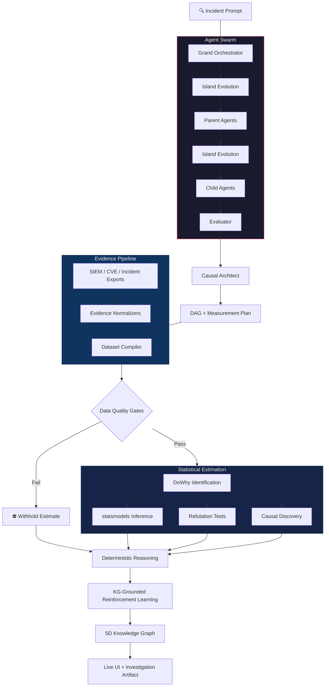

<div align="center">

# CausalOps

**An evidence-gated multi-agent causal reasoning system for trustworthy AI investigations.**

[](https://python.org)
[](https://fastapi.tiangolo.com)
[](https://react.dev)
[](https://langchain-ai.github.io/langgraph/)
[](https://build.nvidia.com)
[](https://www.pywhy.org/dowhy/)
[](https://docker.com)
[](#license)

**Agents propose hypotheses. Evidence decides whether those hypotheses are allowed to become conclusions.**

[The Problem](#the-problem) •
[How It Works](#how-it-works) •
[Architecture](#architecture) •
[Getting Started](#getting-started) •
[API](#api-reference) •
[Tech Stack](#tech-stack) •
[Design Deep Dive](#design-deep-dive)

</div>

---

# The Problem

Large Language Models are remarkably good at producing convincing explanations.

Unfortunately, they are equally capable of producing convincing explanations that are completely unsupported by evidence.

Most multi-agent systems still allow an LLM to:

1. Generate a hypothesis.
2. Generate the supporting evidence.
3. Explain why the evidence proves the hypothesis.

The result is a beautifully written answer with no statistical foundation.

In cybersecurity, healthcare, finance, and scientific research, this isn't merely a hallucination problem.

It's an epistemology problem.

If a system cannot distinguish between **what it believes** and **what it can actually demonstrate**, it should not be trusted to make operational decisions.

CausalOps is built around a single architectural constraint:

> **The LLM is allowed to propose hypotheses. Only externally supplied evidence is allowed to validate them.**

Every major subsystem exists to enforce that boundary.

The causal graph may be generated by an LLM.

The measurement plan may be generated by an LLM.

The investigation strategy may be generated by an LLM.

The evidence itself never is.

If sufficient evidence cannot be collected, the estimator refuses to produce an effect estimate.

It does not interpolate.

It does not speculate.

It simply says:

> **"There is insufficient evidence to answer this question."**

That design philosophy changes every downstream component.

The architecture is not optimized to produce convincing answers.

It is optimized to produce **honest** ones.

---

# Core Principles

CausalOps is built around five principles.

## 1. Separate reasoning from evidence

Reasoning proposes ideas.

Evidence validates ideas.

Those two responsibilities never belong to the same component.

---

## 2. Refuse unsupported conclusions

If statistical assumptions fail...

If evidence quality gates fail...

If treatment or outcome variables lack variation...

If there are not enough observations...

No estimate is produced.

The system intentionally fails closed.

---

## 3. Every conclusion must be traceable

Every causal estimate can be traced back to:

- SIEM records
- CVE feeds
- Incident reports
- Asset inventories
- Manual observations

Every observation maintains provenance.

Nothing becomes anonymous during compilation.

---

## 4. Agents never confirm themselves

Agents cannot fabricate supporting data.

Agents cannot rewrite datasets.

Agents cannot manufacture causal evidence.

Their responsibility ends after proposing measurable hypotheses.

---

## 5. Uncertainty is a feature

Unknowns are surfaced.

Weak evidence is reported.

Confidence intervals are exposed.

Refutation tests are included.

The system values calibrated uncertainty over artificial confidence.

---

# How It Works

Give CausalOps a cyber incident.

It doesn't write a report.

It runs an investigation.

---

## 1. Decompose

A Grand Orchestrator decomposes the incident into multiple investigatory tracks.

Before any reasoning begins, an island-model evolutionary algorithm optimizes policy priors for each branch.

Instead of hardcoding search behavior, every investigation starts with policies adapted to the task itself.

---

## 2. Investigate

Parent agents spawn specialized child investigators.

Each child produces a structured decision memo containing:

- investigation strategy
- assumptions
- operational risks
- second-order effects
- confidence
- required evidence
- evidence capable of falsifying its conclusions

Notice what is missing.

No agent is allowed to claim that its hypothesis is true.

Only what would be required to prove it.

---

## 3. Evaluate

A separate evaluator ranks every child memo.

Scoring is based on task-derived objectives instead of static heuristics.

Different incidents naturally prioritize different characteristics.

Some investigations reward caution.

Others reward coverage.

Others reward speed.

---

## 4. Hypothesize

The Causal Architect synthesizes the strongest investigation paths into a measurable causal graph.

It proposes:

- treatment variable
- outcome variable
- confounders
- mediator candidates
- directed causal edges
- measurement plan

Importantly:

The architect is forbidden from generating dataset rows.

Its responsibility ends with defining what evidence would need to exist.

---

## 5. Compile Evidence

Evidence adapters normalize exported telemetry from systems such as:

- Microsoft Sentinel
- SIEM platforms
- CVE feeds
- Incident management systems
- Asset inventories

The dataset compiler converts normalized evidence into a numerical dataframe.

Every compiled row preserves:

- source type
- source name
- observation timestamp
- raw reference
- asset identifier

If minimum statistical requirements are not met, the pipeline stops here.

No estimate is attempted.

---

## 6. Estimate

Once evidence passes validation, DoWhy identifies the causal estimand.

statsmodels computes:

- Average Treatment Effect
- confidence interval
- p-value

Multiple refutation tests challenge the estimate before it is accepted.

The estimate must survive:

- placebo treatment
- random common cause
- subset validation

before downstream reasoning is allowed.

---

## 7. Validate the Graph

LLM-generated graphs are hypotheses.

Not truth.

Conditional independence testing evaluates every proposed edge.

Each edge becomes one of four outcomes:

- Confirmed
- Refuted
- Reversed
- Newly Discovered

Statistical estimation operates only on the validated graph.

---

## 8. Reason

A deterministic reasoning engine analyzes the validated graph.

Unlike previous stages, no LLM participates here.

The reasoning layer identifies:

- causal anomalies
- unexplained outcomes
- spatial pressure zones
- probable secondary causes
- evidence-backed recommendations

Unknown causes are intentionally surfaced as high-severity findings.

---

## 9. Learn

A knowledge-graph-grounded reinforcement learning system updates policy behavior using:

- evaluator scores
- causal estimate strength
- anomaly quality
- graph confidence

Value iteration computes Q-values.

A Stackelberg equilibrium selects dominant policies.

Bidirectional meta-learning propagates improvements across future investigations.

---

## 10. Remember

Every artifact generated throughout execution becomes part of a persistent five-dimensional knowledge graph.

(subject, predicate, object, time, location)

The graph powers:

- reinforcement learning
- historical investigation replay
- policy optimization
- interactive visualization
- future investigations

Knowledge is accumulated rather than discarded.

---

# Why This Architecture Is Different

Most agent systems optimize for convincing outputs.

CausalOps optimizes for evidence-backed conclusions.

That distinction affects every design decision.

Instead of asking:

> "Can an LLM solve this problem?"

CausalOps asks:

> "What should an LLM be allowed to do?"

The answer is intentionally narrow.

LLMs generate hypotheses.

Statistics validate them.

Everything else exists to preserve that separation.

---

# Architecture



---

# Pipeline at a Glance

| Stage | Purpose | Why It Exists |
|--------|---------|---------------|
| **Grand Orchestrator** | Decompose incidents into investigation tracks | Large incidents require multiple independent reasoning paths. |
| **Island Evolution** | Optimize search policies before reasoning | Agents adapt to the task instead of relying on fixed prompts. |
| **Parent Agents** | Coordinate specialized investigations | Divide complex incidents into manageable objectives. |
| **Child Agents** | Produce structured decision memos | Explore competing explanations while explicitly stating assumptions. |
| **Evaluator** | Rank investigation quality | Prevent weak reasoning from influencing downstream stages. |
| **Causal Architect** | Build a measurable causal graph | Converts reasoning into statistically testable hypotheses. |
| **Evidence Compiler** | Convert telemetry into numerical datasets | Guarantees reproducible evidence with row-level provenance. |
| **Estimator** | Estimate causal effects | Generates effect estimates only when statistical assumptions hold. |
| **Causal Discovery** | Validate graph structure | Confirms, rejects, or reverses hypothesized causal relationships. |
| **Reasoning Layer** | Analyze validated evidence | Produces recommendations without relying on LLM generation. |
| **Policy Learning** | Improve future investigations | Learns which investigation strategies consistently perform best. |
| **5D Knowledge Graph** | Persist operational knowledge | Stores every investigation artifact for replay and learning. |

---

# Getting Started

## Prerequisites

- Python **3.12+**
- Docker + Docker Compose
- NVIDIA API Key (free tier supported)

Clone the repository.

```bash
git clone https://github.com/<your-username>/causalops.git
cd causalops
```

---

## Configuration

Copy the environment template.

```bash
cp .env.example .env
```

Configure your NVIDIA API key.

```text
NVIDIA_API_KEY=xxxxxxxxxxxxxxxx
```

---

## Launch

### Recommended

```bash
docker compose up --build
```

This launches:

- React Frontend
- FastAPI Backend
- Redpanda Event Bus
- Distributed Worker
- Memory MCP Server (standalone, `python -m memory.mcp_server`, port 8001)

---

### Local Development

```bash
pip install -r requirements.txt

cd src

uvicorn api:app \
    --host 0.0.0.0 \
    --port 8000
```

---

### Services & Environment Variables

Compose runs four backend processes: **api** (coordinator + SSE, no spawn
consumer), **worker** (spawn consumer), **redpanda**, and **mcp** (the
standalone memory server — see [Persistent Semantic Memory Layer](#persistent-semantic-memory-layer)). Api and worker share `./data` for the SQLite run store.

Kafka topics: `causalops.runs`, `causalops.spawn`, `causalops.artifacts`, `causalops.telemetry`, `causalops.evidence`, `causalops.dlq`.

| Env var | Default (compose) | Purpose |
|---------|-------------------|---------|
| `CAUSALOPS_ENABLE_SPAWN_WORKER` | `0` on api, `1` on worker | In-process spawn consumer in api when `1` |
| `CAUSALOPS_SPAWN_MAX_RETRIES` | `2` | Dispatch retries before DLQ |
| `CAUSALOPS_SPAWN_RETRY_BACKOFF_MS` | `1000` | Delay between spawn retries |
| `CAUSALOPS_SPAWN_CONCURRENCY` | `3` | Concurrent child-agent dispatch, avoids a fully serial queue |
| `CAUSALOPS_BARRIER_TIMEOUT_S` | `1800` | Max wait for a parent/child dispatch barrier |
| `CAUSALOPS_KAFKA_MAX_POLL_INTERVAL_MS` | `1800000` | Kafka consumer max poll interval for long agentic runs |
| `CAUSALOPS_DATA_DIR` | repo-root `data/` | Run artifacts, run store, and 5D graph SQLite files |

For single-process local dev without the worker container, set `CAUSALOPS_ENABLE_SPAWN_WORKER=1` on the api service.

Live UI progress uses SSE. The frontend generates a `run_id`, opens
`GET /run/{run_id}/events`, then calls `POST /run` with the same id. If
`KAFKA_BOOTSTRAP` is unset, the graph still runs but the event stream is empty.

Verify the event bus with the stack running (`docker compose up`):

```bash
chmod +x scripts/smoke_kafka_bus.sh
./scripts/smoke_kafka_bus.sh
```

Runs bus unit tests, checks `/health`, and lists Redpanda topics when compose is up.

Once running:

- Frontend: <http://localhost:8080>
- API docs: <http://localhost:8000/docs>
- Health check: <http://localhost:8000/health>
- Memory MCP server: <http://localhost:8001/sse> (SSE transport; stdio for Claude Desktop/Code)

---

# Quick Demo

Run the bundled evidence-backed demonstration.

```bash
curl http://localhost:8000/demo/estimate
```

No API key is consumed.

The demo exercises the complete evidence pipeline using deterministic SIEM fixtures.

---

# Launch an Investigation

```bash
curl -X POST http://localhost:8000/run \
-H "Content-Type: application/json" \
-d '{
  "task_description":
"A sophisticated adversary has compromised an edge firewall and is performing lateral movement across multiple domain controllers while security patches are being deployed."
}'
```

The API immediately returns a **run_id**.

Use Server Sent Events to watch execution.

```bash
GET /run/{id}/events
```

---

# Watch the Investigation

Open

```
http://localhost:8080
```

The dashboard visualizes:

- agent spawning
- evaluator scoring
- evidence compilation
- DAG generation
- statistical estimation
- anomaly detection
- reinforcement learning
- knowledge graph evolution

in real time.

---

# Data Quality Gates

Statistical estimation is intentionally conservative.

The estimator refuses to execute unless all quality gates pass.

Current requirements include:

- minimum 50 observations
- minimum 10 treated
- minimum 10 controls
- treatment variation
- outcome variation
- acceptable missingness
- valid causal graph

If any requirement fails, estimation is withheld.

Instead of fabricating a result, the API returns

```text
method = withheld:data_quality_gates

ate = null

confidence_interval = null

p_value = null
```

This behavior is intentional.

---

# Example Refusal

Supplying only a single evidence row

```json
{
  "evidence_records": [
    {
      "Patch_Applied":1,
      "Compromised":0
    }
  ]
}
```

does **not** produce an Average Treatment Effect.

Instead the estimator explicitly refuses to perform causal inference because the evidence is statistically insufficient.

---

# Configuration Profiles

Execution quality is configurable.

| Profile | Reasoning Budget | Intended Use |
|----------|-----------------|--------------|
| **fast** | 0 | Smoke tests |
| **balanced** | 1024 | Daily development |
| **deep** | 4096 | Maximum reasoning quality |

---

Execution mode is independent of model size.

### Standard Mode

- Compact swarm
- Local memo ranking
- Fast estimation
- Minimal latency

Ideal for operational triage.

---

### Deep Mode

Runs the full architecture:

- Island Evolution
- Large Swarm
- LLM Evaluation
- Causal Synthesis
- Reinforcement Learning
- Meta Learning

Designed for research-quality investigations.

---

# API Reference

| Endpoint | Description |
|----------|-------------|
| `POST /run` | Launch a full investigation |
| `GET /run/{id}` | Retrieve completed investigation |
| `GET /run/{id}/events` | Live execution telemetry |
| `GET /run/{id}/graph/5d` | Retrieve knowledge graph |
| `GET /run/{id}/reasoning` | Deterministic reasoning artifact |
| `POST /estimate` | Direct causal estimation |
| `GET /demo/estimate` | Bundled evidence-backed demo |
| `POST /normalize/sentinel` | Normalize Microsoft Sentinel exports |
| `POST /normalize/cve` | Normalize NVD/CVE feeds |
| `POST /normalize/incidents` | Normalize incident report exports |

Interactive OpenAPI documentation becomes available automatically.

```
http://localhost:8000/docs
```

---

# Tech Stack

CausalOps combines modern agent orchestration, causal inference, reinforcement learning, and distributed systems into a single evidence-gated reasoning engine.

| Layer | Technology | Purpose |
|--------|------------|---------|
| **Reasoning Model** | NVIDIA Nemotron Ultra (NIM) | Structured hypothesis generation and planning |
| **Agent Framework** | LangGraph | Stateful multi-agent orchestration |
| **Validation** | DoWhy | Causal identification and effect estimation |
| **Inference** | statsmodels | Confidence intervals and hypothesis testing |
| **Backend** | FastAPI | Async API and orchestration layer |
| **Frontend** | React 19 + TanStack Router | Interactive investigation dashboard |
| **Visualization** | Recharts + react-force-graph | Live graph visualization |
| **Messaging** | Redpanda (Kafka) | Distributed event streaming |
| **Persistence** | SQLite | Runs, artifacts, graph storage |
| **Infrastructure** | Docker Compose | Local deployment |
| **Data Models** | Pydantic | Strongly typed contracts |
| **Telemetry** | Server Sent Events | Live execution updates |

---

# Design Deep Dive

The architecture deliberately separates reasoning from statistics.

Every subsystem exists to enforce a single invariant:

> **LLMs are allowed to propose hypotheses. They are never allowed to validate them.**

That sounds simple.

Implementing it is not.

---

## Why Separate the LLM From the Estimator?

Most agent systems collapse three fundamentally different responsibilities into one component.

The same LLM:

- generates hypotheses,
- interprets evidence,
- and produces conclusions.

This creates an obvious failure mode.

A model can unintentionally manufacture evidence supporting its own reasoning.

CausalOps prevents this architecturally.

The causal architect produces only:

- variables
- graph structure
- measurement plan

It never creates observations.

It never constructs dataframes.

It never estimates causal effects.

Those responsibilities belong exclusively to deterministic statistical components.

---

## Evidence Is the Source of Truth

Every observation originates from externally supplied telemetry.

Examples include:

- Microsoft Sentinel exports
- SIEM alerts
- EDR telemetry
- CVE feeds
- Incident reports
- Asset inventories

Every compiled row retains provenance.

Each observation records:

- source type
- source name
- timestamp
- asset identifier
- raw reference

Nothing enters the estimator without traceability.

---

## Data Quality Gates

Statistical estimation is expensive to trust.

Therefore the estimator refuses execution unless minimum evidence standards are met.

Current requirements include:

- minimum observation count
- treated samples
- control samples
- treatment variation
- outcome variation
- acceptable missingness
- measurable graph structure

Failure at any stage immediately terminates estimation.

The API intentionally returns

```text
method = withheld:data_quality_gates

ate = null

confidence_interval = null

p_value = null
```

No fallback estimates exist.

No "best guess" exists.

Evidence either supports estimation or it does not.

---

## Causal Discovery

The graph produced by the LLM is only a proposal.

Before estimation begins, every edge undergoes conditional independence testing.

Possible outcomes:

### Confirmed

The observed data supports the proposed relationship.

---

### Refuted

The variables appear conditionally independent.

The edge is removed.

---

### Reversed

Evidence supports the opposite causal direction.

The graph is automatically corrected.

---

### Discovered

A statistically significant dependency exists that the hypothesis failed to include.

The graph is expanded.

---

Estimation operates on the validated graph rather than the original proposal.

This distinction is one of the core architectural differences between CausalOps and traditional LLM agent systems.

---

## Statistical Estimation

After graph validation, DoWhy identifies the causal estimand.

The estimator computes

- Average Treatment Effect
- standard error
- confidence interval
- hypothesis test
- p-value

Multiple robustness checks are then executed.

Current refuters include

- placebo treatment
- random common cause
- subset validation

If robustness checks fail, downstream reasoning receives that uncertainty.

Confidence is never artificially inflated.

---

## Deterministic Reasoning

Reasoning intentionally occurs *after* statistical estimation.

Unlike previous stages, this component contains no LLM.

Instead it traverses the validated graph searching for

- anomalous assets
- improbable outcomes
- unexplained failures
- concentrated pressure zones
- secondary causal pathways

Unknown causes remain unknown.

The engine never invents explanations to fill missing information.

---

## Reinforcement Learning

Operational knowledge should improve over time.

Each completed investigation produces structured feedback.

Signals include

- evaluator scores
- estimate quality
- anomaly detection quality
- graph confidence
- policy effectiveness

These signals become rewards within a model-based Markov Decision Process.

Value iteration computes policy quality.

A Stackelberg equilibrium determines which child policies dominate.

Bidirectional meta-learning shares improvements across future investigations.

The result is an investigation engine that gradually learns which reasoning strategies consistently produce stronger evidence-backed analyses.

---

## Five-Dimensional Knowledge Graph

Every artifact produced during execution becomes part of a persistent knowledge graph.

Dimensions:

- Subject
- Predicate
- Object
- Time
- Location

Unlike traditional triples, temporal and spatial context are first-class citizens.

The graph supports

- historical replay
- reinforcement learning
- anomaly localization
- cross-run learning
- interactive visualization

Knowledge accumulates instead of disappearing after each run.

---

# Answering the Hard Questions

These are the questions experienced engineers typically ask after understanding the architecture.

---

## Where Does the Estimator's Data Come From?

Never from the LLM.

The dataframe is constructed exclusively from normalized evidence records.

Every row originates from externally supplied telemetry.

Synthetic observations are rejected before statistical estimation begins.

---

## Can the LLM Accidentally Confirm Its Own Hypothesis?

No.

The LLM has no mechanism for generating observations.

Its output ends with a graph and measurement plan.

Every subsequent stage is deterministic.

---

## Why Fifty Rows?

Fifty observations are **not** considered statistically ideal.

They are merely the minimum smoke gate required before estimation becomes possible.

Higher sample counts naturally produce more stable estimates.

The estimator reports sample size so downstream users can judge estimate quality themselves.

---

## Why Use DoWhy?

DoWhy separates

- identification
- estimation
- assumptions

rather than treating causal inference as a single regression problem.

That separation mirrors CausalOps' architectural philosophy.

---

## Why Use statsmodels Too?

DoWhy identifies what should be estimated.

statsmodels computes

- coefficient estimates
- p-values
- confidence intervals

Both libraries solve different problems.

---

## Why Perform Causal Discovery After Graph Generation?

LLMs reason.

Statistics validate.

Allowing conditional independence testing to challenge the hypothesis prevents reasoning errors from becoming statistical assumptions.

---

## Why Doesn't the Estimator "Try Anyway"?

Because uncertainty should never be hidden.

Producing no estimate is preferable to producing an unjustified estimate.

The architecture intentionally favors calibrated uncertainty over artificial confidence.

---

## Why Isn't the Reasoning Layer Another LLM?

Because recommendations should be consequences of evidence, not additional generations.

Every recommendation is derived from validated statistical structure rather than free-form text generation.

---

## Is This an Autonomous Agent?

No.

It is better described as an **evidence-gated reasoning system**.

Agents generate competing explanations.

Statistics determine which explanations survive.

Those surviving explanations become the basis for deterministic operational reasoning.

That distinction is fundamental.

---

# Backend Architecture

The backend is intentionally modular.

Each component owns a single responsibility and exposes strongly typed interfaces to the rest of the system.

| File | Responsibility |
|------|----------------|
| `api.py` | FastAPI endpoints, request validation, orchestration entrypoints |
| `engine.py` | End-to-end investigation lifecycle |
| `agents.py` | Grand orchestrator, parent agents, child agents |
| `evaluator.py` | Structured memo evaluation and ranking |
| `evolution.py` | Island-model evolutionary policy optimization |
| `causal.py` | Causal graph synthesis and measurement planning |
| `dataset_compiler.py` | Evidence normalization into statistical datasets |
| `estimators.py` | DoWhy estimation, statsmodels inference, robustness tests |
| `causal_discovery.py` | Conditional independence testing and graph validation |
| `reasoning.py` | Deterministic causal reasoning engine |
| `policy_learning.py` | Reinforcement learning and meta-learning |
| `graph_5d.py` | Persistent knowledge graph |
| `graph_stream.py` | Live graph updates via event streaming |
| `benchmarking.py` | Deterministic evaluation metrics |
| `schema.py` | Shared Pydantic models |
| `workers.py` | Distributed task execution |
| `events.py` | Typed Kafka event definitions |
| `telemetry.py` | Live execution telemetry |

---

# Repository Structure

```
causalops/

├── api/
│   ├── api.py
│   ├── engine.py
│   ├── agents.py
│   ├── evaluator.py
│   ├── evolution.py
│   ├── causal.py
│   ├── causal_discovery.py
│   ├── estimators.py
│   ├── dataset_compiler.py
│   ├── reasoning.py
│   ├── policy_learning.py
│   ├── graph_5d.py
│   ├── benchmarking.py
│   └── schema.py
│
├── frontend/
│
├── workers/
│
├── docker/
│
├── docs/
│
├── examples/
│
├── tests/
│
└── README.md
```

---

# Performance Characteristics

The architecture is designed around bounded concurrency and deterministic execution rather than maximizing raw LLM throughput.

| Component | Complexity |
|-----------|------------|
| Agent Dispatch | Parallel |
| Memo Evaluation | Linear |
| Dataset Compilation | Linear |
| Causal Discovery | Graph-dependent |
| Statistical Estimation | Linear |
| Knowledge Graph Updates | Incremental |
| Reinforcement Learning | Fixed Iteration |
| Event Streaming | Asynchronous |

Most runtime is spent waiting on external model inference rather than local computation.

The deterministic portions of the pipeline are intentionally lightweight so computational resources are focused on reasoning rather than infrastructure.

---

# Persistent Semantic Memory Layer

Every completed run is embedded, indexed, and made retrievable to future runs — a hybrid architecture combining vector retrieval, a cross-run knowledge graph, and temporal decay, exposed over MCP.

- **Vector retrieval** — each completed run's task description is embedded (`gemini-embedding-001`, 1536-dim) and stored in Supabase pgvector. New incidents retrieve the most similar past runs before the orchestrator decomposes them.
- **Knowledge graph** — entities (assets, MITRE techniques, CVEs, causal graph nodes) extracted from evidence records and causal graphs persist as nodes and edges across runs, queryable by relationship.
- **Temporal indexing** — similarity is weighted by `exp(-0.023 * age_in_days)` (30-day half-life), so recent incidents outweigh stale ones with the same textual similarity.
- **MCP server** — a standalone FastMCP process (`python -m memory.mcp_server`, port 8001, SSE or stdio transport) exposing four tools: `search_similar_incidents`, `get_entity_relationships`, `get_asset_timeline`, `write_run_to_memory`. Never mounted inside the FastAPI app.
- **Agent integration** — a `memory_retrieve` phase runs before the orchestrator, and a `memory_write` phase runs after every run completes; both are non-fatal by design, so a memory-layer outage never fails a run.

Schema is tracked as code in `supabase/migrations/`. See [`CLAUDE.md`](CLAUDE.md) for the full component breakdown, environment variables, and manual retention query.

---

# Design Goals

CausalOps was designed around several long-term objectives.

- Evidence-backed reasoning instead of narrative generation
- Statistical reproducibility
- Explicit uncertainty
- Transparent decision making
- Modular architecture
- Human-auditable investigations
- Distributed execution
- Continuous policy improvement
- Knowledge accumulation across investigations

Every subsystem exists to support one or more of these goals.

---

# Future Work

Several extensions are planned.

## Connectors

- Microsoft Sentinel authentication
- Splunk integration
- Elastic integration
- CrowdStrike ingestion
- Microsoft Defender connector
- Wiz connector
- ServiceNow incident ingestion

---

## Knowledge Graph

- ~~Cross-investigation retrieval~~ — done, see [Persistent Semantic Memory Layer](#persistent-semantic-memory-layer)
- ~~Persistent organizational memory~~ — done, see [Persistent Semantic Memory Layer](#persistent-semantic-memory-layer)
- Graph embeddings (embedding the causal graph structure itself, not just task descriptions)
- Multi-hop causal querying (beyond the current single-hop entity neighborhood lookup)
- Automated temporal replay and memory-row retention policy

---

## Reinforcement Learning

- Online learning
- Human feedback integration
- Policy distillation
- Multi-objective optimization
- Distributed experience replay

---

## Infrastructure

- Kubernetes deployment
- Redis caching
- PostgreSQL persistence
- Horizontal worker scaling
- GPU scheduling
- Cloud-native deployment

---

## Research

- Benchmark suite
- Agent evaluation leaderboard
- Public datasets
- Additional causal discovery algorithms
- Bayesian causal estimation
- Counterfactual recommendation generation

---

# Philosophy

Modern AI systems are increasingly capable of producing answers.

The challenge is no longer generating explanations.

The challenge is knowing when those explanations deserve to be trusted.

CausalOps is built on the belief that reasoning and evidence should be treated as separate computational responsibilities.

Reasoning is creative.

Evidence is empirical.

Conflating the two creates systems that sound intelligent while becoming increasingly difficult to audit.

Separating them creates systems that are willing to admit uncertainty.

That tradeoff is intentional.

---

# Contributing

Contributions are welcome.

If you discover:

- statistical issues
- architectural improvements
- causal inference enhancements
- performance optimizations
- documentation improvements

please open an issue or submit a pull request.

Before contributing, please ensure that new functionality preserves the project's central invariant:

> **Hypotheses may be generated. Evidence may not.**

---

# Citation

If this work contributes to your research or project, please cite it.

```bibtex
@software{garg2026causalops,
  author = {Darsh Garg},
  title = {CausalOps: An Evidence-Gated Multi-Agent Causal Reasoning Engine},
  year = {2026},
  url = {https://github.com/<your-username>/causalops}
}
```

---

# License

Copyright © 2026 Darsh Garg.

All rights reserved.

This software may be downloaded and evaluated for personal, educational, or research purposes.

Redistribution, modification, or commercial use requires prior written permission from the copyright holder.

See **LICENSE.md** for complete licensing terms.

---

# Acknowledgments

CausalOps builds upon decades of work in several research communities.

This project draws inspiration from advances in

- causal inference
- multi-agent systems
- reinforcement learning
- distributed systems
- knowledge graphs
- statistical decision theory

and would not be possible without the open-source ecosystems surrounding FastAPI, LangGraph, DoWhy, statsmodels, React, Docker, and many other outstanding projects.

---

<div align="center">

### Agents propose.

### Evidence decides.

### Statistics verify.

### Uncertainty is preserved.

---

**If an answer cannot be justified, CausalOps refuses to produce one.**

</div>
