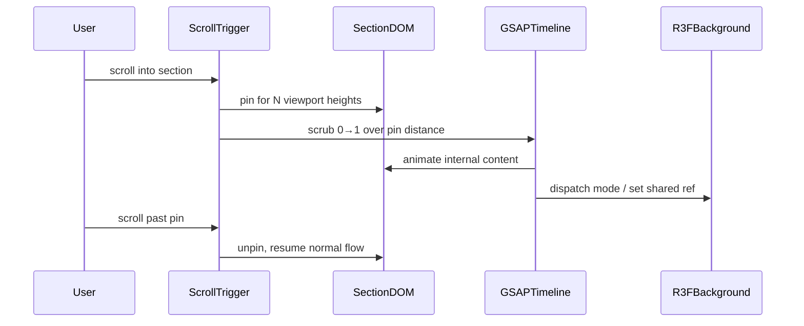

# Frontend UI Fixes — Design

> **Updated:** 2026-09-05. Architecture companion to [[frontend-ui-fixes-requirements]].
> Implementation steps: [[frontend-ui-fixes-tasks]].
> Stack: Next.js 16 App Router, Tailwind v4 CSS-first, shadcn/Radix, Framer Motion, **GSAP + ScrollTrigger**, R3F + drei, Sanity, Biome, pnpm.

## Design Principles (Sep 2026)

1. **Scroll is the director** — pinned sections use scroll distance as timeline scrubber.
2. **3D background participates** — R3F scatter/reform syncs with GSAP pin beats via shared refs or CustomEvents.
3. **Restraint on content** — glow beats graph; emerge beats slide; rope beats rigid line.
4. **Reduced motion is a first-class layout** — never pin-trap; always ship static fallback.
5. **Smallest safe diff** — extend existing components; no new state library.

---

## Component Dependency Map

```
PortfolioContent.tsx
├── ObsidianBackgroundCanvas.tsx ← scatter modes: intro | click | about-pin | projects-edge
├── HeroSection → HeroContent → ProfileImage (+ hover overlay fix)
├── AboutSection → AboutSectionClient → AboutTelemetry (2 glow cards)
│   └── [NEW] gsap/about-pin.ts — ScrollTrigger pin + summary beats
├── Projects section → ProjectsSlider
│   └── [NEW] gsap/projects-pin.ts — pin + emerge + side drift
├── EducationSection → EducationFlowchart
│   └── [NEW] gsap/education-pin.ts + rope geometry + dot-sync distort
├── HeaderScrolling (logo — no tab glow)
├── Footer (logo glyph left of Anant's Hub)
└── PortfolioLab → ChatInputBar (textarea vertical center)
```

**Cross-component signaling:** Reuse `window` CustomEvents (`orby:navigate`, `orby:speech` pattern) for background mode switches:
- `background:mode` → `{ mode: 'idle' | 'about-pin' | 'projects-edge' | 'click-scatter' }`

---

## GSAP Pinned Sections Architecture

> **Prerequisite:** Official GSAP ScrollTrigger docs research before coding (Phase 3 engagement). Licensing: `@gsap/react` already in repo.

### Pattern (all three sections)



### Shared hook proposal

`src/hooks/useSectionPin.ts` (or `src/lib/gsap/section-pin.ts`):
- Accepts: `triggerRef`, `pinDuration` (vh multiplier), `onProgress(progress: number)`
- Returns: `isPinned`, cleanup on unmount
- Registers ScrollTrigger with `pin: true`, `scrub: 1`, `anticipatePin: 1`
- **Reduced motion:** skip pin, call `onProgress(1)` immediately

### Coexistence with R3F fixed background

- Background canvas stays `position: fixed` — pin affects **section content only**, not canvas DOM.
- Sync via ref passed from `ObsidianBackgroundCanvas` context OR CustomEvent on progress thresholds.
- Avoid ScrollSmoother initially — native scroll + ScrollTrigger pin is lower risk with fixed R3F layer.
- `backdrop-filter` glass surfaces (`.cosmic-card`): test GPU load during pin; reduce blur on mobile if jank.

---

## Fix 1 — Hero & Volumetric Scatter

### Click scatter (depth-read fix, not a 2D→3D upgrade)

**File:** `ObsidianBackgroundCanvas.tsx`

> **2026-09-05 correction:** this used to describe the target as upgrading from a "radial sine ripple" driven by `handleClick`/`burstActive`/`scatterBurstActive`. None of those symbols exist in the file. Full corrected diagnosis and prompt: [[ui-fix-01-hero-background]].

Click already triggers the same formation-replay mechanism as the mount intro: `formRetrigger` → fresh `pScatter` via `randomOffsetInSphere` (genuinely isotropic 3D, confirmed) → fly-apart (`FORM_CLICK_OUT_DURATION`) → reassemble with `pNorm` breathing wiggle (`FORM_CLICK_IN_DURATION`). The data is already volumetric. The gap is perceptual: no camera parallax during the click (camera only moves on scroll), `depthWrite={false}` additive blending doesn't stratify near/far, and the scatter direction ignores where the raycast actually hit.

| Fix | Detail |
|---|---|
| Depth-correlated size/opacity | Beyond built-in `sizeAttenuation`, add an explicit near/far multiplier during `formationActive`, ranged off the actual per-frame min/max camera distance |
| Hit-point-biased scatter | Use the discarded `hit[0].point` from the click raycast to bias nearby points' `pScatter` outward from the click location, tapering to unbiased for far points |
| Camera-axis bias (stretch goal) | Only if the above isn't enough — riskier, touches the shared mount+click code path |

See [[ui-fix-01-hero-background]] for the full mechanism trace and the ready-to-paste implementation prompt.

### Profile hover overlay

**File:** `HeroContent.tsx`

- Wrapper: `relative overflow-hidden rounded-*` on profile card
- Overlay: `absolute inset-0` (not inset with gap) — verify `inset-0` covers rounded clip
- Lab open/close buttons: centered in overlay, full-bleed hit area

---

## Fix 2 — About Pinned Section

### Layout beats (scroll-scrubbed)

| Progress | Visible content | Background mode |
|---|---|---|
| 0.0–0.4 | `aboutSummary` + 2 glow cards | `about-pin` scatter (high amplitude) |
| 0.4–0.8 | Summary morph / second summary | scatter continues, slower reform |
| 0.8–1.0 | Optional: hint toward full bio OR hold | fade to `idle` |

> **2026-09-05 verified:** `gsap`/`@gsap/react` are already installed and `Providers.tsx` already wires Lenis to `ScrollTrigger.update` — the "ScrollSmoother vs native scroll" question elsewhere in this doc is already answered in code: native Lenis + ScrollTrigger, no ScrollSmoother. Full trace: [[ui-fix-02-about-section]].

### Bio expand (click, not scroll)

- `AboutSectionClient.tsx`: wrap card in `<button>` or attach `onClick` to card surface
- `expanded` state toggles full `fullBio` PortableText below pin area OR inside card
- Pin timeline and click-expand are **orthogonal** — expand can happen during or after pin

> **2026-09-05 verified:** confirmed today's toggle is button-only — the only `onClick` in `AboutSectionClient.tsx` is on the "Read full bio" button (line 139). Extend the existing `expanded` state (line 94) to the card wrapper; don't add a second state.

### Telemetry — 2 glow cards

File: `AboutTelemetry.tsx`

```tsx
// Pseudocode — glow on click, no expand
const [glowingIndex, setGlowingIndex] = useState<number | null>(null)
const handleCardClick = (i: number) => {
  setGlowingIndex(i)
  setTimeout(() => setGlowingIndex(null), 500)
}
// className: glowingIndex === i && 'ring-2 ring-violet-400/50 shadow-[0_0_24px_rgba(167,139,250,0.35)]'
```

- **2026-09-05 verified:** `profile.stats[]` schema has no `order` field (`label`, `value`, `summary` only) — default to `.slice(0, 2)` in code plus Studio-side content cleanup, not a schema addition, unless review specifically asks for `order`.
- Remove `TelemetryDetail`, accordion state, `skills`/`projects` props (confirmed used only for graph derivation, lines 28–41 of `AboutTelemetry.tsx`).
- Full corrected spec + ready-to-paste prompt: [[ui-fix-03-about-telemetry]].

## Fix 6 — Projects Pinned Section

> **2026-09-05 correction:** this section previously assumed auto-play was capped to indices 0–2 and didn't mention the existing GSAP `Draggable` swipe gesture, "tether flash" effect, or `useSpaceFloat` ambient drift already on all three visible cards. Full corrected diagnosis, target behavior, and implementation prompt: [[ui-fix-04-projects-section]]. **Auto-play scope resolved:** keep cycling through all projects (confirmed by the user) — the live code's behavior is correct, do not cap it.

###### Timeline beats (unchanged shape, now scoped to a one-time pin-entry reveal — not the per-index transition)

| Progress | Effect |
|---|---|
| 0.0 | Pin starts; card wrappers invisible (outer wrapper only, not the existing `AnimatePresence`/`slideVariants` layer) |
| 0.2 | Center card wrapper fades in |
| 0.5 | All three solid; auto-play continues exactly as it does today |
| 0.5–1.0 | Edge loop active (new); side-card drift stays always-on as it is today |

###### Card emerge

- Fires once on pin-entry, on the cards' outer wrappers — deliberately separate from `ProjectsSlider.tsx`'s existing `slideVariants`/`AnimatePresence`, which already drives a ±200px `x` slide + opacity/scale on **every** index change (manual, drag, keyboard, auto-play) and must keep doing so unchanged after the emerge.
- No added horizontal translate on the emerge itself.
- Side cards animate opacity 0 → their existing resting `0.35` (not to 1).

###### Border / edge effect

- Confirmed absent from `globals.css` — genuinely new CSS, no existing class to reuse or collide with.
- Violet/indigo ~15% opacity, 4–6s loop, active during auto-play.
- Optional: dispatch `background:mode projects-edge` — the consumer side of this event is explicitly deferred in [[ui-fix-01-hero-background]]; don't build it here either unless trivial.

###### Side card drift

- **Already exists** via `useSpaceFloat({radius: 4, rotate: 0.3})` on each side card (`src/hooks/use-space-float.ts`), always-on regardless of auto-play state — this matches the resolved auto-play scope, no gating change needed.
- Read that hook before adding anything: if it writes a CSS `transform` on the wrapper, a second independent Framer `repeat: Infinity` transform animation on the same element will fight it. Only tune the existing hook's params if the emerge transition needs it.

See [[ui-fix-04-projects-section]] for the full mechanism trace and the ready-to-paste implementation prompt.

## Fix 7b — Education Pinned Section

> **2026-09-05 correction:** re-verified against `EducationFlowchart.tsx`/`EducationSection.tsx` on `post-frontend` — rope connectors and dot-sync deform are **already substantially implemented**, not from-scratch tasks. Full corrected mechanism + prompt: [[ui-fix-05-education-section]]. The sub-sections below are kept only as a short index; treat the linked note as the source of truth, not this file.

### Spring entry sequence

Genuinely not built yet — no gsap/ScrollTrigger anywhere in Education today, only a `distort`-value entrance stagger (unaffected, keep it). Reuse the app's already-registered `ScrollTrigger` (wired to Lenis in `Providers.tsx`) and the existing `useGSAP`/`gsap.matchMedia` idiom from `split-heading.tsx` — do not re-research GSAP setup from scratch. Full spec: [[ui-fix-05-education-section]].

### Rope connectors

**Already built.** `StretchingLine` in `EducationFlowchart.tsx` recomputes a `THREE.QuadraticBezierCurve3` every frame from the blobs' live positions with a tunable bow `amplitude` — a real bent, blob-synced curve, not a rigid line. The three-way "SVG vs R3F tube vs GSAP morph" choice below is superseded — none needed. If it still doesn't read as "rope" enough, tune the existing amplitude constants first. Full detail: [[ui-fix-05-education-section]].

~~**Options (pick one during implementation):**~~

~~| Approach | Pros | Cons |~~
~~|---|---|---|~~
~~| SVG quadratic bezier in DOM overlay | Simple, accessible | Sync with R3F blob positions |~~
~~| R3F `TubeGeometry` along curve | True 3D | Heavier |~~
~~| GSAP morph SVG path | Smooth animation | Two systems |~~

~~**Recommend:** DOM SVG overlay positioned via blob screen projections updated in `useFrame` — matches existing hybrid pattern.~~ (Superseded — see above.)

### Dot-sync deform

**Already built, has one real bug.** `collegeDistortForT(t)` in `EducationFlowchart.tsx` already maps the travelling dot's progress to College's `MeshDistortMaterial.distort` (middle-school level → rigid as the dot arrives). The bug: the dot loop wraps instantly (no delay) and the distort assignment has no smoothing once entrance finishes, so College's shape **snaps** at every loop restart — likely the actual "not subtle" complaint, not a missing feature. Fix: add a ~500ms loop-restart pause to the dot, and a short smoothing lerp on the distort assignment. Do not rebuild the mapping function. Full detail: [[ui-fix-05-education-section]].

### Header padding

`EducationSection.tsx` uses `section-pad-top-tight` + `mb-16` on the header block (confirmed) — but whether it actually overlaps the college blob can't be determined from static code (the blob is 3D-projected). Screenshot at 375px and 1280px first; only change spacing if the overlap is confirmed. Full detail: [[ui-fix-05-education-section]].

## Fix 8 — Logo & Footer

### Logo

> **2026-09-05 correction:** the shader-based "A" glyph (`HeaderLogo`) is rendered **only in `Footer.tsx`** today — it does not exist in the header (`HeaderScrolling.tsx` uses a plain text wordmark) or in the Lab panel (`PortfolioLab.tsx` has no logo at all). There is no code path tying glow/intensity to sidebar open state anywhere. Full trace + open question for the user: [[ui-fix-06-logo-footer]].

- **Thinner, more cursive A** (real, actionable): regenerate `LOGO_GLYPH_SVG_PATH` in `logoGlyphPath.ts`; downstream renderers (`icon.svg`, `HeaderLogoFallback.tsx`, the `useLogoTexture` rasterizer) already just reference the shared constants.
- **"No glow difference tab open vs closed"** (blocked): no logo instance exists anywhere that could differ by sidebar state — needs a fresh repro from the user before any shader code is touched. Do not implement a fix for an unconfirmed bug.
- Footer: keep leftmost placement (already correct), fix sizing — see [[ui-fix-06-logo-footer]].

### Footer

```
[LogoMark] Anant's Hub          building in public · © 2026
```

- LogoMark: `h-[1em] w-auto` inline with footer text
- Leftmost in footer grid — adjust `Footer.tsx` column 1

---

## Fix 4 — Lab Textarea Vertical Center

**File:** `src/components/lab/ChatInputBar.tsx`

> **2026-09-05 correction:** re-verified against the live file. The `items-end` bug is real, at lines 80–85. The chat-bubble `break-words` item this design doc groups nearby (old "Task 7.2") is **already shipped** in `ChatThread.tsx` line 162 — not open work. Full corrected diagnosis and prompt: [[ui-fix-07-portfolio-lab]].

```css
/* Today: static items-end on the outer row (lines 80-85) — bottom-pins text+counter always */
/* Target: conditional — items-center for a single line with no counter showing, items-end otherwise */
```

**Pattern:**
- Derive "single line, no counter" from the same `scrollHeight`/`lineHeight` measurement `resize()` already computes — don't add a second measurement path.
- Send button (`shrink-0 h-7 w-7`) needs no separate positioning — it re-centers with the row automatically.

See [[ui-fix-07-portfolio-lab]] for the full trace and ready-to-paste implementation prompt.

## Animation Library Matrix

| Area | Primary | Secondary |
|---|---|---|
| Hero scatter | R3F useFrame | — |
| About pin | GSAP ScrollTrigger | Framer (bio expand) |
| About glow | CSS transition / Framer | — |
| Projects pin | GSAP ScrollTrigger | Framer (card emerge) |
| Projects drift | Framer Motion repeat | — |
| Education spring | GSAP | R3F distort lerp |
| Education rope | SVG + GSAP draw | — |
| Logo | Static SVG | — |

---

## Sanity Schema (minimal changes)

```ts
// profile.ts — verify existing
aboutSummary: text (3–4 sentences)
stats[]: { label, value, order? } — use first 2 by order for About
```

No `stats[].summary` or graph fields needed (superseded).

---

## Performance & Risk Register

| Risk | Mitigation |
|---|---|
| ScrollTrigger + fixed R3F jank | Pin content only; profile on mobile |
| Multiple pins on long page | Stagger pin durations; kill triggers on unmount |
| backdrop-filter during pin | Reduce blur radius on `<768px` |
| Education blob/Rope desync | Single RAF loop publishes blob screen coords |
| GSAP licensing in production | Verify Club plugins if ScrollSmoother needed later |

---

## Brainstorm — Projects Card × Document Effects

Options for "document has active role in card effects":

1. **Live preview strip** — active project's `description` Portable Text scrolls inside card border glow
2. **Tech tag pulse** — stack pills illuminate in sequence matching auto-play index
3. **Background constellation** — R3F stars connect into pattern matching project's `category`
4. **Edge chroma** — border effect color shifts per project accent color from Sanity

**Recommend:** (4) edge chroma + (2) tag pulse — low content risk, high polish.

---

## External References (implementation phase)

- [GSAP ScrollTrigger pin](https://gsap.com/docs/v3/Plugins/ScrollTrigger/)
- [GSAP React useGSAP](https://gsap.com/resources/React/)
- shadcn textarea patterns (grow + max rows)
- Existing repo: `ExperienceCard.tsx` AnimatePresence pattern for bio expand fallback

---

## Component spec cross-reference

Each design section maps to a detailed build note:

| Design § | Component spec |
|---|---|
| Fix 1 Hero scatter | [[ui-fix-01-hero-background]] |
| Fix 2 About pin | [[ui-fix-02-about-section]] + [[ui-fix-03-about-telemetry]] |
| Fix 4 Lab textarea | [[ui-fix-07-portfolio-lab]] |
| Fix 6 Projects pin | [[ui-fix-04-projects-section]] |
| Fix 7b Education | [[ui-fix-05-education-section]] |
| Fix 8 Logo/footer | [[ui-fix-06-logo-footer]] |
| GSAP architecture | [[ui-fix-02-about-section]], [[ui-fix-04-projects-section]], [[ui-fix-05-education-section]] |

Index: [[frontend-ui-fixes-index]]
