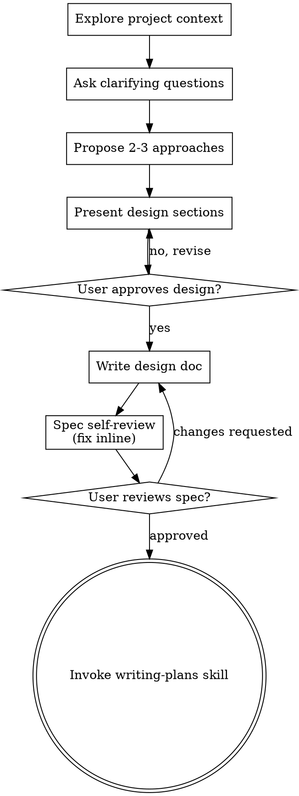

---
type: input
input_kind: ai-conversation
source_app: claude-code
source_os: windows
title: "Plan personal productivity automations for next month"
started_at: 2026-07-28T14:37:06
ended_at: 2026-07-29T10:38:51
exported_at: 2026-07-31T21:03:31
duration_minutes: 1201.8
project: Jarvis
cwd: 'D:\Users\_Anant\10_Areas\Documents\Jarvis'
session_id: e9a65eb4-cb7d-4ebc-9417-54e8c35fee36
status: raw
turn_count: 8
tools_used:
  Agent: 1
  Glob: 1
  Grep: 4
  Read: 5
  Skill: 1
tokens:
  input: 3075
  output: 36491
  cache_creation: 467583
  cache_read: 1401686
  total: 1908835
cost_usd: 2.521729
model:
  - "claude-sonnet-5"
files_touched:
  - "D:\\Users\\_Anant\\10_Areas\\Documents\\Jarvis\\.obsidian\\community-plugins.json"
  - "D:\\Users\\_Anant\\10_Areas\\Documents\\Jarvis\\10_Areas\\Life\\Plans\\Summer\\Final Month Plan (Jul 28 - Sep 1).md"
  - "D:\\Users\\_Anant\\10_Areas\\Documents\\Jarvis\\60_Claude\\07_AI_Information\\AI_CONTEXT.md"
  - "D:\\Users\\_Anant\\10_Areas\\Documents\\Jarvis\\60_Claude\\20_Distilled_Notes\\Ingestion Pipeline Audit — Clippings, Summaries & Implementation (2026-07-27).md"
  - "D:\\Users\\_Anant\\10_Areas\\Documents\\Jarvis\\60_Claude\\20_Distilled_Notes\\Sources - Plan\\00_Execution.md"
tags:
  - input
  - ai-conversation
  - claude-code
  - windows
---

# Plan personal productivity automations for next month

## You

I am aiming to develop a few automations for daily use. I have listed this previously in the vault and there might be plenty notes regarding automation. A few notes that I could find were: `60_Claude/20_Distilled_Notes/Sources - Plan/Web Ingestion Implementation`, `60_Claude/20_Distilled_Notes/Sources - Plan/00_Execution`, `10_Areas/AI` (not exactly automations). There must be many more files that talk about automations that I wish to build. Either ways, we need to make the existing thinking to reality in the next month. Here are a few automations that comes to my head when thinking about making my life easier with technology. Reminders and todoist interconnected with google calendar - reflected inside obsidian (the plan). Gmail - outreaching, networking and newletters management with obsidian. Automate processes inside jarvis and the plan with other tools I use frequently. Youtube, reels, sources that need a transcript to be described - need a way that when shared to something it generates a note inside obsidian as a video clipping. These are just osme automations that came to my head that need to be done. We need more automations

## Claude

Given this is exploratory/creative planning work (new automations, not yet scoped), I'll invoke the brainstorming skill first before diving into vault research or planning.

### Tool Calls

- `Skill` -- `{"skill":"superpowers:brainstorming"}`

## You

Base directory for this skill: C:\Users\Anant Gupta\.claude\plugins\cache\claude-plugins-official\superpowers\6.2.0\skills\brainstorming

# Brainstorming Ideas Into Designs

Help turn ideas into fully formed designs and specs through natural collaborative dialogue.

Start by understanding the current project context, then ask questions one at a time to refine the idea. Once you understand what you're building, present the design and get user approval.

<HARD-GATE>
Do NOT invoke any implementation skill, write any code, scaffold any project, or take any implementation action until you have presented a design and the user has approved it. This applies to EVERY project regardless of perceived simplicity.
</HARD-GATE>

## Anti-Pattern: "This Is Too Simple To Need A Design"

Every project goes through this process. A todo list, a single-function utility, a config change — all of them. "Simple" projects are where unexamined assumptions cause the most wasted work. The design can be short (a few sentences for truly simple projects), but you MUST present it and get approval.

## Checklist

You MUST create a task for each of these items and complete them in order:

1. **Explore project context** — check files, docs, recent commits
2. **Offer the visual companion just-in-time** — NOT upfront. The first time a question would genuinely be clearer shown than described, offer it then (its own message); on approval its browser tab opens for you. If no visual question ever arises, never offer it. See the Visual Companion section below.
3. **Ask clarifying questions** — one at a time, understand purpose/constraints/success criteria
4. **Propose 2-3 approaches** — with trade-offs and your recommendation
5. **Present design** — in sections scaled to their complexity, get user approval after each section
6. **Write design doc** — save to `docs/superpowers/specs/YYYY-MM-DD-<topic>-design.md` and commit
7. **Spec self-review** — quick inline check for placeholders, contradictions, ambiguity, scope (see below)
8. **User reviews written spec** — ask user to review the spec file before proceeding
9. **Transition to implementation** — invoke writing-plans skill to create implementation plan

## Process Flow

**The terminal state is invoking writing-plans.** Do NOT invoke frontend-design, mcp-builder, or any other implementation skill. The ONLY skill you invoke after brainstorming is writing-plans.

## The Process

**Understanding the idea:**

- Check out the current project state first (files, docs, recent commits)
- Before asking detailed questions, assess scope: if the request describes multiple independent subsystems (e.g., "build a platform with chat, file storage, billing, and analytics"), flag this immediately. Don't spend questions refining details of a project that needs to be decomposed first.
- If the project is too large for a single spec, help the user decompose into sub-projects: what are the independent pieces, how do they relate, what order should they be built? Then brainstorm the first sub-project through the normal design flow. Each sub-project gets its own spec → plan → implementation cycle.
- For appropriately-scoped projects, ask questions one at a time to refine the idea
- Prefer multiple choice questions when possible, but open-ended is fine too
- Only one question per message - if a topic needs more exploration, break it into multiple questions
- Focus on understanding: purpose, constraints, success criteria

**Exploring approaches:**

- Propose 2-3 different approaches with trade-offs
- Present options conversationally with your recommendation and reasoning
- Lead with your recommended option and explain why
- YAGNI ruthlessly - remove unnecessary features from every approach and design

**Presenting the design:**

- Once you believe you understand what you're building, present the design
- Scale each section to its complexity: a few sentences if straightforward, up to 200-300 words if nuanced
- Ask after each section whether it looks right so far
- Cover: architecture, components, data flow, error handling, testing
- Be ready to go back and clarify if something doesn't make sense

**Design for isolation and clarity:**

- Break the system into smaller units that each have one clear purpose, communicate through well-defined interfaces, and can be understood and tested independently
- For each unit, you should be able to answer: what does it do, how do you use it, and what does it depend on?
- Can someone understand what a unit does without reading its internals? Can you change the internals without breaking consumers? If not, the boundaries need work.
- Smaller, well-bounded units are also easier for you to work with - you reason better about code you can hold in context at once, and your edits are more reliable when files are focused. When a file grows large, that's often a signal that it's doing too much.

**Working in existing codebases:**

- Explore the current structure before proposing changes. Follow existing patterns.
- Where existing code has problems that affect the work (e.g., a file that's grown too large, unclear boundaries, tangled responsibilities), include targeted improvements as part of the design - the way a good developer improves code they're working in.
- Don't propose unrelated refactoring. Stay focused on what serves the current goal.

## After the Design

**Documentation:**

- Write the validated design (spec) to `docs/superpowers/specs/YYYY-MM-DD-<topic>-design.md`
  - (User preferences for spec location override this default)
- Use elements-of-style:writing-clearly-and-concisely skill if available
- Commit the design document to git

**Spec Self-Review:**
After writing the spec document, look at it with fresh eyes:

1. **Placeholder scan:** Any "TBD", "TODO", incomplete sections, or vague requirements? Fix them.
2. **Internal consistency:** Do any sections contradict each other? Does the architecture match the feature descriptions?
3. **Scope check:** Is this focused enough for a single implementation plan, or does it need decomposition?
4. **Ambiguity check:** Could any requirement be interpreted two different ways? If so, pick one and make it explicit.

Fix any issues inline. No need to re-review — just fix and move on.

**User Review Gate:**
After the spec review loop passes, ask the user to review the written spec before proceeding:

> "Spec written and committed to `<path>`. Please review it and let me know if you want to make any changes before we start writing out the implementation plan."

Wait for the user's response. If they request changes, make them and re-run the spec review loop. Only proceed once the user approves.

**Implementation:**

- Invoke the writing-plans skill to create a detailed implementation plan
- Do NOT invoke any other skill. writing-plans is the next step.

## Visual Companion

A browser-based companion for showing mockups, diagrams, and visual options during brainstorming. Available as a tool — not a mode. Accepting the companion means it's available for questions that benefit from visual treatment; it does NOT mean every question goes through the browser.

**Offering the companion (just-in-time):** Do NOT offer it upfront. Wait until a question would genuinely be clearer shown than told — a real mockup / layout / diagram question, not merely a UI *topic*. The first time that happens, offer it then, as its own message:
> "This next part might be easier if I show you — I can put together mockups, diagrams, and comparisons in a browser tab as we go. It's still new and can be token-intensive. Want me to? I'll open it for you."

**This offer MUST be its own message.** Only the offer — no clarifying question, summary, or other content. Wait for the user's response. If they accept, start the server with `--open` so their browser opens to the first screen automatically. If they decline, continue text-only and don't offer again unless they raise it.

**Per-question decision:** Even after the user accepts, decide FOR EACH QUESTION whether to use the browser or the terminal. The test: **would the user understand this better by seeing it than reading it?**

- **Use the browser** for content that IS visual — mockups, wireframes, layout comparisons, architecture diagrams, side-by-side visual designs
- **Use the terminal** for content that is text — requirements questions, conceptual choices, tradeoff lists, A/B/C/D text options, scope decisions

A question about a UI topic is not automatically a visual question. "What does personality mean in this context?" is a conceptual question — use the terminal. "Which wizard layout works better?" is a visual question — use the browser.

If they agree to the companion, read the detailed guide before proceeding:
`skills/brainstorming/visual-companion.md`

## Claude

### Tool Calls

- `Grep` -- pattern `automation` path `D:\Users\_Anant\10_Areas\Documents\Jarvis`
- `Read` -- `D:\Users\_Anant\10_Areas\Documents\Jarvis\60_Claude\07_AI_Information\AI_CONTEXT.md`
- `Agent` -- `{"description":"Survey existing automation plans in vault","subagent_type":"Explore","run_in_background":false,"prompt":"I\u0027m helping the user brainstorm/design a set of personal-life automations to build over the next month, inside their Obsidian vault \"Jarvis\" (repo root: D:\\Users\\_Anant\\10_Areas\\Documents\\Jarvis). Before asking design questions, I need a survey of what automation thinking ALREADY EXISTS in the vault, so I don\u0027t re-litigate decisions already made or ignore existing infrastructure.\n\nThe user specifically wants automations for:\n1. Reminders + Todoist + Google Calendar, reflected inside Obsidian and \"The Plan\" (a separate related vault/system referenced elsewhere).\n2. Gmail — outreach/networking tracking and newsletter management surfaced in Obsidian.\n3. Cross-tool automation between Jarvis and \"The Plan\" and other frequently-used tools.\n4. A \"share to Obsidian\" pipeline: when the user shares a YouTube video / Instagram Reel / other source that needs a transcript, it should auto-generate a video-clipping note inside Obsidian.\n5. Any other automation ideas already logged as candidates.\n\nPlease read and summarize (don\u0027t just list filenames — extract actual content/decisions) from these known-relevant files:\n- `60_Claude/20_Distilled_Notes/Sources - Plan/00_Execution.md`\n- `60_Claude/20_Distilled_Notes/Sources - Plan/GitHub Ingestion Implementation.md`\n- `60_Claude/20_Distilled_Notes/Sources - Plan/PDF\u0027s Ingestion Implementation.md`\n- Anything else in `60_Claude/20_Distilled_Notes/Sources - Plan/` (list the dir first, read each file that looks automation-related, e.g. a \"Web Ingestion Implementation\" note)\n- `20_Progress/AI/Kiro/The Plan/specs/pkm-capability-engine/design.md`\n- `20_Progress/AI/Kiro/The Plan/specs/claude-code-ops-layer/requirements.md` (and design.md/tasks.md siblings if present)\n- `20_Progress/AI/Kiro/Jarvis/specs/pkm-capability-engine/design.md` and `claude-code-ops-layer/requirements.md` (note: parallel copies exist under both \"The Plan\" and \"Jarvis\" Kiro dirs — check if they\u0027re identical or diverged)\n- `10_Areas/AI/` — list contents, read anything that looks like automation/tooling notes (not just AI concepts)\n- `60_Claude/10_Source_Summaries/PDF Ingestion/Read/Outreach Automation Manual (PDF).md`\n- `30_Order/System/cursor-workflow/README.md`\n- `00_Dashboard.md` (root) — for current active automation projects\n- `60_Claude/07_AI_Information/Session Logs/log.md` — read the last ~40 entries / tail for any recent automation work or decisions\n\nAlso do a broader search: grep for terms like \"Todoist\", \"Google Calendar\", \"Gmail\", \"newsletter\", \"transcript\", \"clipping\", \"reels\", \"n8n\", \"Zapier\", \"webhook\", \"cron\", \"MCP server\" across the vault (excluding 50_Archive/ and node_modules-like dirs) to catch anything outside the files listed above — especially in `20_Progress/`, `10_Areas/`, and `60_Claude/`.\n\nReport back (this is research only — do not edit any files):\n- What automations are ALREADY decided/speced vs merely mentioned in passing\n- What infrastructure already exists (scripts, MCP servers, hooks, existing integrations) that\u0027s relevant — e.g. I already see MCP tools for Gmail and Google Calendar are connected, so check if any note discusses using those\n- Concrete gaps: which of the user\u0027s 4 automation ideas above have zero existing thinking, vs partial specs\n- Any naming/scope conflicts between \"Jarvis\" and \"The Plan\" Kiro specs worth flagging\n- Keep the report well-organized by automation area. Aim for under 700 words plus a short list of exact file paths worth me reading in full myself."}`
- `Grep` -- pattern `Final Month Plan` path `D:\Users\_Anant\10_Areas\Documents\Jarvis\10_Areas\Life\Plans\Summer`
- `Read` -- `D:\Users\_Anant\10_Areas\Documents\Jarvis\10_Areas\Life\Plans\Summer\Final Month Plan (Jul 28 - Sep 1).md`

## You

Continue from where you left off.

## Claude

No response requested.

## You

Finish the task at hand, find more automations across my vault listed and suggest me some more based on all the information gathered.

## Claude

Here's the full picture — what's already been thought through, what's a dead end, and what's actually new.

## What already exists (don't re-plan these)

**Outreach (Gmail, career)** — Fully decided, "no new build required." One Contact note per company, draft from `Contacts/Mimic.md`, manual send only. The only transferable piece from the Outreach Automation Manual PDF is better contact-discovery (Apollo/Hunter-style), not automation of the send/decide step. `60_Claude/20_Distilled_Notes/Sources - Plan/00_Execution.md` (OUTREACH TRACK).

**Reminders/Todoist/Calendar** — Not speced, just role-assigned: Google Calendar = time container ("when"), the daily note = task truth ("what"), Todoist/Reminders = optional non-canonical mirrors. A pointer to a "wishlist" section in `Final Month Plan (Jul 28 - Sep 1).md` is dead — that section doesn't exist. Real substance: **five `CronCreate` scheduled routines are already fully designed** (morning `/startday`, midday internship-dossier cap check, evening `/closeday`, `Applying/` staleness check, Sunday `/weekly-review`) but not provisioned, blocked only on your go-ahead for unattended Pro-plan usage. This is the single highest-leverage item in the whole vault: zero design work left, pure yes/no.

**Cross-vault (Jarvis ↔ The Plan)** — Architecture is decided and the hard part is done: `The Plan/60_Jarvis/Promotion Criteria.md` already classified 94 Jarvis notes into 40 KEEP / 20 REVIEW / 34 SKIP. **That queue has never fired a single note.** The-plan/the-plan-fs MCP servers were also observed stuck "connecting…" in a 2026-07-21 session — check that's resolved before building anything on top.

**Video/transcript clipping** — Confirmed dead track: `05_Clippings/Videos/` and `10_Source_Summaries/Video Ingestion/` are empty, `Video Ingestion Implementation.md` is zero bytes. What already exists and works manually: `yt-dlp -x --audio-format mp3` → `faster-whisper` → paste into `/ingest-clipping`. There's also an unused Copilot prompt template (`60_Claude/00_Inbox/copilot/copilot-custom-prompts/Clip YouTube Transcript.md`) with the right note shape (summary, key takeaways, mermaid mindmap, timestamped quotes) sitting uncatalogued.

**Newsletters** — Genuine, untouched gap. Zero mentions anywhere in the vault.

## New findings that change the shape of your ask

1. **`obsidian-local-rest-api` is already installed and enabled** (checked `.obsidian/community-plugins.json` directly). This is the actual missing piece for "share to Obsidian from my phone" — a REST endpoint into the vault already exists. Combined with iOS/Android Shortcuts (share sheet → HTTP POST), this is a much shorter path to your video-clipping idea than building a new ingestion service.

2. **The "Content" play is the one real gap in an otherwise-covered framework.** A distilled note (`Hermes Agent — Trading & Alert System`) generalizes a 4-play framework — Sales, Content, Research, Monitoring — and 00_Execution.md confirms three of four are already running under different names: `internship-research-loop` = Research + Monitoring, the Contacts/Mimic.md system = Sales. **Content has no equivalent anywhere.** Your newsletter-digest idea is exactly that missing play — worth framing it that way rather than as a one-off Gmail script.

3. **`internship-research-loop`'s Step 1 already proves the execution pattern** you'd want for calendar/Gmail/newsletter automations: hourly GitHub Actions hitting APIs directly, no live agent session required. That's a cheaper, more reliable mechanism than CronCreate-triggered Claude Code sessions for anything that's pure data-fetch-and-file (calendar pull, newsletter triage) — save the agent-driven CronCreate routines for things that need judgment (startday/closeday narrative, weekly review).

4. **The AI Conversation Archive pipeline** (global SessionEnd hook + `/export-ai-session`) is a working precedent for "automatic raw capture now, distillation on demand later" — the right template for both the newsletter digest and the video clipping pipeline, instead of trying to do capture-and-synthesize in one shot.

5. **A small, already-scoped hygiene automation**: `40_Resources/CS/Links` and `40_Resources/Random` are bookmark dumps that silently drift out of sync with what's already been ingested — the fix (auto-append `→ [[Summary Note]]` once a link is summarized) is fully specified in 00_Execution.md, just not built.

## Suggested automations (beyond your four), ranked by leverage

| # | Automation | Why | Effort |
|---|---|---|---|
| 1 | **Say yes/no to the 5 CronCreate routines** | Fully designed already, unblocks daily-floor tracking that "never ran" per Final Month Plan's own Implementation Status table | Decision, not build |
| 2 | **Fire the existing Jarvis↔The Plan promotion queue** | Classification work is done; this is a dispatch loop, not a design problem | Small |
| 3 | **Newsletter digest via Gmail MCP** (the missing "Content" play) | Search bulk-sender/newsletter threads weekly → label → synthesize into one Obsidian digest note | Medium |
| 4 | **Phone share-sheet → Obsidian, via `obsidian-local-rest-api` + Shortcuts** | Infrastructure already installed; closes your video/Reels clipping ask more directly than a new pipeline | Medium |
| 5 | **`/clip-video` skill wrapping the existing manual pipeline** | yt-dlp → whisper → the already-written Copilot template → `/ingest-clipping`, one command instead of four manual steps | Small–medium |
| 6 | **Calendar pull into `/startday`** | Google Calendar MCP is live; inject today's events into the daily note instead of just assigning Calendar a role in prose | Small |
| 7 | **One-way Todoist → daily-note pull only** (not bidirectional) | Respects the existing non-canonical-mirror decision; bidirectional sync is exactly the trap that decision was made to avoid | Small |
| 8 | **Link-file `→ [[Summary]]` marker pass** | Fully specified, closes a small but real drift source | Small |

Given the Final Month Plan's actual week structure (W0 close-out now, W1 starts Aug 1), items 1, 2, and 8 are close-out-sized and could land in W0 this week. 3–7 are real builds and would want to be sequenced against whichever weekly flagship isn't already claimed (TradingView/CausalOps in W1, Arc in W2).

Want me to turn any of these into an actual design (starting with whichever you want to build first), or file this synthesis as a note in `60_Claude/20_Distilled_Notes/Sources - Plan/` first?

### Tool Calls

- `Grep` -- pattern `Zapier|n8n|IFTTT|Shortcuts app|webhook|RSS feed|Notion|Readwise|Pocket|Instapaper|Whisper|yt-dlp|Apple Reminders|Google Keep|Raycast|Hazel|AppleScript` path `D:\Users\_Anant\10_Areas\Documents\Jarvis`
- `Glob` -- pattern `10_Areas/AI/**` path ``
- `Grep` -- pattern `CronCreate|ScheduleWakeup|scheduled routine|cron job` path `D:\Users\_Anant\10_Areas\Documents\Jarvis`
- `Read` -- `D:\Users\_Anant\10_Areas\Documents\Jarvis\60_Claude\20_Distilled_Notes\Sources - Plan\00_Execution.md`
- `Read` -- `D:\Users\_Anant\10_Areas\Documents\Jarvis\60_Claude\20_Distilled_Notes\Ingestion Pipeline Audit — Clippings, Summaries & Implementation (2026-07-27).md`
- `Read` -- `D:\Users\_Anant\10_Areas\Documents\Jarvis\.obsidian\community-plugins.json`

## Actions Taken

**Files created:**
_None_

**Files modified:**
_None_

**Files deleted (heuristic, from Bash commands):**
_None detected_

**Commands run:**
_None_

