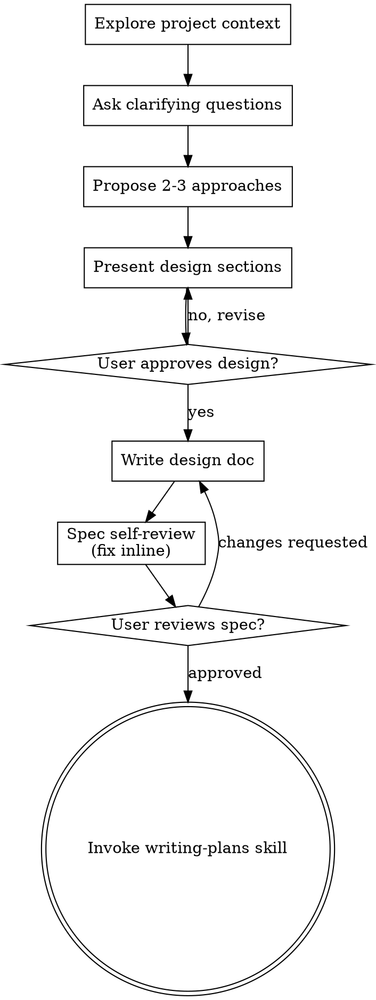

---
type: input
input_kind: ai-conversation
source_app: claude-code
source_os: windows
title: "Restructure mentorship program with skills and standards"
started_at: 2026-08-07T19:06:17
ended_at: 2026-08-08T13:42:46
exported_at: 2026-08-12T15:00:02
duration_minutes: 1116.5
project: Jarvis
cwd: 'D:\Users\_Anant\10_Areas\Documents\Jarvis'
session_id: 7a78e3f8-b5bc-4e26-977e-ebff83ed2d74
status: raw
turn_count: 8
tools_used:
  AskUserQuestion: 10
  Bash: 1
  Edit: 7
  Glob: 17
  Grep: 1
  Read: 30
  Skill: 1
  TaskCreate: 5
  TaskUpdate: 10
  ToolSearch: 1
  Write: 15
tokens:
  input: 85723
  output: 281283
  cache_creation: 1156948
  cache_read: 20624422
  total: 22148376
cost_usd: 11.736952
model:
  - "claude-sonnet-5"
files_touched:
  - "C:\\Users\\Anant Gupta\\.claude\\projects\\D--Users--Anant-10-Areas-Documents-Jarvis\\memory\\feedback_vault_note_writing.md"
  - "D:\\Users\\_Anant\\10_Areas\\Documents\\Jarvis\\.claude\\commands\\distill-note.md"
  - "D:\\Users\\_Anant\\10_Areas\\Documents\\Jarvis\\.claude\\commands\\note-to-actions.md"
  - "D:\\Users\\_Anant\\10_Areas\\Documents\\Jarvis\\.claude\\commands\\transcript-to-brief.md"
  - "D:\\Users\\_Anant\\10_Areas\\Documents\\Jarvis\\.claude\\skills\\distill-note.md"
  - "D:\\Users\\_Anant\\10_Areas\\Documents\\Jarvis\\.claude\\skills\\note-to-actions.md"
  - "D:\\Users\\_Anant\\10_Areas\\Documents\\Jarvis\\.claude\\skills\\trace-topic.md"
  - "D:\\Users\\_Anant\\10_Areas\\Documents\\Jarvis\\.claude\\skills\\transcript-to-brief.md"
  - "D:\\Users\\_Anant\\10_Areas\\Documents\\Jarvis\\10_Areas\\Summer Grind.md"
  - "D:\\Users\\_Anant\\10_Areas\\Documents\\Jarvis\\20_Progress\\AI\\Claude Code\\MOC.md"
  - "D:\\Users\\_Anant\\10_Areas\\Documents\\Jarvis\\20_Progress\\Mentorship Program\\adx\\adx.md"
  - "D:\\Users\\_Anant\\10_Areas\\Documents\\Jarvis\\20_Progress\\Mentorship Program\\Meetings\\Briefs\\Project Briefings - 2026-07-13.md"
  - "D:\\Users\\_Anant\\10_Areas\\Documents\\Jarvis\\20_Progress\\Mentorship Program\\Meetings\\Mentor Meeting - One-Pager.md"
  - "D:\\Users\\_Anant\\10_Areas\\Documents\\Jarvis\\20_Progress\\Mentorship Program\\Meetings\\Mentor Meeting Playbook.md"
  - "D:\\Users\\_Anant\\10_Areas\\Documents\\Jarvis\\20_Progress\\Mentorship Program\\Meetings\\Transcripts\\Mentor Meeting Transcript.md"
  - "D:\\Users\\_Anant\\10_Areas\\Documents\\Jarvis\\20_Progress\\Mentorship Program\\Mentor Details.md"
  - "D:\\Users\\_Anant\\10_Areas\\Documents\\Jarvis\\20_Progress\\Mentorship Program\\Mentorship Board.md"
  - "D:\\Users\\_Anant\\10_Areas\\Documents\\Jarvis\\20_Progress\\Mentorship Program\\Plans\\Fall 2026 — Detailed Expectations.md"
  - "D:\\Users\\_Anant\\10_Areas\\Documents\\Jarvis\\20_Progress\\Mentorship Program\\Plans\\Mentor Meeting - Hackathons, Summer, and Networking.md"
  - "D:\\Users\\_Anant\\10_Areas\\Documents\\Jarvis\\20_Progress\\Mentorship Program\\Plans\\Plan.md"
  - "D:\\Users\\_Anant\\10_Areas\\Documents\\Jarvis\\30_Order\\Standards\\Action Standard.md"
  - "D:\\Users\\_Anant\\10_Areas\\Documents\\Jarvis\\30_Order\\Standards\\Brief Standard.md"
  - "D:\\Users\\_Anant\\10_Areas\\Documents\\Jarvis\\30_Order\\Standards\\MOC Standard.md"
  - "D:\\Users\\_Anant\\10_Areas\\Documents\\Jarvis\\30_Order\\Standards\\Project Standard.md"
  - "D:\\Users\\_Anant\\10_Areas\\Documents\\Jarvis\\30_Order\\Standards\\Source Summary Standard.md"
  - "D:\\Users\\_Anant\\10_Areas\\Documents\\Jarvis\\30_Order\\Templates\\Capability\\Action Template.md"
  - "D:\\Users\\_Anant\\10_Areas\\Documents\\Jarvis\\30_Order\\Templates\\Capability\\Brief Template.md"
  - "D:\\Users\\_Anant\\10_Areas\\Documents\\Jarvis\\30_Order\\Templates\\Capability\\Clipping Distill Template.md"
  - "D:\\Users\\_Anant\\10_Areas\\Documents\\Jarvis\\30_Order\\Templates\\Capability\\MOC Template.md"
  - "D:\\Users\\_Anant\\10_Areas\\Documents\\Jarvis\\30_Order\\Templates\\Frontmatter\\For Evergreen.md"
  - "D:\\Users\\_Anant\\10_Areas\\Documents\\Jarvis\\30_Order\\Templates\\Frontmatter\\For Progress.md"
  - "D:\\Users\\_Anant\\10_Areas\\Documents\\Jarvis\\30_Order\\Templates\\Frontmatter\\For Transcript.md"
  - "D:\\Users\\_Anant\\10_Areas\\Documents\\Jarvis\\30_Order\\Templates\\Metadata\\For Progress.md"
  - "D:\\Users\\_Anant\\10_Areas\\Documents\\Jarvis\\30_Order\\Templates\\MOC.md"
  - "D:\\Users\\_Anant\\10_Areas\\Documents\\Jarvis\\30_Order\\Workflows\\00_Workflows Index.md"
  - "D:\\Users\\_Anant\\10_Areas\\Documents\\Jarvis\\30_Order\\Workflows\\Brief to Action.md"
  - "D:\\Users\\_Anant\\10_Areas\\Documents\\Jarvis\\30_Order\\Workflows\\Brief to Progress.md"
  - "D:\\Users\\_Anant\\10_Areas\\Documents\\Jarvis\\30_Order\\Workflows\\Capture to Summary.md"
  - "D:\\Users\\_Anant\\10_Areas\\Documents\\Jarvis\\30_Order\\Workflows\\Conversation Capture.md"
  - "D:\\Users\\_Anant\\10_Areas\\Documents\\Jarvis\\30_Order\\Workflows\\Transcript to Brief.md"
  - "D:\\Users\\_Anant\\10_Areas\\Documents\\Jarvis\\60_Claude\\07_AI_Information\\Jarvis Writing and Formatting.md"
  - "D:\\Users\\_Anant\\10_Areas\\Documents\\Jarvis\\60_Claude\\07_AI_Information\\Session Logs\\log.md"
  - "D:\\Users\\_Anant\\10_Areas\\Documents\\Jarvis\\AGENTS.md"
  - "D:\\Users\\_Anant\\10_Areas\\Documents\\Jarvis\\CLAUDE.md"
tags:
  - input
  - ai-conversation
  - claude-code
  - windows
---

# Restructure mentorship program with skills and standards

## You

`D:\Users\_Anant\10_Areas\Documents\Jarvis\20_Progress\Mentorship Program`, `D:\Users\_Anant\10_Areas\Documents\Jarvis\20_Progress\Mentorship Program\Meetings`, `D:\Users\_Anant\10_Areas\Documents\Jarvis\20_Progress\Mentorship Program\Plans`, `D:\Users\_Anant\10_Areas\Documents\Jarvis\20_Progress\Mentorship Program\Mentorship Board.md`, `D:\Users\_Anant\10_Areas\Documents\Jarvis\10_Areas\Life\Plans\Summer`, `D:\Users\_Anant\10_Areas\Documents\Jarvis\10_Areas\Summer Grind.md`, `D:\Users\_Anant\10_Areas\Documents\Jarvis\10_Areas\Life\Enumerate` & `D:\Users\_Anant\10_Areas\Documents\Jarvis\10_Areas\Life\Habits`. A lot of directories and file have been mentioned to you - live inside jarvis. We are working on completely modifying and improving our current mentorship program folder. There are several steps/demands to this modification. Firstly, the `D:\Users\_Anant\10_Areas\Documents\Jarvis\20_Progress\Mentorship Program\Meetings` has been modifed with 3 new folders: Action, Briefs and Transcripts. The meeting gets recorded and the transcript is then pasted into jarvis. We analyze the entire meeting with a skill for transcripts to turned to a brief - a skill that turns any sort of information into a very good note by asking questions about the transcript and meeting. Asks for content if necessary. This is a skill that is invoked for any sort of communication transcript that has been pasted into jarvis. This skill also works for meeting transcripts and youtube transcripts. Any sort of transcript that has been provided whether I am an active part or not gets turned into this briefing upon the skill invocation. After the brief has been created, we have tons of things required to accomplish or finish. We need another skill for this purpose. This is a much more broaded purpose skill - turns any note that is written down into actionable steps based on the interlinks provided in them. This just does not simply turn one brief into another brief - it understands what was in the transcript, what was described in the brief and asks questions regarding the steps that need to be taken to complete each and every thing that was discussed in the meeting. This is an exceptionally hard task to do because there are going to various interlinks in this file. On almost each snetence should be an interlink, there are less words in this file. Just statements, stating what needs to be covered based on the note written and questions answered upon the skill invoke. These two skills are general skills that could be used for any other purpose, not just meetings. Now that we have the claude setup cleared out of the way for the directory specified. Let's talk about: `D:\Users\_Anant\10_Areas\Documents\Jarvis\20_Progress\Mentorship Program\Plans`. This is a directory that is going to be interlinked to all the plans and sumer related files that were mentioned. We relate all these plans to the main goal listed out for a periodic time. We need to upgrade as time progresses but that does not mean the previous plan has failed. It was just never written down or executed properly, there is no such thing as a failure in the plans we make across anything in jarvis. We retry over and over again. So, interlink to the main plans that will be listed for that specific period of time or previosuly. But all the main things derived would be from that main file. What needs to be listed down even more clearly over here is the new: ` D:\Users\_Anant\10_Areas\Documents\Jarvis\20_Progress\Mentorship Program\Plans\Plan.md` ## Fall 2026 - header, we write down in short what exactly are we expecting from ahnaf this fall. We derive these short listings based on a very detailed note(going to create) inside: `D:\Users\_Anant\10_Areas\Documents\Jarvis\20_Progress\Mentorship Program\Plans`. We plan and lay out each and every single expectation from our mentor for the following weeks. We previously discussed that the meetings would be more frequently, we take action on it by planning each and every step out here. We have only been talking about summer plans so far but fall is upon us in less than a month now. We need to further analyze and take action regarding each and every thing across jarvis. We first focus on the mentorship program that we currently have. I will also enroll for another mentor this fall which will provide a different purpose (future plan). `D:\Users\_Anant\10_Areas\Documents\Jarvis\20_Progress\Mentorship Program\Mentorship Board.md` - moc file is thin and with absolute no content except dataview entries. I do not want the entire file to be dataview entries. This should be an actual moc file, the standard for the moc files across my vault are not being defined. So, I created a MOC standard doc: `D:\Users\_Anant\10_Areas\Documents\Jarvis\30_Order\Standards\MOC Standard.md`. This standard is dervied from for evergreen frontmatter template. We need to establish the standards for this specific type of file that we keep on creating. This is a self improving file as time progresses and changes are made in the folder. This is not simply a dataview entry file (dataview boards are created at the most bottom of each moc file). We write content in it with interlinks to the main files of the folder, we write content in a manner that is short and direct. Gives extreme clarity regarding the folder and notes created in it. That's what a MOC is. Write down the standard for it, create the skills mentioned and implement the plans folder things that were talked about. We have a lot to do in this folder, let's make sure that we do it systematically and correctly. Whenever in doubt, ask further questions. Do not assume anything and do not overdo the task. Stick to what was mentioned, review each and every folder mentioned and notes in it in detail. Let's not miss anything and make sure that we have a rigid workflow for this folder. With everything completely wired perfectly. Just a skill away or reading the moc or plan. We need content to be our most golden part of this project. Do this task correctly.

## Claude

### Tool Calls

- `Skill` -- `{"skill":"superpowers:brainstorming"}`

## You

Base directory for this skill: C:\Users\Anant Gupta\.claude\plugins\cache\claude-plugins-official\superpowers\6.2.0\skills\brainstorming

# Brainstorming Ideas Into Designs

Help turn ideas into fully formed designs and specs through natural collaborative dialogue.

Start by understanding the current project context, then ask questions one at a time to refine the idea. Once you understand what you're building, present the design and get user approval.

<HARD-GATE>
Do NOT invoke any implementation skill, write any code, scaffold any project, or take any implementation action until you have presented a design and the user has approved it. This applies to EVERY project regardless of perceived simplicity.
</HARD-GATE>

## Anti-Pattern: "This Is Too Simple To Need A Design"

Every project goes through this process. A todo list, a single-function utility, a config change — all of them. "Simple" projects are where unexamined assumptions cause the most wasted work. The design can be short (a few sentences for truly simple projects), but you MUST present it and get approval.

## Checklist

You MUST create a task for each of these items and complete them in order:

1. **Explore project context** — check files, docs, recent commits
2. **Offer the visual companion just-in-time** — NOT upfront. The first time a question would genuinely be clearer shown than described, offer it then (its own message); on approval its browser tab opens for you. If no visual question ever arises, never offer it. See the Visual Companion section below.
3. **Ask clarifying questions** — one at a time, understand purpose/constraints/success criteria
4. **Propose 2-3 approaches** — with trade-offs and your recommendation
5. **Present design** — in sections scaled to their complexity, get user approval after each section
6. **Write design doc** — save to `docs/superpowers/specs/YYYY-MM-DD-<topic>-design.md` and commit
7. **Spec self-review** — quick inline check for placeholders, contradictions, ambiguity, scope (see below)
8. **User reviews written spec** — ask user to review the spec file before proceeding
9. **Transition to implementation** — invoke writing-plans skill to create implementation plan

## Process Flow



**The terminal state is invoking writing-plans.** Do NOT invoke frontend-design, mcp-builder, or any other implementation skill. The ONLY skill you invoke after brainstorming is writing-plans.

## The Process

**Understanding the idea:**

- Check out the current project state first (files, docs, recent commits)
- Before asking detailed questions, assess scope: if the request describes multiple independent subsystems (e.g., "build a platform with chat, file storage, billing, and analytics"), flag this immediately. Don't spend questions refining details of a project that needs to be decomposed first.
- If the project is too large for a single spec, help the user decompose into sub-projects: what are the independent pieces, how do they relate, what order should they be built? Then brainstorm the first sub-project through the normal design flow. Each sub-project gets its own spec → plan → implementation cycle.
- For appropriately-scoped projects, ask questions one at a time to refine the idea
- Prefer multiple choice questions when possible, but open-ended is fine too
- Only one question per message - if a topic needs more exploration, break it into multiple questions
- Focus on understanding: purpose, constraints, success criteria

**Exploring approaches:**

- Propose 2-3 different approaches with trade-offs
- Present options conversationally with your recommendation and reasoning
- Lead with your recommended option and explain why
- YAGNI ruthlessly - remove unnecessary features from every approach and design

**Presenting the design:**

- Once you believe you understand what you're building, present the design
- Scale each section to its complexity: a few sentences if straightforward, up to 200-300 words if nuanced
- Ask after each section whether it looks right so far
- Cover: architecture, components, data flow, error handling, testing
- Be ready to go back and clarify if something doesn't make sense

**Design for isolation and clarity:**

- Break the system into smaller units that each have one clear purpose, communicate through well-defined interfaces, and can be understood and tested independently
- For each unit, you should be able to answer: what does it do, how do you use it, and what does it depend on?
- Can someone understand what a unit does without reading its internals? Can you change the internals without breaking consumers? If not, the boundaries need work.
- Smaller, well-bounded units are also easier for you to work with - you reason better about code you can hold in context at once, and your edits are more reliable when files are focused. When a file grows large, that's often a signal that it's doing too much.

**Working in existing codebases:**

- Explore the current structure before proposing changes. Follow existing patterns.
- Where existing code has problems that affect the work (e.g., a file that's grown too large, unclear boundaries, tangled responsibilities), include targeted improvements as part of the design - the way a good developer improves code they're working in.
- Don't propose unrelated refactoring. Stay focused on what serves the current goal.

## After the Design

**Documentation:**

- Write the validated design (spec) to `docs/superpowers/specs/YYYY-MM-DD-<topic>-design.md`
  - (User preferences for spec location override this default)
- Use elements-of-style:writing-clearly-and-concisely skill if available
- Commit the design document to git

**Spec Self-Review:**
After writing the spec document, look at it with fresh eyes:

1. **Placeholder scan:** Any "TBD", "TODO", incomplete sections, or vague requirements? Fix them.
2. **Internal consistency:** Do any sections contradict each other? Does the architecture match the feature descriptions?
3. **Scope check:** Is this focused enough for a single implementation plan, or does it need decomposition?
4. **Ambiguity check:** Could any requirement be interpreted two different ways? If so, pick one and make it explicit.

Fix any issues inline. No need to re-review — just fix and move on.

**User Review Gate:**
After the spec review loop passes, ask the user to review the written spec before proceeding:

> "Spec written and committed to `<path>`. Please review it and let me know if you want to make any changes before we start writing out the implementation plan."

Wait for the user's response. If they request changes, make them and re-run the spec review loop. Only proceed once the user approves.

**Implementation:**

- Invoke the writing-plans skill to create a detailed implementation plan
- Do NOT invoke any other skill. writing-plans is the next step.

## Visual Companion

A browser-based companion for showing mockups, diagrams, and visual options during brainstorming. Available as a tool — not a mode. Accepting the companion means it's available for questions that benefit from visual treatment; it does NOT mean every question goes through the browser.

**Offering the companion (just-in-time):** Do NOT offer it upfront. Wait until a question would genuinely be clearer shown than told — a real mockup / layout / diagram question, not merely a UI *topic*. The first time that happens, offer it then, as its own message:
> "This next part might be easier if I show you — I can put together mockups, diagrams, and comparisons in a browser tab as we go. It's still new and can be token-intensive. Want me to? I'll open it for you."

**This offer MUST be its own message.** Only the offer — no clarifying question, summary, or other content. Wait for the user's response. If they accept, start the server with `--open` so their browser opens to the first screen automatically. If they decline, continue text-only and don't offer again unless they raise it.

**Per-question decision:** Even after the user accepts, decide FOR EACH QUESTION whether to use the browser or the terminal. The test: **would the user understand this better by seeing it than reading it?**

- **Use the browser** for content that IS visual — mockups, wireframes, layout comparisons, architecture diagrams, side-by-side visual designs
- **Use the terminal** for content that is text — requirements questions, conceptual choices, tradeoff lists, A/B/C/D text options, scope decisions

A question about a UI topic is not automatically a visual question. "What does personality mean in this context?" is a conceptual question — use the terminal. "Which wizard layout works better?" is a visual question — use the browser.

If they agree to the companion, read the detailed guide before proceeding:
`skills/brainstorming/visual-companion.md`


## Claude

I'll start by exploring the current state of the mentorship folder and related files before asking clarifying questions.

This is a large, coupled initiative — two new general-purpose skills, a MOC standard, a Plans-folder restructure, and a Fall 2026 detail note that Plan.md's summary derives from. I've read the current state of the Mentorship Program folder, the Summer plan files, the empty MOC Standard doc, and existing MOC examples in the vault (which currently use `type: index`, not `evergreen`).

Before designing, I want to lock the build order and a few structural decisions so I don't build things in the wrong sequence or invent content that should come from you.

Starting with the MOC Standard since the Board rewrite depends on it.

MOC Standard, both skills, and the Plans-folder scope are settled. Two more things I need before I can write the design doc — these need your actual input, not my assumptions:

**1. Fall cadence.** The Playbook currently locks meetings at bi-weekly (every other Monday, 30 min), revisit "at the start of September." You said meetings should get more frequent this fall and that we're "taking action on it by planning each and every step out here." What's the actual new cadence — weekly? Same bi-weekly slot but with a mid-cycle async check-in? Something else?

**2. Fall expectations content.** This is the part I can't invent — Plan.md's `## Fall 2026` short list and the new detailed note both need to reflect what you actually want from Ahnaf this fall, not a generic mentorship template. Given the 4 existing goals (Relationship, Project+build review, Startup fundamentals, Professional image) and the fact that adx contribution became the real center of gravity in the last meeting — what's actually different or more specific for fall? For example: is adx contribution still the primary thread, does professional-image work (resume/interview prep) become the priority now that recruiting season is live, is there a specific ask per meeting you want locked in, etc. Give me whatever's in your head, even roughly — I'll structure and interlink it, not fabricate substance.

### Tool Calls

- `Glob` -- pattern `20_Progress/Mentorship Program/**` path ``
- `Glob` -- pattern `10_Areas/Life/Plans/Summer/**` path ``
- `Read` -- `D:\Users\_Anant\10_Areas\Documents\Jarvis\20_Progress\Mentorship Program\Mentorship Board.md`
- `Read` -- `D:\Users\_Anant\10_Areas\Documents\Jarvis\10_Areas\Summer Grind.md`
- `Read` -- `D:\Users\_Anant\10_Areas\Documents\Jarvis\30_Order\Standards\MOC Standard.md`
- `Read` -- `D:\Users\_Anant\10_Areas\Documents\Jarvis\20_Progress\Mentorship Program\Plans\Plan.md`
- `Read` -- `D:\Users\_Anant\10_Areas\Documents\Jarvis\20_Progress\Mentorship Program\Meetings\Mentor Meeting Playbook.md`
- `Read` -- `D:\Users\_Anant\10_Areas\Documents\Jarvis\20_Progress\Mentorship Program\Meetings\Mentor Meeting - One-Pager.md`
- `Read` -- `D:\Users\_Anant\10_Areas\Documents\Jarvis\20_Progress\Mentorship Program\Mentor Details.md`
- `Read` -- `D:\Users\_Anant\10_Areas\Documents\Jarvis\20_Progress\Mentorship Program\Plans\Mentor Meeting - Hackathons, Summer, and Networking.md`
- `Glob` -- pattern `.claude/skills/*.md` path ``
- `Glob` -- pattern `**/*MOC*.md` path ``
- `Glob` -- pattern `20_Progress/Mentorship Program/Meetings/**` path ``
- `Read` -- `D:\Users\_Anant\10_Areas\Documents\Jarvis\20_Progress\Mentorship Program\Meetings\Briefs\Project Briefings - 2026-07-13.md`
- `Read` -- `D:\Users\_Anant\10_Areas\Documents\Jarvis\20_Progress\Mentorship Program\Meetings\Transcripts\Mentor Meeting Transcript.md`
- `Read` -- `D:\Users\_Anant\10_Areas\Documents\Jarvis\20_Progress\AI\Claude Code\MOC.md`
- `Read` -- `D:\Users\_Anant\10_Areas\Documents\Jarvis\.claude\skills\distill-note.md`
- `Glob` -- pattern `.claude/commands/*.md` path ``
- `Glob` -- pattern `10_Areas/Life/Habits/**` path ``
- `Glob` -- pattern `10_Areas/Life/Enumerate/**` path ``
- `AskUserQuestion` -- `{"questions":[{"question":"This is four coupled pieces: (A) MOC Standard doc, (B) two general-purpose skills (transcript→brief, note→actionable-steps), (C) Plans folder restructure + Fall 2026 detail note, (D) Mentorship Board rewritten as a real MOC. D depends on A. B feeds the Meetings/Action folder that C\u0027s Fall plan will eventually route through. What order do you want me to design and build these in?","header":"Build order","multiSelect":false,"options":[{"label":"A → B → C → D (Recommended)","description":"Standard first (it governs D), then the two skills (self-contained, unblock the meeting pipeline immediately), then Plans/Fall content, then rewrite the Board last using the finished standard."},{"label":"B → A → D → C","description":"Skills first since you called out the meeting pipeline as urgent, then standard, then Board, then Plans/Fall content last."},{"label":"One combined spec, build all four together","description":"Design all four in a single spec and implement in one pass rather than sequencing them as separate design/build cycles."}]}]}`
- `AskUserQuestion` -- `{"questions":[{"question":"Existing MOCs across the vault (Claude Code/MOC.md, Dossiers MOC.md, etc.) all use `type: index` in frontmatter, not `type: evergreen`. You said the MOC standard should be \"derived from evergreen frontmatter template.\" Do you mean: keep `type: index` as the distinguishing value but give it the same shape as evergreen (status, tags, notes, next), or actually change MOC type to `evergreen` with a sub-marker?","header":"MOC type field","multiSelect":false,"options":[{"label":"Keep type: index, evergreen-shaped fields (Recommended)","description":"type: index stays as-is (matches every existing MOC in the vault, zero migration). status/tags/notes/next fields follow the same maturity model as evergreen (seed→sprout→tree)."},{"label":"Switch to type: evergreen + tags: [moc]","description":"Change type to evergreen on all MOC files, distinguish them via a moc tag instead. Requires updating every existing MOC file\u0027s frontmatter to match."}]}]}`
- `AskUserQuestion` -- `{"questions":[{"question":"For the actual content structure above the dataview block — what sections should every MOC have? Looking at Claude Code/MOC.md as the closest existing example, it has: a purpose paragraph, then prose sections explaining sub-areas with inline links, then a status table, then dataview blocks at the bottom, then a Links section. Should the standard formalize something close to that shape?","header":"MOC sections","multiSelect":false,"options":[{"label":"Yes — Purpose → Map → Status → Dataview → Links (Recommended)","description":"1 What this folder/note-cluster is for (1-3 sentences). 2 A short-linked prose map of the key notes and how they relate (the actual content, not a list). 3 Optional status/table if the folder tracks live state. 4 Dataview queries at the very bottom. 5 A final Links section for anything not woven into the prose."},{"label":"Simpler: Purpose → Map → Dataview only","description":"Drop the separate Status table and Links section — fold status into the prose map, and put any extra links inline rather than in a trailing section. Fewer mandatory sections."}]}]}`
- `AskUserQuestion` -- `{"questions":[{"question":"You called this \"a self-improving file as time progresses and changes are made in the folder.\" What should actually trigger an update to a MOC\u0027s prose content?","header":"MOC upkeep trigger","multiSelect":false,"options":[{"label":"Whoever adds/changes a note updates the MOC in the same session (Recommended)","description":"Add to CLAUDE.md/MOC Standard: creating or substantially changing a note inside a MOC-governed folder means updating that folder\u0027s MOC prose map in the same edit, not deferring it. Keeps it current by construction."},{"label":"vault-curator sweeps periodically","description":"Leave per-session updates optional; rely on the vault-curator agent\u0027s periodic maintenance passes to catch MOCs that drifted out of sync with their folder\u0027s actual notes."},{"label":"Both — immediate update is the rule, curator is the safety net","description":"State the immediate-update rule as the standard, and note vault-curator\u0027s monthly/quarterly passes as the backstop for anything missed."}]},{"question":"Should the MOC Standard also formally retrofit the other existing MOCs (Claude Code/MOC.md, Dossiers MOC.md, etc.) right now, or just establish the standard and apply it to Mentorship Board only, leaving the others to get retrofitted opportunistically later?","header":"Retrofit scope","multiSelect":false,"options":[{"label":"Standard + Mentorship Board only, for now (Recommended)","description":"Write the standard, apply it to Mentorship Board.md now. Other MOCs get flagged as needing a retrofit pass but are not touched in this session — stays focused on what was actually asked."},{"label":"Retrofit all existing MOCs now too","description":"Expand scope to rewrite every MOC file found (Claude Code, Dossiers, Programs, Contacts, Removed Dossiers, UI MOC, Templates/MOC.md) to match the new standard in this same session."}]}]}`
- `AskUserQuestion` -- `{"questions":[{"question":"What should the two new general-purpose skills be called (as slash commands), matching the existing verb-first naming pattern (distill-note, trace-topic, ingest-clipping)?","header":"Skill names","multiSelect":false,"options":[{"label":"/transcript-to-brief and /note-to-actions (Recommended)","description":"Descriptive, matches what each skill actually converts (transcript→brief, any note→linked action steps). Clear at a glance which does what."},{"label":"/brief and /actionize","description":"Shorter, punchier command names. Less self-documenting but faster to type."}]},{"question":"Both skills are described as invoked manually (\"upon skill invocation\") rather than auto-triggering when you paste a transcript. Confirm: these are slash commands you run deliberately (/transcript-to-brief, /note-to-actions), not something that fires automatically when a transcript lands in a note?","header":"Invocation model","multiSelect":false,"options":[{"label":"Manual slash command only (Recommended)","description":"You paste the transcript into a note yourself, then explicitly run /transcript-to-brief pointing at it. No automatic detection — matches how every other skill in this vault works."},{"label":"Also auto-detect","description":"In addition to the manual command, Claude should proactively suggest running the skill whenever it notices a raw transcript-shaped paste in a session, without being asked."}]}]}`
- `AskUserQuestion` -- `{"questions":[{"question":"For /transcript-to-brief: what frontmatter `type` should the generated brief note use? The existing precedent (Project Briefings - 2026-07-13.md) used `type: project`, but CLAUDE.md\u0027s type guide lists `input` for raw captures/source summaries, which is conceptually closer to \"synthesis of a transcript.\"","header":"Brief note type","multiSelect":false,"options":[{"label":"type: input (Recommended)","description":"Matches CLAUDE.md\u0027s existing type guide — a brief is a distilled synthesis of a source (the transcript), same category as source summaries. No new type needed."},{"label":"type: project","description":"Matches the existing Mentorship brief precedent. Treats the brief as active work output rather than a source distillation."}]},{"question":"For /transcript-to-brief used OUTSIDE the Mentorship folder (its general-purpose case — e.g. a YouTube transcript pasted into a random note) — where should the output brief be saved by default?","header":"General brief location","multiSelect":false,"options":[{"label":"Same folder as the source transcript note (Recommended)","description":"Keeps the brief next to what it was generated from — no folder-routing logic needed, works the same whether it\u0027s a mentorship transcript or a random YouTube paste."},{"label":"Always ask the user where to save it","description":"The skill never assumes a destination — it always prompts for a save location as one of its questions, even when the source folder would be an obvious default."}]}]}`
- `AskUserQuestion` -- `{"questions":[{"question":"One conflict to resolve: inside Mentorship Program/Meetings/, transcripts live in Transcripts/ and you specifically created a sibling Briefs/ folder for the output. \"Same folder as source\" would put the brief in Transcripts/, not Briefs/. Should the skill special-case this: if the source note\u0027s parent folder has a sibling folder matching a brief-output naming pattern (Briefs/, Summaries/, etc.), save there instead of next to the source?","header":"Sibling-folder routing","multiSelect":false,"options":[{"label":"Yes — check for a sibling Briefs/-style folder first (Recommended)","description":"Skill looks one level up from the transcript\u0027s folder for a sibling folder whose name suggests brief/summary output (Briefs, Summaries, Debriefs). If found, save there. Otherwise fall back to same-folder-as-source."},{"label":"No — always same folder as source, move manually if needed","description":"Keep the rule simple and literal. For Mentorship meetings specifically, you\u0027d move the generated brief from Transcripts/ into Briefs/ yourself after the skill runs."}]}]}`
- `AskUserQuestion` -- `{"questions":[{"question":"You said the skill \"asks questions about the transcript and meeting\" and \"asks for content if necessary.\" Looking at the real Mentor Meeting Transcript.md, it\u0027s genuinely messy — unreliable speaker labels, garbled fragments (\"a mouthful\", cut-off sentences). What should the question-asking actually cover?","header":"Brief Q\u0026A scope","multiSelect":true,"options":[{"label":"Disambiguate unclear/garbled passages (Recommended)","description":"When the transcript has ambiguous speaker attribution or garbled text that changes meaning, ask you to clarify rather than guessing or silently dropping it."},{"label":"Ask what mattered most (Recommended)","description":"Ask which threads/topics in the transcript are actually worth capturing in depth vs mentioned in passing — avoids a brief that\u0027s bloated with low-value tangents."},{"label":"Ask for missing outcome/decisions","description":"If the transcript ends without a clear resolution on a topic (e.g. a cadence question, a next step), ask you directly what was actually decided, since it may not be in the text."},{"label":"Ask for external context not in the transcript","description":"If the conversation references something assumed-known (a project, a person, an acronym) that isn\u0027t in the vault yet, ask you to explain it before writing the brief."}]}]}`
- `AskUserQuestion` -- `{"questions":[{"question":"/note-to-actions output type: CLAUDE.md\u0027s type guide has no \"action\" type (only evergreen/input/concept/project/thought/brainstorm). The Meetings/Action/ folder you created implies a distinct kind of note — link-dense, terse statements, not prose. Should this be a new frontmatter type, or reuse an existing one?","header":"Action note type","multiSelect":false,"options":[{"label":"New type: action (Recommended)","description":"Adds `action` to CLAUDE.md\u0027s type guide, routed to wherever the source note lives (Meetings/Action/ for mentorship). Distinct shape deserves its own type — it\u0027s not prose (evergreen) and not raw capture (input)."},{"label":"Reuse type: project","description":"Treat action notes as a project variant instead of introducing a new type across the vault\u0027s taxonomy."}]},{"question":"You said the output is \"just statements... on almost every sentence should be an interlink,\" not another brief. Should these statements be plain declarative lines (\"Raise the adx memory-layer proposal, see [[adx]], deadline [[2026-07-19]]\"), or Tasks-plugin checkboxes (\"- [ ] Raise the adx memory-layer proposal...\")?","header":"Statement format","multiSelect":false,"options":[{"label":"Plain declarative statements, no checkboxes (Recommended)","description":"Matches what you described literally — dense, linked statements of what needs to be covered. Not a task tracker, a linked map of what\u0027s outstanding."},{"label":"Checkbox tasks (- [ ] ...)","description":"Same link density, but formatted as Tasks-plugin checkboxes so they\u0027re completable/trackable and can surface in dataview/Tasks queries elsewhere in the vault."}]},{"question":"When a topic in the source note references something without an existing vault note (a person, a concrete next step, a concept), and search turns up nothing — per CLAUDE.md\u0027s \"search before creating\" rule, should the skill create a stub note to link to, or just note the gap and ask you?","header":"Missing-link handling","multiSelect":false,"options":[{"label":"Ask you, don\u0027t auto-create stubs (Recommended)","description":"Surface it as one of the skill\u0027s questions (\"X isn\u0027t in the vault yet — want a note for it, or should I skip linking it?\") rather than silently creating thin stub notes that clutter the vault."},{"label":"Auto-create a minimal stub note","description":"Skill creates a bare-minimum note (frontmatter + title) for anything referenced but missing, so the interlink always resolves, without asking each time."}]}]}`
- `AskUserQuestion` -- `{"questions":[{"question":"For the Plans/ folder: should I create one file per period (retroactively splitting Winter/Summer content out of Plan.md into separate period files in Plans/, all cross-linked), or just add the one new file this actually calls for — a Fall 2026 detail note — and leave Winter/Summer content where it already lives (inline in Plan.md, and in the Summer/ folder), just linking to it from the new Fall note?","header":"Plans/ restructure scope","multiSelect":false,"options":[{"label":"Just add the Fall 2026 detail note, link to existing periods (Recommended)","description":"Plan.md keeps its existing Winter/Summer sections as-is (no migration risk to stable content). New file: Plans/Fall 2026 — Detailed Expectations.md, which links back to Plan#Winter, Plan#Summer, and the Summer folder as the \"previous attempts, not failures\" precedent, per what you said about retrying rather than migrating."},{"label":"Split every period into its own file in Plans/","description":"Retroactively extract Winter and Summer sections out of Plan.md into Plans/Winter.md and Plans/Summer.md, converting Plan.md into a lighter index that links to each period file. More consistent long-term, more work and risk to already-stable content now."}]}]}`

## You

1. For fall the meetings will be every alternate week. 2. Let's hold back on planning out the fall semester for now. I would love to contribute to adx as much as i possibly can but that depends on ahnaf and the issues that I raise. I also want to work in a systematic manner alongside ahnaf so that I do not screw anything up. So before we even think about working on this product, let's establish each and everything required from ahnaf. We map it all out based on the plans created and the meetings coming forward. Another thing I discovered was this goals document created at the start of the program: `https://docs.google.com/document/d/[REDACTED]/edit?tab=t.0`. This is a great reference for where we currently stand from where we initially started off. Now, that you have each and every part about this folder mapped out, write the moc standar, create the skills mentioned and update the plans folder. We also need a template for transcripts and briefs. Something in general not only for this folder but for any transcript or brief we would create in the future. The skills should be looking for these templates and standards while implementing the skill. Let's lock this in and completely remaster the mentorship program folder.

## Claude

I have the full picture now, including the vault's existing Standard/Template/Workflow triad system (e.g. Source Summary Standard → Clipping Distill Template → Capture to Summary workflow). To do this "correctly" per that existing system, Brief and Action notes need the same triad, not just a skill file. Here's the full build list before I start touching files:

**New vault infrastructure (30_Order/):**
- `Standards/MOC Standard.md` — filled in (exists, empty)
- `Standards/Brief Standard.md`, `Standards/Action Standard.md` — new
- `Templates/Capability/MOC Template.md`, `Brief Template.md`, `Action Template.md` — new
- `Templates/Frontmatter/For Transcript.md` — new (transcripts stay raw/minimal, like the existing one)
- `Workflows/Transcript to Brief.md`, `Workflows/Brief to Action.md` — new, registered in `00_Workflows Index.md`
- `Templates/MOC.md` (the Templates folder's own index) gets the new templates added — small addition, not a rewrite

**Skills:**
- `.claude/skills/transcript-to-brief.md` + `.claude/commands/transcript-to-brief.md`
- `.claude/skills/note-to-actions.md` + `.claude/commands/note-to-actions.md`
- Both registered in `CLAUDE.md`'s skills table; `action` added to CLAUDE.md's type guide

**Mentorship Program folder:**
- `Plans/Fall 2026 — Detailed Expectations.md` — new, but deliberately a **scaffold, not pre-filled content** per what you said (holding back on fall specifics) — it's the accumulating record that fills up via `/note-to-actions` run against each fall meeting's brief, anchored to the Detailed Goals doc and the existing 4-Goals frame
- `Plans/Plan.md` `## Fall 2026` — short stub: cadence confirmed (alternate week, unchanged), pointer to the detail note, one-line forward note on the second mentor (future)
- `Mentorship Board.md` — rewritten as a real MOC per the new standard

I won't touch AGENTS.md — the new Workflow docs carry the specific routing, same pattern as existing workflows.

That's ~15 files. Want me to proceed with this full build, or trim anything (e.g. skip the Standard/Workflow docs and just ship the two skills more informally)?

### Tool Calls

- `Read` -- `D:\Users\_Anant\10_Areas\Documents\Jarvis\30_Order\Templates\MOC.md`
- `Glob` -- pattern `30_Order/Templates/*.md` path ``
- `Glob` -- pattern `30_Order/Standards/*.md` path ``
- `Glob` -- pattern `30_Order/Workflows/*.md` path ``
- `Glob` -- pattern `docs/superpowers/**` path ``
- `Read` -- `D:\Users\_Anant\10_Areas\Documents\Jarvis\30_Order\Standards\Project Standard.md`
- `Read` -- `D:\Users\_Anant\10_Areas\Documents\Jarvis\30_Order\Standards\Source Summary Standard.md`
- `Read` -- `D:\Users\_Anant\10_Areas\Documents\Jarvis\30_Order\Workflows\Conversation Capture.md`
- `Read` -- `D:\Users\_Anant\10_Areas\Documents\Jarvis\30_Order\Workflows\Brief to Progress.md`
- `Read` -- `D:\Users\_Anant\10_Areas\Documents\Jarvis\30_Order\Workflows\Capture to Summary.md`
- `Glob` -- pattern `30_Order/Templates/Metadata/*.md` path ``
- `Read` -- `D:\Users\_Anant\10_Areas\Documents\Jarvis\30_Order\Workflows\00_Workflows Index.md`
- `Read` -- `D:\Users\_Anant\10_Areas\Documents\Jarvis\30_Order\Templates\Metadata\For Progress.md`
- `Glob` -- pattern `**/For Progress*.md` path ``
- `Glob` -- pattern `**/For Evergreen*.md` path ``
- `Glob` -- pattern `**/Clipping Distill Template*.md` path ``
- `Read` -- `D:\Users\_Anant\10_Areas\Documents\Jarvis\30_Order\Templates\Frontmatter\For Progress.md`
- `Read` -- `D:\Users\_Anant\10_Areas\Documents\Jarvis\30_Order\Templates\Capability\Clipping Distill Template.md`
- `Read` -- `D:\Users\_Anant\10_Areas\Documents\Jarvis\30_Order\Templates\Frontmatter\For Evergreen.md`
- `Grep` -- pattern `Where does this note go|routing table|## Write Contract` path `D:\Users\_Anant\10_Areas\Documents\Jarvis\AGENTS.md`
- `Read` -- `D:\Users\_Anant\10_Areas\Documents\Jarvis\AGENTS.md`

## You

This is a brief and detailed build that needs to take place correctly. But more importantly this needs to be taken place systematically - step by step. Let's first write the templates, refine them based on the global standard drafted. After the template is finalized, move to the standard to be written down. After that, write the workflows docs. Only after we have established each and every thing we write down the skills and commands mentioned. When the skills have been completed we modify the mentorship program folder just as stated. Make sure to build each and everything that you said you would build here. DO it correctly, do not overdo the task. Stick to everything that has been explained to you in this conversation and the notes written down as ai information. Complete the task now, finish it and report back what was completed in slight detail.

## Claude

Before I start writing files, let me pull up the exact vault formatting rules from memory so I don't violate them across a dozen new files.

Starting with templates.

Now updating the Templates folder's own index to reflect the new templates.

Templates done. Moving to Standards.

Standards done. Now the two workflow docs.

Now registering both in the Workflows Index.

Workflows registered. Now building the two skills and their commands.

Now registering both skills in CLAUDE.md's table and adding the `action` type to the type guide.

Now updating Plan.md's `## Fall 2026` section.

Now the final piece: rewriting Mentorship Board.md as a real MOC.

Now appending a session log entry per the vault's write contract.

Under budget. Everything is built and wired. Here's what's in place:

**Vault infrastructure (30_Order/)**
- `MOC Standard.md` filled in — Purpose → Map → Status → Dataview → Links, `type: index` with evergreen-shaped frontmatter
- Two new note types added to the taxonomy: `brief` (`type: input`) and `action` (new `type: action`), each with a `Standard`, `Template`, and `Workflow` doc following the vault's existing triad pattern
- `MOC Template.md`, `Brief Template.md`, `Action Template.md`, `For Transcript.md`
- `Transcript to Brief.md` and `Brief to Action.md` workflows, registered in `00_Workflows Index.md`
- `Templates/MOC.md` updated with the new templates (plus the previously-missing Clipping Distill Template link)

**Two new general-purpose skills**
- `/transcript-to-brief` — any transcript into a brief, asking only where there's a real gap (disambiguation, what mattered, missing context)
- `/note-to-actions` — any brief/note into a link-dense `type: action` map, statements only, no checkboxes, missing links get asked about instead of auto-stubbed
- Both registered in `CLAUDE.md`'s skills table and type guide

**Mentorship Program folder**
- `Mentorship Board.md` rewritten as a real MOC — prose replacing the old dataview-only stub
- New `Plans/Fall 2026 — Detailed Expectations.md`, deliberately left as a scaffold (not pre-filled) per your instruction to establish what's required from Ahnaf through real meetings before adx work starts
- `Plan.md`'s `## Fall 2026` filled with a short stub (cadence confirmed at alternate weeks) instead of invented content

Scoped out on purpose: didn't retrofit the vault's other existing MOCs, didn't touch AGENTS.md's central routing table (the new workflow docs carry the specifics instead). Full detail is in tonight's session log entry.

### Tool Calls

- `Read` -- `C:\Users\Anant Gupta\.claude\projects\D--Users--Anant-10-Areas-Documents-Jarvis\memory\feedback_vault_note_writing.md`
- `Glob` -- pattern `**/Jarvis Writing and Formatting*.md` path ``
- `Read` -- `D:\Users\_Anant\10_Areas\Documents\Jarvis\60_Claude\07_AI_Information\Jarvis Writing and Formatting.md`
- `Read` -- `D:\Users\_Anant\10_Areas\Documents\Jarvis\.claude\commands\distill-note.md`
- `Read` -- `D:\Users\_Anant\10_Areas\Documents\Jarvis\.claude\skills\trace-topic.md`
- `ToolSearch` -- `{"query":"select:TaskCreate,TaskUpdate","max_results":5}`
- `TaskCreate` -- `{"subject":"Write 3 Capability templates + 1 Frontmatter template","description":"MOC Template.md, Brief Template.md, Action Template.md in 30_Order/Templates/Capability/; For Transcript.md in 30_Order/Templates/Frontmatter/. Update Templates/MOC.md index with new entries.","activeForm":"Writing templates"}`
- `TaskCreate` -- `{"subject":"Write MOC Standard, Brief Standard, Action Standard","description":"Fill 30_Order/Standards/MOC Standard.md; create Brief Standard.md and Action Standard.md matching Project Standard/Source Summary Standard per-heading format.","activeForm":"Writing standards docs"}`
- `TaskCreate` -- `{"subject":"Write Transcript to Brief and Brief to Action workflows","description":"New docs in 30_Order/Workflows/, registered in 00_Workflows Index.md pick-a-workflow table.","activeForm":"Writing workflow docs"}`
- `TaskCreate` -- `{"subject":"Build transcript-to-brief and note-to-actions skills + commands","description":".claude/skills/transcript-to-brief.md + command, .claude/skills/note-to-actions.md + command. Register in CLAUDE.md skills table and type guide (add \u0027action\u0027 type).","activeForm":"Building skills and commands"}`
- `TaskCreate` -- `{"subject":"Rebuild Mentorship Program: Plans folder + Board MOC","description":"Create Plans/Fall 2026 — Detailed Expectations.md (scaffold, not pre-filled), fill Plan.md ## Fall 2026 short stub, rewrite Mentorship Board.md as real MOC per new standard.","activeForm":"Rebuilding Mentorship Program folder"}`
- `TaskUpdate` -- `{"taskId":"1","status":"in_progress"}`
- `Write` -- `D:\Users\_Anant\10_Areas\Documents\Jarvis\30_Order\Templates\Capability\MOC Template.md`
```
---
type: index
status: sprout
created: <% tp.date.now("YYYY-MM-DD") %>
updated: <% tp.date.now("YYYY-MM-DD") %>
tags:
  - moc
notes: []
next:
---
# <% tp.file.title %>

## Purpose

One to three sentences: what this folder or note-cluster is for, and who reads it first. State the reason the cluster exists, not what a MOC is.

*Example:* This is the control surface for the Ahnaf mentorship program — every meeting, plan, and open thread lives under this folder. Read this before opening any individual note inside it.

## Map

The actual content of the MOC: short-linked prose explaining the key notes in this folder and how they relate to each other. Every sentence should earn a link. This is what makes a MOC different from a dataview query — write it, don't list it.

*Example:* [[Mentor Details]] holds who the mentor is and how to reach them. [[Plan]] is the standing goals document — its periodic sections are read before every meeting. [[Mentor Meeting Playbook]] is the format every meeting follows; its Session Log is the append-only record of what was actually said.

## Status

Optional. A short table or a few lines of current live state — active threads, blockers, what's next. Omit this section entirely if the folder is reference-only and has no live state worth tracking.

## Dataview

Live, generated queries only, placed at the very bottom, never above the prose Map. If a query would only repeat what the Map already says, skip it.

```dataview
TABLE status, updated
FROM "<folder path>"
SORT updated DESC
```

## Links

Anything relevant that did not fit naturally into the Map's prose — adjacent folders, external resources, or notes this cluster depends on but does not own. Keep this short; most links belong in the Map.

```
- `Write` -- `D:\Users\_Anant\10_Areas\Documents\Jarvis\30_Order\Templates\Capability\Brief Template.md`
```
---
type: input
status: sprout
created: <% tp.date.now("YYYY-MM-DD") %>
updated: <% tp.date.now("YYYY-MM-DD") %>
tags:
  - brief
input_kind: transcript
source_note:
related_progress: []
next:
---
# <% tp.file.title %>

**Source:**
**Transcript:**
**Date of conversation:**

## What This Was

One to three sentences: what kind of transcript this is (meeting, video, call, written exchange) and who was involved. Enough that the brief is interpretable without opening the transcript.

## What Was Decided

Every concrete decision or resolution that came out of the conversation, one bullet each. If a thread never actually resolved, it does not belong here — say so in Open Questions instead of inventing a resolution.

- **Decision:** Full sentence stating what was resolved.

## Key Threads

The substantive topics worth capturing in depth — the ones that actually mattered, not every tangent the transcript touched. One `###` subheading per thread, ordered by what matters most.

### Thread Name

What was actually discussed on this thread, compressed but complete. Bold the key names and terms on first mention. Link to the vault notes this thread connects to.

## Open Questions

Unresolved threads, ambiguous passages that could not be confidently disambiguated, and anything the transcript assumed as known context that is not yet in the vault.

- [ ] 

## Follow-Up Actions

The high-level next steps only. The full link-dense breakdown happens in the linked action note `/note-to-actions` produces from this brief, not here.

- [ ] 

## Related Notes

Confirmed-existing wikilinks to notes this transcript touches. Grep before adding.

- [[ ]]

```
- `Write` -- `D:\Users\_Anant\10_Areas\Documents\Jarvis\30_Order\Templates\Capability\Action Template.md`
```
---
type: action
status: active
created: <% tp.date.now("YYYY-MM-DD") %>
updated: <% tp.date.now("YYYY-MM-DD") %>
tags:
  - action
source_note:
related_progress: []
next:
---
# <% tp.file.title %>

Derived from [[ ]]. Statements only — no checkboxes, no prose paragraphs. Every statement links to the thing it is about; a statement with no link was not actually mapped back to its source.

## Thread Name

One statement per required step, grouped under the thread heading it came from in the source brief, in the same order. Each statement carries its own link — to the project, concept, person, or date it concerns.

*Example:* Raise the [[adx]] memory-layer proposal as a GitHub issue, referencing [[CausalOps — Index]] as prior art, before [[2026-07-19]].

## Open Threads

Statements naming what the Q&A pass could not resolve into a concrete next step — named as open, not silently dropped and not guessed at.

```
- `Write` -- `D:\Users\_Anant\10_Areas\Documents\Jarvis\30_Order\Templates\Frontmatter\For Transcript.md`
```
---
type: input
status: seed
created: <% tp.date.now("YYYY-MM-DD") %>
input_kind: transcript
source_url:
related_progress: []
tags:
  - transcript
next:
---
# <% tp.file.title %>

**Captured:** <% tp.date.now("YYYY-MM-DD") %>
**Source:**

## Raw Transcript

Paste the untouched transcript below, inside the fence. Do not edit, clean, or summarize here — this file is the raw capture. Summarization happens in the linked brief once `/transcript-to-brief` runs.

```
[paste here]
```

```
- `Edit` -- `D:\Users\_Anant\10_Areas\Documents\Jarvis\30_Order\Templates\MOC.md`
```diff
- # Metadata
[[For Everything]]
[[For Brainstorm]]
[[For Classes]]
[[For Evergreen]]
[[For Inputs]]
[[For Progress]]
[[For Thoughts]]
+ # Metadata
[[For Everything]]
[[For Brainstorm]]
[[For Classes]]
[[For Evergreen]]
[[For Inputs]]
[[For Progress]]
[[For Thoughts]]
[[For Transcript]]
# Capability
[[Clipping Distill Template]]
[[MOC Template]]
[[Brief Template]]
[[Action Template]]
```
- `TaskUpdate` -- `{"taskId":"1","status":"completed"}`
- `TaskUpdate` -- `{"taskId":"2","status":"in_progress"}`
- `Write` -- `D:\Users\_Anant\10_Areas\Documents\Jarvis\30_Order\Standards\MOC Standard.md`
```
---
type: evergreen
status: sprout
created: 2026-08-07
updated: 2026-08-08
tags:
  - system
  - standards
notes:
  - "[[MOC Template]]"
  - "[[HUMAN_WRITING]]"
---
# MOC Standard
==A MOC earns its name by explaining a folder in prose — a note that is only a dataview query is an index, not a map.==
This is the content standard for `type: index` notes (MOCs) anywhere in the vault. A MOC's frontmatter takes the same shape as an evergreen note (`status`, `tags`, `notes`, `next`) — `type: index` is what actually marks it as a map rather than a claim. The template gives the empty shape; this doc gives the content.
## Maps To
- Template: [[MOC Template]]
## Used By Workflow
- No linear capture→summarize→distill workflow applies — a MOC is maintained inline. Whoever creates or substantially changes a note inside a MOC-governed folder updates that folder's MOC prose in the same session, not later. The vault-curator agent's periodic sweeps are the backstop for anything missed.
## Per-Heading Standard
### Frontmatter
`type: index`, `status:` follows the evergreen maturity model (`seed | sprout | tree`), `created`/`updated`, `tags:` includes `moc`, `notes:` lists the folder's real key notes, `next:` the single next thing this cluster needs.
> [!WARNING]
> A MOC with `notes: []` left empty forever. If the folder has notes worth mapping, `notes:` should list them.
### Purpose
One to three sentences: what this folder or cluster is for and who reads it first. States the reason the cluster exists, not a definition of what a MOC is.
*Density:* short. If it takes more than three sentences, the folder may need to be split rather than the Purpose padded.
> [!WARNING]
> "This is the MOC for X" — restating the heading instead of saying why X exists.
### Map
The actual content. Short-linked prose explaining the key notes in the folder and how they relate — not a bullet list of bare links, sentences that carry information. This is what makes a MOC different from a dataview query.
*Density:* this is the bulk of the note. Every note worth surfacing gets a sentence, not just a link.
> [!WARNING]
> A bullet list of bare `[[Note]]` links with no surrounding sentence. That is an index, not a map.
### Status
Optional. A short table or a few lines of current live state, if the folder tracks ongoing work. Omit entirely for reference-only folders.
> [!WARNING]
> A stale status table nobody has touched in months. Either update it in the same session as the folder's other changes, or delete the section.
### Dataview
Live queries only, at the very bottom, never above the Map's prose. If a query would only repeat what the Map already says, do not add it.
> [!WARNING]
> A MOC that is a dataview block above the fold with the rest of the file left empty — the exact failure this Standard exists to fix.
### Links
Anything relevant that did not fit naturally into the Map's prose. Keep it short — most links belong woven into the Map, not listed separately.
## Done Conditions
- The Map section is prose with inline links, not a bare list.
- Dataview blocks sit below the prose, never above it.
- `notes:` frontmatter lists the folder's real key notes, all verified to exist.
- The MOC was updated in the same session as whatever note change in its folder triggered the update.
- No duplicate frontmatter keys; no `---` in the body; zero blank lines except after a callout.
## Gold Standard Example
- [[20_Progress/AI/Claude Code/MOC]] — a real Purpose→Map→Status→Dataview→Links shape: a purpose paragraph, prose sections explaining sub-areas with inline links, a status table, dataview blocks, and a closing Links section.

```
- `Write` -- `D:\Users\_Anant\10_Areas\Documents\Jarvis\30_Order\Standards\Brief Standard.md`
```
---
type: evergreen
status: sprout
created: 2026-08-08
updated: 2026-08-08
tags:
  - system
  - standards
notes:
  - "[[Brief Template]]"
  - "[[Transcript to Brief]]"
  - "[[HUMAN_WRITING]]"
---
# Brief Standard
==A brief compresses a transcript into what was decided and what actually mattered — it is not a second transcript, and it is not a task list.==
This is the content standard for `type: input` notes produced from any transcript — meeting, call, YouTube video, or written exchange — regardless of which folder they live in. The template gives the empty shape; this doc gives the content, and [[Transcript to Brief]] gives the steps that produce it.
## Maps To
- Template: [[Brief Template]]
## Used By Workflow
- [[Transcript to Brief]] — the `/transcript-to-brief` skill reads this Standard before writing the brief body.
## Per-Heading Standard
### Frontmatter
`type: input`, `status: sprout`, `input_kind: transcript`, `created`/`updated`, `tags:` includes `brief`, `source_note:` the raw transcript this brief was built from (filename with extension, no folder path), `related_progress:` the projects or notes this transcript touches, `next:` the single next thing this brief needs — usually the `/note-to-actions` pass that has not run yet.
> [!WARNING]
> `source_note` pointing at a transcript that does not exist, or written as a full path instead of a bare filename.
### Source Lines
`**Source:**`, `**Transcript:**`, `**Date of conversation:**` immediately after the title, no blank line after the frontmatter close.
*Density:* three lines, metadata only.
### What This Was
One to three sentences: what kind of transcript this is and who was involved. Enough that the brief is interpretable without opening the transcript.
> [!WARNING]
> Restating the title, or a vague "this was a conversation about various topics."
### What Was Decided
Every concrete decision or resolution, one bullet each, bolding a short label before the sentence. If a thread never actually resolved, it does not belong here — it belongs in Open Questions.
*Density:* one bullet per real decision. Zero bullets is a valid, honest result if nothing was decided.
> [!WARNING]
> Inventing a resolution for a thread the transcript left open. Force-resolving ambiguity is worse than naming it as unresolved.
### Key Threads
`###` subheadings, one per substantive topic, ordered by what matters most, not the order it was said. Each thread compresses what was discussed, bolds key names on first mention, and links to the vault notes it touches.
*Density:* the bulk of the note. Skip threads that were only mentioned in passing — that is what the "what mattered most" question during `/transcript-to-brief` is for.
> [!WARNING]
> A thread section for every topic touched, including 10-second tangents. That produces a second transcript, not a brief.
### Open Questions
`- [ ]` Tasks format. Unresolved threads, passages too garbled or ambiguously attributed to confidently write up, and anything the transcript assumed as known context that is not yet in the vault.
*Density:* the genuine gaps — typically two to six.
> [!WARNING]
> Guessing at a garbled or ambiguously-attributed passage instead of flagging it here.
### Follow-Up Actions
`- [ ]` format, short. The high-level next steps only — the full link-dense breakdown belongs in the linked action note that `/note-to-actions` produces from this brief, not here.
*Density:* enough to point at what needs following up, not a duplicate of the action note.
> [!WARNING]
> Writing the full action breakdown here instead of in its own note — see [[Action Standard]].
### Related Notes
Verified wikilinks only — Grep before adding.
*Density:* link every project, person, and concept the transcript actually touched.
## Done Conditions
- Reopening the raw transcript would not surface a decision or thread this brief missed.
- Key Threads covers what mattered, not everything that was said.
- Open Questions names every garbled or ambiguous passage instead of guessing.
- No duplicate frontmatter keys; every `notes:`/`related_progress:` link verified; no `---` in the body; zero blank lines except after a callout.
## Gold Standard Example
- [[Project Briefings - 2026-07-13]] — a real post-meeting brief: an honest framing line about unreliable speaker labels, numbered substantive threads instead of a blow-by-blow transcript recap, and clear treatment of what was and was not actually resolved.

```
- `Write` -- `D:\Users\_Anant\10_Areas\Documents\Jarvis\30_Order\Standards\Action Standard.md`
```
---
type: evergreen
status: sprout
created: 2026-08-08
updated: 2026-08-08
tags:
  - system
  - standards
notes:
  - "[[Action Template]]"
  - "[[Brief to Action]]"
  - "[[HUMAN_WRITING]]"
---
# Action Standard
==An action note is a linked map of what still needs doing, not a second brief and not a checklist — every statement earns its place by carrying a link.==
This is the content standard for `type: action` notes produced from any brief or note with real interlinks, regardless of folder. The template gives the empty shape; this doc gives the content, and [[Brief to Action]] gives the steps that produce it.
## Maps To
- Template: [[Action Template]]
## Used By Workflow
- [[Brief to Action]] — the `/note-to-actions` skill reads this Standard before writing the action note body.
## Per-Heading Standard
### Frontmatter
`type: action`, `status: active`, `created`/`updated`, `tags:` includes `action`, `source_note:` the brief or note this was derived from, `related_progress:` the projects it touches, `next:` the single next statement to close out.
> [!WARNING]
> `type: project` used instead — action notes are their own type precisely because they are not prose progress notes.
### Opening Line
One line naming the source note this was derived from and the format rule: statements only, no checkboxes, no prose paragraphs, and a statement with no link was not actually mapped back to its source.
### Thread Sections
One `##` heading per thread, matching the source brief's Key Threads in the same order. Under each, one short declarative statement per required step. Every statement carries at least one wikilink — to the project, concept, person, or date it concerns.
*Density:* terse. A statement is one sentence, not a paragraph. If a step needs a paragraph to explain, the explanation belongs in the source brief, not here.
> [!WARNING]
> A statement with zero links — "Follow up on the resume review" instead of "Follow up on the [[Portfolio]] resume review Ahnaf offered in [[Mentor Meeting Playbook]]." A sentence with no link has not actually been mapped back to anything.
### Open Threads
Statements naming what the Q&A pass could not resolve into a concrete next step — named as open, not silently dropped and not guessed at.
> [!WARNING]
> Silently omitting a thread from the source brief instead of naming it here as unresolved.
## Done Conditions
- Nearly every sentence carries at least one wikilink; a sentence with none is the exception, not the norm.
- No checkboxes, no prose paragraphs — statements only.
- Every thread from the source brief is represented, either as resolved statements or as a named open thread — nothing silently dropped.
- Missing link targets were raised as a question during the skill run, not auto-created as stub notes.
- No duplicate frontmatter keys; no `---` in the body; zero blank lines except after a callout.
## Gold Standard Example
- No vault example exists yet — `20_Progress/Mentorship Program/Meetings/Action/` will hold the first real instance once a fall meeting brief runs through `/note-to-actions`.

```
- `TaskUpdate` -- `{"taskId":"2","status":"completed"}`
- `TaskUpdate` -- `{"taskId":"3","status":"in_progress"}`
- `Write` -- `D:\Users\_Anant\10_Areas\Documents\Jarvis\30_Order\Workflows\Transcript to Brief.md`
```
---
type: evergreen
status: tree
created: 2026-08-08
updated: 2026-08-08
tags:
  - system
  - workflow
notes:
  - "[[00_Workflows Index]]"
  - "[[Brief Standard]]"
  - "[[40_Resources/Obsidian/Jarvis Vault Architecture]]"
---
# Transcript to Brief

Turn any raw transcript — a meeting, a call, a YouTube video, a written exchange — into a brief that carries the decisions and threads, not the noise. This is the general-purpose entry point the `/transcript-to-brief` skill follows; it is not scoped to mentorship meetings even though the Mentorship Program folder is its first real use.

**Use when:** a transcript has been pasted into the vault and is worth turning into something usable, whether or not you were an active participant in it.

**Moves:** transcript note (wherever it was pasted) → brief note, saved to a sibling `Briefs/`-style folder if one exists next to the transcript's folder, otherwise saved alongside the transcript.

**Template:** [[Brief Template]]

## Steps

1. Confirm the raw transcript exists as its own note, using [[For Transcript]] if it was not already saved with proper frontmatter. **Never edit the raw transcript** — treat it the same as a `05_Clippings/` capture even outside that folder.
2. Read [[Brief Standard]] before writing the brief body.
3. Read the transcript once, fully, before asking anything.
4. Ask, only where the transcript actually requires it:
	- Disambiguation for garbled passages or unclear speaker attribution that would change what gets written.
	- Which threads actually mattered enough to become a `### Key Threads` section, versus a passing mention.
	- Any external context the transcript assumes as known (a project, a person, an acronym) that is not yet in the vault.
5. Write the brief using [[Brief Template]]'s shape: source lines, What This Was, What Was Decided, Key Threads, Open Questions, Follow-Up Actions, Related Notes.
6. Check for a sibling folder next to the transcript's folder whose name suggests brief output (`Briefs/`, `Summaries/`, `Debriefs/`). Save there if one exists; otherwise save in the same folder as the transcript.
7. Wikilink every project, person, and concept the transcript actually touched. Verify each link exists before adding it to frontmatter.
8. Set `next:` on the brief — usually a pointer at the `/note-to-actions` pass that turns Follow-Up Actions into a full linked action note.

## Frontmatter to set

```yaml
type: input
status: sprout
input_kind: transcript
source_note: "[[Transcript Filename.md]]"
next: Run /note-to-actions against this brief
```

## Done when

- The raw transcript is untouched and saved with `type: input`, `status: seed` frontmatter.
- The brief exists, saved next to the transcript or in its sibling Briefs-style folder.
- Every ambiguous or garbled passage was either resolved by asking, or named in Open Questions — never silently guessed.
- The brief links to every real project, person, and concept it touches.
- The session log records the import.

```
- `Write` -- `D:\Users\_Anant\10_Areas\Documents\Jarvis\30_Order\Workflows\Brief to Action.md`
```
---
type: evergreen
status: tree
created: 2026-08-08
updated: 2026-08-08
tags:
  - system
  - workflow
notes:
  - "[[00_Workflows Index]]"
  - "[[Action Standard]]"
  - "[[40_Resources/Obsidian/Jarvis Vault Architecture]]"
---
# Brief to Action

Turn any note with real content into a linked map of what still needs doing. This is the general-purpose entry point the `/note-to-actions` skill follows — it works against a meeting brief, but also against any note dense enough to need its Follow-Up Actions broken into concrete, linked steps.

**Use when:** a brief or note exists, its topics are understood, and what's missing is the concrete next step for each one.

**Moves:** source note (a brief, or any note with interlinks) → action note, saved to a sibling `Action/`-style folder if one exists next to the source's folder, otherwise saved alongside the source.

**Template:** [[Action Template]]

## Steps

1. Read the source note fully — its Key Threads (if it's a brief) or its own section structure (if it's a general note) — before asking anything.
2. Read [[Action Standard]] before writing the action note body.
3. For each thread or topic in the source, ask what the concrete next step actually is. Do not infer a next step the source doesn't support — ask.
4. For each entity a step needs to reference (a person, a concept, a project) that has no existing vault note, ask whether to link it as-is, skip the link, or note it as a gap — never silently create a stub note.
5. Write the action note using [[Action Template]]'s shape: one `##` per thread, matching the source's thread order, each holding link-dense declarative statements — no checkboxes, no prose paragraphs.
6. Name anything the Q&A pass could not resolve under `## Open Threads` instead of dropping it.
7. Check for a sibling folder next to the source's folder whose name suggests action output (`Action/`, `Next Steps/`). Save there if one exists; otherwise save in the same folder as the source.
8. Link the action note back to its source in `source_note:`, and link the source's Follow-Up Actions section forward to this note.

## Frontmatter to set

```yaml
type: action
status: active
source_note: "[[Source Brief or Note]]"
next: <the single next statement to close out>
```

## Done when

- Every thread in the source is represented in the action note, either as statements or as a named open thread.
- Nearly every sentence carries a wikilink; any that don't are the rare exception.
- No checkboxes and no prose paragraphs snuck into the action note.
- Missing link targets were asked about, not auto-created as stubs.
- The session log records the pass.

```
- `Edit` -- `D:\Users\_Anant\10_Areas\Documents\Jarvis\30_Order\Workflows\00_Workflows Index.md`
```diff
- | Capture an LLM conversation so its decisions survive | [[Conversation Capture]] |
| Strengthen an existing note without rewriting it | [[Enrichment]] |
+ | Capture an LLM conversation so its decisions survive | [[Conversation Capture]] |
| Turn any transcript (meeting, call, video) into a brief | [[Transcript to Brief]] |
| Turn a brief or linked note into a map of concrete next steps | [[Brief to Action]] |
| Strengthen an existing note without rewriting it | [[Enrichment]] |
```
- `TaskUpdate` -- `{"taskId":"3","status":"completed"}`
- `TaskUpdate` -- `{"taskId":"4","status":"in_progress"}`
- `Write` -- `D:\Users\_Anant\10_Areas\Documents\Jarvis\.claude\skills\transcript-to-brief.md`
```
---
name: transcript-to-brief
description: Turns any transcript — meeting, call, YouTube video, written exchange — into a structured brief by asking targeted questions, not by summarizing blind.
---
# transcript-to-brief

**Usage:** `/transcript-to-brief` (points at the transcript in the current note, or asks which one) or `/transcript-to-brief "path/to/Transcript.md"`

General-purpose skill. It works on any transcript anywhere in the vault, not just Mentorship Program meetings — a mentorship transcript is just the first real use.

---

## Instructions

When this skill is invoked:

Before drafting, read:

- `30_Order/Standards/Brief Standard.md`
- `30_Order/Workflows/Transcript to Brief.md`
- `30_Order/Templates/Capability/Brief Template.md`
- `HUMAN_WRITING.md`

### 1. Locate the Transcript

If a path was given, use it. Otherwise ask which note holds the transcript, or use the active file if it's clearly a transcript (raw pasted conversation, `type: input`).

If the transcript is pasted as loose text with no note yet, save it first using `30_Order/Templates/Frontmatter/For Transcript.md` — `type: input`, `status: seed`, `input_kind: transcript`. Never edit the raw text once saved.

### 2. Read Fully Before Asking Anything

Read the entire transcript once, start to finish, before asking a single question. Do not ask mid-read.

### 3. Ask Only What the Transcript Actually Requires

Ask about, in this order, and only where a real gap exists — do not ask questions the transcript already answers:

1. **Disambiguation** — garbled passages or unclear/unreliable speaker attribution that would change what gets written. Quote the exact confusing fragment when asking.
2. **What mattered most** — which threads deserve a full `### Key Threads` subsection versus a passing mention. Propose your own read first ("It looks like X and Y were the real substance, Z was a tangent — is that right?") rather than asking open-ended.
3. **External context** — anything the conversation assumes as known (a project, a person, an acronym, a prior decision) that isn't yet in the vault. Search the vault first; only ask if it's genuinely missing.

Ask one question at a time if the answers might change each other. Batch unrelated questions.

### 4. Search Before Linking

For every project, person, or concept the transcript touches, search the vault (MCP search or Grep) before adding a wikilink. Only wikilink notes confirmed to exist.

### 5. Write the Brief

Follow `Brief Template.md`'s exact shape and `Brief Standard.md`'s per-heading content rules:

- Source lines (`**Source:**`, `**Transcript:**`, `**Date of conversation:**`)
- `## What This Was`
- `## What Was Decided` — only real resolutions, bulleted
- `## Key Threads` — `###` per thread that actually mattered
- `## Open Questions` — every unresolved or disambiguation-needed item, `- [ ]` format
- `## Follow-Up Actions` — high-level only, `- [ ]` format
- `## Related Notes` — verified wikilinks

### 6. Choose the Save Location

Check for a sibling folder next to the transcript's folder whose name suggests brief output (`Briefs/`, `Summaries/`, `Debriefs/`). Save there if one exists. Otherwise save in the same folder as the transcript.

### 7. Set Frontmatter and Close Out

Set `type: input`, `status: sprout`, `input_kind: transcript`, `source_note:` pointing at the transcript (filename with extension, no path), `related_progress:`, and `next:` pointing at running `/note-to-actions` against this brief.

Append a one-line entry to `60_Claude/07_AI_Information/Session Logs/log.md`.

Tell the user: where the brief was saved, what Open Questions remain, and that `/note-to-actions` is the next step if the brief has real follow-up work.

---

## Style Guidelines

- The brief is not a second transcript. If Key Threads is as long as the source, something wasn't compressed.
- Never invent a resolution for a thread the transcript left open — that goes in Open Questions.
- Follow [[HUMAN_WRITING]]: no filler, no generic framing, concrete over polished.

```
- `Write` -- `D:\Users\_Anant\10_Areas\Documents\Jarvis\.claude\commands\transcript-to-brief.md`
```
---
description: Turn a transcript into a structured brief — asks targeted questions instead of summarizing blind.
---
The transcript to process (path, or blank for the active/most recent one): $ARGUMENTS

Read `.claude/skills/transcript-to-brief.md` and execute every step exactly as written. Do not explain the skill or ask for confirmation before starting — just run it, asking the questions the skill itself calls for.

```
- `Write` -- `D:\Users\_Anant\10_Areas\Documents\Jarvis\.claude\skills\note-to-actions.md`
```
---
name: note-to-actions
description: Turns any note — a brief, or any note with real content — into a link-dense map of concrete next steps, by asking what each thread actually requires rather than inferring it.
---
# note-to-actions

**Usage:** `/note-to-actions` (points at the note in the current file, or asks which one) or `/note-to-actions "path/to/Note.md"`

General-purpose skill. It is not a second brief — it does not re-summarize. It reads a note that already exists, understands what each thread in it actually requires, and asks until every thread either becomes a linked statement or is named as an open thread.

---

## Instructions

When this skill is invoked:

Before drafting, read:

- `30_Order/Standards/Action Standard.md`
- `30_Order/Workflows/Brief to Action.md`
- `30_Order/Templates/Capability/Action Template.md`
- `HUMAN_WRITING.md`

### 1. Locate the Source Note

If a path was given, use it. Otherwise ask which note to process, or use the active file. The source is usually a brief from `/transcript-to-brief`, but can be any note with enough real content and existing interlinks to extract steps from.

### 2. Understand the Source Fully First

Read the whole source note, including everything it already links to (`related_progress:`, inline wikilinks) that's needed to understand each thread. Do not start writing statements from a partial read.

### 3. Ask What Each Thread Actually Requires

For each thread or topic in the source (a brief's `## Key Threads`, or a general note's own section structure), ask what the concrete next step actually is. This is the core of the skill — do not infer a next step the source doesn't support.

Ask concretely, one thread at a time if the threads are independent: "For [thread], what's the actual next move — and on what, by when, with whom?" Propose a candidate statement if one is obvious from context, but confirm it rather than assuming.

### 4. Ask Before Linking to Missing Notes

If a step needs to reference a person, concept, or project with no existing vault note (search first — Grep or MCP search), ask the user: link it anyway pointing at a note to create, skip the link, or note the gap. Never silently create a stub note.

### 5. Write the Action Note

Follow `Action Template.md`'s exact shape and `Action Standard.md`'s per-heading content rules:

- Opening line naming the source and the format rule.
- One `##` per thread, matching the source's thread order exactly.
- Under each: plain declarative statements, one per required step, no checkboxes, no prose paragraphs. Every statement carries at least one wikilink.
- `## Open Threads` for anything the Q&A pass could not resolve — name it, don't drop it.

### 6. Choose the Save Location

Check for a sibling folder next to the source's folder whose name suggests action output (`Action/`, `Next Steps/`). Save there if one exists. Otherwise save in the same folder as the source.

### 7. Set Frontmatter and Close Out

Set `type: action`, `status: active`, `source_note:` pointing at the source (filename with extension, no path), `related_progress:`, and `next:` — the single statement to close out first.

Link the action note back into the source note's `## Follow-Up Actions` (or equivalent) section if the source is a brief.

Append a one-line entry to `60_Claude/07_AI_Information/Session Logs/log.md`.

---

## Style Guidelines

- Statements only. A sentence with no link has not actually been mapped back to anything — rewrite it or ask a question until it can carry one.
- Terse. One sentence per step. Explanation belongs in the source note, not here.
- Nothing silently dropped — every thread either resolves into statements or is named under Open Threads.
- Follow [[HUMAN_WRITING]]: no filler, no generic framing, concrete over polished.

```
- `Write` -- `D:\Users\_Anant\10_Areas\Documents\Jarvis\.claude\commands\note-to-actions.md`
```
---
description: Turn a note into a link-dense map of concrete next steps — asks what each thread requires instead of inferring it.
---
The note to process (path, or blank for the active/most recent one): $ARGUMENTS

Read `.claude/skills/note-to-actions.md` and execute every step exactly as written. Do not explain the skill or ask for confirmation before starting — just run it, asking the questions the skill itself calls for.

```
- `Edit` -- `D:\Users\_Anant\10_Areas\Documents\Jarvis\CLAUDE.md`
```diff
- **Type guide:**
- `evergreen` — Distilled, reusable knowledge (`60_Claude/20_Distilled_Notes/`, `40_Resources/`)
- `input` — Raw captures, source summaries (`60_Claude/05_Clippings/`, `60_Claude/10_Source_Summaries/`)
- `concept` — Course concepts, definitions (`10_Areas/UMN/`, `40_Resources/CS/`)
- `project` — Active work with outcomes (`20_Progress/`)
- `thought` / `brainstorm` — Inbox-style captures (`00_Inbox/`)
+ **Type guide:**
- `evergreen` — Distilled, reusable knowledge (`60_Claude/20_Distilled_Notes/`, `40_Resources/`)
- `input` — Raw captures, source summaries (`60_Claude/05_Clippings/`, `60_Claude/10_Source_Summaries/`); transcripts and briefs also use `input` — see [[Brief Standard]]
- `concept` — Course concepts, definitions (`10_Areas/UMN/`, `40_Resources/CS/`)
- `project` — Active work with outcomes (`20_Progress/`)
- `thought` / `brainstorm` — Inbox-style captures (`00_Inbox/`)
- `index` — MOC / content map for a folder (see [[MOC Standard]]) — prose Map + Status + Dataview, not a bare link list
- `action` — Link-dense map of concrete next steps derived from a brief or note (see [[Action Standard]]); statements only, no checkboxes
```
- `Edit` -- `D:\Users\_Anant\10_Areas\Documents\Jarvis\CLAUDE.md`
```diff
- | Ingest clipping | `/ingest-clipping "filename.md"` | `.claude/skills/ingest-clipping.md` |
| Distill note | `/distill-note` | `.claude/skills/distill-note.md` |
+ | Ingest clipping | `/ingest-clipping "filename.md"` | `.claude/skills/ingest-clipping.md` |
| Transcript to brief | `/transcript-to-brief` | `.claude/skills/transcript-to-brief.md` |
| Note to actions | `/note-to-actions` | `.claude/skills/note-to-actions.md` |
| Distill note | `/distill-note` | `.claude/skills/distill-note.md` |
```
- `TaskUpdate` -- `{"taskId":"4","status":"completed"}`
- `TaskUpdate` -- `{"taskId":"5","status":"in_progress"}`
- `Read` -- `D:\Users\_Anant\10_Areas\Documents\Jarvis\20_Progress\Mentorship Program\adx\adx.md`
- `Write` -- `D:\Users\_Anant\10_Areas\Documents\Jarvis\20_Progress\Mentorship Program\Plans\Fall 2026 — Detailed Expectations.md`
```
---
type: project
status: active
created: 2026-08-08
updated: 2026-08-08
deadline:
related_progress:
  - "[[Plan]]"
  - "[[Mentor Meeting Playbook]]"
  - "[[Mentor Details]]"
  - "[[adx]]"
tags:
  - "#progress"
  - mentorship
next: Hold the first fall meeting under the alternate-week cadence, then run /transcript-to-brief and /note-to-actions against it
---
# Fall 2026 — Detailed Expectations
## Goal
A complete, link-dense map of everything actually required from Ahnaf this fall — built from real meetings as they happen, not decided in advance. [[Plan#Fall 2026]] carries only the short pointer to this note; this is where the detail lives once it exists.
## Current State
Deliberately empty of fall-specific content right now. [[Plan#Summer]]'s 4-Goals framework (Relationship, Project + build review, Startup fundamentals, Professional image) is still the operative frame until fall goals get established through actual conversation. The one thing settled: cadence holds at alternate weeks, unchanged from summer.
[[adx]] contribution is the live thread carried over from the 2026-07-14 meeting (see [[Mentor Meeting Playbook#Session Log]]), but how much of fall this occupies depends on Ahnaf and the issues Anant actually raises — not something to plan around in isolation. The original program goals document is the baseline to check this against once real content exists here: [Detailed Goals (Google Doc)](https://docs.google.com/document/d/[REDACTED]/edit?usp=sharing).
A second mentor, for a different purpose, is a live idea for fall enrollment — noted here as future work, not built out until it actually happens.
## Next Action
Hold the first fall meeting under the alternate-week cadence, run `/transcript-to-brief` on the transcript, then `/note-to-actions` on the resulting brief — that action note is what starts filling in the sections below.
## Open Questions
- [ ] What does Ahnaf actually want to focus on this fall, given adx contribution depends on him raising real issues?
- [ ] Does the Detailed Goals doc reveal a gap between where the program started and where it stands now that's worth raising directly with Ahnaf?
- [ ] Once the second mentor is enrolled, does that relationship get its own Plans file, or a subsection here?
- [ ] Should the alternate-week cadence get revisited once fall recruiting season is fully underway, or does it hold as-is?
## Log
- **2026-08-08:** Note created as the fall scaffold. Deliberately not pre-filled with assumed fall goals — this accumulates from real meetings via `/note-to-actions`, per the explicit decision to establish what's required from Ahnaf systematically rather than guess at it before the work (adx or otherwise) begins.

```
- `Edit` -- `D:\Users\_Anant\10_Areas\Documents\Jarvis\20_Progress\Mentorship Program\Plans\Plan.md`
```diff
- ## Fall 2026
+ ## Fall 2026
Cadence holds at alternate weeks, unchanged from [[Plan#Summer|Summer]]. Specifics are deliberately not pre-written here — [[Fall 2026 — Detailed Expectations]] accumulates what's actually required from Ahnaf as real meetings happen, via `/note-to-actions` against each meeting's brief, not from assumptions made now. Before any adx-specific work, the priority is establishing everything required from Ahnaf systematically, so nothing gets worked on out of order. A second mentor, for a different purpose, is a live idea for fall enrollment — future work, not yet built out.
```
- `Edit` -- `D:\Users\_Anant\10_Areas\Documents\Jarvis\20_Progress\Mentorship Program\Plans\Plan.md`
```diff
-   - "[[Mentor Meeting Playbook]]"
  - "[[Project Briefings - 2026-07-13]]"
tags:
+   - "[[Mentor Meeting Playbook]]"
  - "[[Project Briefings - 2026-07-13]]"
  - "[[Fall 2026 — Detailed Expectations]]"
tags:
```
- `Write` -- `D:\Users\_Anant\10_Areas\Documents\Jarvis\20_Progress\Mentorship Program\Mentorship Board.md`
```
---
type: index
status: sprout
created: 2025-12-25
updated: 2026-08-08
tags:
  - moc
  - mentorship
notes:
  - "[[Mentor Details]]"
  - "[[Plan]]"
  - "[[Mentor Meeting Playbook]]"
  - "[[Fall 2026 — Detailed Expectations]]"
  - "[[adx]]"
next: Hold the first fall meeting under the confirmed alternate-week cadence
---
# Mentorship Board
## Purpose
This is the control surface for the Ahnaf mentorship program — every meeting, plan, and open thread lives under this folder. Read this before opening any individual note inside it.
## Map
[[Mentor Details]] holds who Ahnaf is — Senior Engineering Manager at Best Buy, matched through the CSE Mentor Program — and how to reach him. [[Plan]] is the standing goals document: its `## Summer` section carries the live 4-Goals framework (Relationship, Project + build review, Startup fundamentals, Professional image), the 5-month roadmap, and the standing meeting format; `## Fall 2026` stays intentionally short, pointing at [[Fall 2026 — Detailed Expectations]] rather than pre-deciding fall content before real meetings generate it.
[[Mentor Meeting Playbook]] is the format every meeting follows — Demo → Shipped/Blocked/Deciding → Ask — and its Session Log is the append-only record of what was actually said. The most recent entry, 2026-07-14, is where **adx** — [[adx|Ahnaf's own Agent Development Kit]] — became the real center of gravity of the relationship, ahead of the original four goals.
Each meeting now moves through three folders under `Meetings/`: the raw call lands untouched in `Transcripts/`, `/transcript-to-brief` turns it into a dated brief in `Briefs/` — [[Project Briefings - 2026-07-13]] is the current real example — and `/note-to-actions` turns that brief into a link-dense action note in `Action/` once one exists for a given meeting. [[Mentor Meeting - One-Pager]] and [[Mentor Meeting - Hackathons, Summer, and Networking]] are both superseded, kept for history rather than as live references.
[[Fall 2026 — Detailed Expectations]] is where fall actually gets planned — not by guessing now, but by accumulating what Ahnaf raises meeting by meeting, checked against the program's original [Detailed Goals doc](https://docs.google.com/document/d/[REDACTED]/edit?usp=sharing) for how far the relationship has actually moved since it started.
## Status
| Thread | State |
|---|---|
| Cadence | Alternate weeks, confirmed for fall — unchanged from summer |
| Fall 2026 content | Not yet written — accumulates from real meetings via [[Fall 2026 — Detailed Expectations]] |
| adx contribution | Contingent on what Ahnaf raises; primary currency of the relationship through fall per the 2026-07-14 Session Log entry |
| Second mentor | Idea for fall enrollment, different purpose — not yet built out |
## Dataview
```dataview
TABLE status, deadline, related_progress, next
FROM "20_Progress/Mentorship Program"
WHERE (type = "project" OR type = "brainstorm")
SORT deadline ASC
```
## Links
[[adx]] — Ahnaf's Agent Development Kit, [ahnafyy/adx](https://github.com/ahnafyy/adx); the codebase-review notes live under `20_Progress/Mentorship Program/adx/`.

```
- `Read` -- `D:\Users\_Anant\10_Areas\Documents\Jarvis\60_Claude\07_AI_Information\Session Logs\log.md`
- `Edit` -- `D:\Users\_Anant\10_Areas\Documents\Jarvis\60_Claude\07_AI_Information\Session Logs\log.md`
```diff
- # Session Log
## [2026-07-27] fix | Summer Plans cleanup — merged 11 files to 6, built the Plan Template/Standard/Workflow chain
+ # Session Log
## [2026-08-08] build | Mentorship Program remaster — MOC Standard, Brief/Action infrastructure, two new skills
- Full brainstorming-skill session, systematically ordered per user instruction: templates → standards → workflows → skills/commands → the Mentorship Program folder itself. Nothing built out of order.
- **New vault infrastructure, following the existing Standard→Template→Workflow triad** (matched to [[Project Standard]]/[[Source Summary Standard]] precedent, not invented fresh): [[MOC Standard]] filled in (was an empty stub), plus two new note types added to the vault's taxonomy — `brief` (reuses `type: input`, its own [[Brief Standard]]) and `action` (new `type: action`, its own [[Action Standard]]). Templates: [[MOC Template]], [[Brief Template]], [[Action Template]] in `Templates/Capability/`, [[For Transcript]] in `Templates/Frontmatter/`. Workflows: [[Transcript to Brief]] and [[Brief to Action]], registered in `00_Workflows Index.md`. `Templates/MOC.md` (the Templates folder's own index) got the new templates added, plus the previously-missing [[Clipping Distill Template]] link.
- **Two new general-purpose skills**, not scoped to mentorship despite the folder being the first real use: `/transcript-to-brief` (any transcript — meeting, call, video, written exchange — into a Brief-Standard-compliant brief, asking only where the transcript actually has a gap: garbled/ambiguous passages, what mattered most, missing external context) and `/note-to-actions` (any brief or linked note into a link-dense `type: action` map — plain statements only, no checkboxes, every sentence carrying a wikilink, missing link targets raised as a question rather than auto-stubbed). Both registered in `.claude/commands/` and `CLAUDE.md`'s skills table; `action` and `index` added to CLAUDE.md's type guide.
- **Mentorship Program folder rebuilt**: [[Mentorship Board]] rewritten as a real MOC per the new standard (Purpose → Map → Status → Dataview → Links, prose replacing the old dataview-only stub). New [[Fall 2026 — Detailed Expectations]] scaffold in `Plans/` — deliberately **not pre-filled** with fall goals per explicit user instruction ("hold back on planning the fall semester... establish everything required from Ahnaf systematically before adx work starts"); it accumulates from real meetings via `/note-to-actions`, anchored against the program's original Google-Doc goals baseline. [[Plan]]'s `## Fall 2026` section got a short stub (cadence confirmed at alternate weeks, unchanged from summer) rather than invented content.
- **Scoped deliberately:** did not retrofit the vault's other existing MOCs (Claude Code/MOC.md, Dossiers MOC.md, etc.) to the new standard — flagged as a future opportunistic pass, not done this session. Did not touch AGENTS.md's central routing table — the two new Workflow docs carry the specific moves instead, matching how existing workflows (Conversation Capture, Capture to Summary) already work.

## [2026-07-27] fix | Summer Plans cleanup — merged 11 files to 6, built the Plan Template/Standard/Workflow chain
```
- `TaskUpdate` -- `{"taskId":"5","status":"completed"}`
- `Bash` -- `wc -l "D:\Users\_Anant\10_Areas\Documents\Jarvis\CLAUDE.md"`
```
139 D:\Users\_Anant\10_Areas\Documents\Jarvis\CLAUDE.md
```

## Actions Taken

**Files created:**
- `D:\Users\_Anant\10_Areas\Documents\Jarvis\.claude\commands\note-to-actions.md`
- `D:\Users\_Anant\10_Areas\Documents\Jarvis\.claude\commands\transcript-to-brief.md`
- `D:\Users\_Anant\10_Areas\Documents\Jarvis\.claude\skills\note-to-actions.md`
- `D:\Users\_Anant\10_Areas\Documents\Jarvis\.claude\skills\transcript-to-brief.md`
- `D:\Users\_Anant\10_Areas\Documents\Jarvis\20_Progress\Mentorship Program\Mentorship Board.md`
- `D:\Users\_Anant\10_Areas\Documents\Jarvis\20_Progress\Mentorship Program\Plans\Fall 2026 — Detailed Expectations.md`
- `D:\Users\_Anant\10_Areas\Documents\Jarvis\30_Order\Standards\Action Standard.md`
- `D:\Users\_Anant\10_Areas\Documents\Jarvis\30_Order\Standards\Brief Standard.md`
- `D:\Users\_Anant\10_Areas\Documents\Jarvis\30_Order\Standards\MOC Standard.md`
- `D:\Users\_Anant\10_Areas\Documents\Jarvis\30_Order\Templates\Capability\Action Template.md`
- `D:\Users\_Anant\10_Areas\Documents\Jarvis\30_Order\Templates\Capability\Brief Template.md`
- `D:\Users\_Anant\10_Areas\Documents\Jarvis\30_Order\Templates\Capability\MOC Template.md`
- `D:\Users\_Anant\10_Areas\Documents\Jarvis\30_Order\Templates\Frontmatter\For Transcript.md`
- `D:\Users\_Anant\10_Areas\Documents\Jarvis\30_Order\Workflows\Brief to Action.md`
- `D:\Users\_Anant\10_Areas\Documents\Jarvis\30_Order\Workflows\Transcript to Brief.md`

**Files modified:**
- `D:\Users\_Anant\10_Areas\Documents\Jarvis\20_Progress\Mentorship Program\Plans\Plan.md`
- `D:\Users\_Anant\10_Areas\Documents\Jarvis\30_Order\Templates\MOC.md`
- `D:\Users\_Anant\10_Areas\Documents\Jarvis\30_Order\Workflows\00_Workflows Index.md`
- `D:\Users\_Anant\10_Areas\Documents\Jarvis\60_Claude\07_AI_Information\Session Logs\log.md`
- `D:\Users\_Anant\10_Areas\Documents\Jarvis\CLAUDE.md`

**Files deleted (heuristic, from Bash commands):**
_None detected_

**Commands run:**
- `wc -l "D:\Users\_Anant\10_Areas\Documents\Jarvis\CLAUDE.md"`


