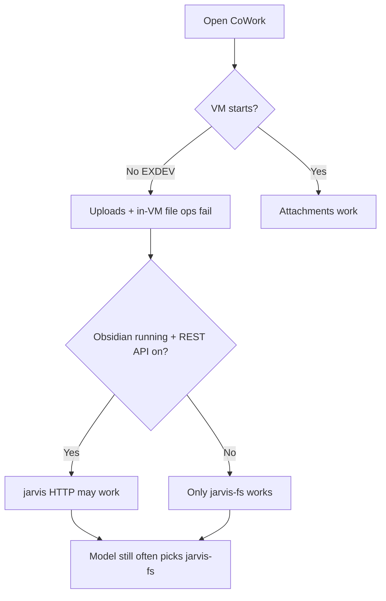

# Summer planning and daily systems

## You

<plugin_info kind="matched_installed">
display_name: Vercel
description: Build and deploy web apps and agents
skills:
  - ai-gateway: Vercel AI Gateway expert guidance. Use when configuring model routing, provider failover, cost tracking, or managing multiple AI providers through a unified API.
  - ai-sdk: Vercel AI SDK expert guidance. Use when building AI-powered features — chat interfaces, text generation, structured output, tool calling, agents, MCP integration, streaming, embeddings, reranking, image generation, or working with any LLM provider.
  - auth: Authentication integration guidance — Clerk (native Vercel Marketplace), Descope, and Auth0 setup for Next.js applications. Covers middleware auth patterns, sign-in/sign-up flows, and Marketplace provisioning. Use when implementing user authentication.
  - bootstrap: Project bootstrapping orchestrator for repos that depend on Vercel-linked resources (databases, auth, and managed integrations). Use when setting up or repairing a repository so linking, environment provisioning, env pulls, and first-run db/dev commands happen in the correct safe order.
  - chat-sdk: Vercel Chat SDK expert guidance. Use when building multi-platform chat bots — Slack, Telegram, Microsoft Teams, Discord, Google Chat, GitHub, Linear — with a single codebase. Covers the Chat class, adapters, threads, messages, cards, modals, streaming, state management, and webhook setup.
  - deployments-cicd: Vercel deployment and CI/CD expert guidance. Use when deploying, promoting, rolling back, inspecting deployments, building with --prebuilt, or configuring CI workflow files for Vercel.
  - env-vars: Vercel environment variable expert guidance. Use when working with .env files, vercel env commands, OIDC tokens, or managing environment-specific configuration.
  - knowledge-update: Corrects outdated LLM knowledge about the Vercel platform and introduces new products. Injected at session start.
  - marketplace: Vercel Marketplace expert guidance — discovering, installing, and building integrations, auto-provisioned environment variables, unified billing, and the vercel integration CLI. Use when consuming third-party services, building custom integrations, or managing marketplace resources on Vercel.
  - next-cache-components: Next.js 16 Cache Components guidance — PPR, use cache directive, cacheLife, cacheTag, updateTag, and migration from unstable_cache. Use when implementing partial prerendering, caching strategies, or migrating from older Next.js cache patterns.
  - next-forge: next-forge expert guidance — production-grade Turborepo monorepo SaaS starter by Vercel. Use when working in a next-forge project, scaffolding with `npx next-forge init`, or editing @repo/* workspace packages.
  - next-upgrade: Upgrade Next.js to the latest version following official migration guides and codemods. Use when upgrading Next.js versions, running codemods, or migrating between major releases.
  - nextjs: Next.js App Router expert guidance. Use when building, debugging, or architecting Next.js applications — routing, Server Components, Server Actions, Cache Components, layouts, middleware/proxy, data fetching, rendering strategies, and deployment on Vercel.
  - react-best-practices: React best-practices reviewer for TSX files. Triggers after editing multiple TSX components to run a condensed quality checklist covering component structure, hooks usage, accessibility, performance, and TypeScript patterns.
  - routing-middleware: Vercel Routing Middleware guidance — request interception before cache, rewrites, redirects, personalization. Works with any framework. Supports Edge, Node.js, and Bun runtimes. Use when intercepting requests at the platform level.
  - runtime-cache: Vercel Runtime Cache API guidance — ephemeral per-region key-value cache with tag-based invalidation. Shared across Functions, Routing Middleware, and Builds. Use when implementing caching strategies beyond framework-level caching.
  - shadcn: shadcn/ui expert guidance — CLI, component installation, composition patterns, custom registries, theming, Tailwind CSS integration, and high-quality interface design. Use when initializing shadcn, adding components, composing product UI, building custom registries, configuring themes, or troubleshooting component issues.
  - turbopack: Turbopack expert guidance. Use when configuring the Next.js bundler, optimizing HMR, debugging build issues, or understanding the Turbopack vs Webpack differences.
  - vercel-agent: Vercel Agent guidance — AI-powered code review, incident investigation, and SDK installation. Automates PR analysis and anomaly debugging. Use when configuring or understanding Vercel's AI development tools.
  - vercel-cli: Vercel CLI expert guidance. Use when deploying, managing environment variables, linking projects, viewing logs, managing domains, or interacting with the Vercel platform from the command line.
  - vercel-functions: Vercel Functions expert guidance — Serverless Functions, Edge Functions, Fluid Compute, streaming, Cron Jobs, and runtime configuration. Use when configuring, debugging, or optimizing server-side code running on Vercel.
  - vercel-sandbox: Vercel Sandbox guidance — ephemeral Firecracker microVMs for running untrusted code safely. Supports AI agents, code generation, and experimentation. Use when executing user-generated or AI-generated code in isolation.
  - vercel-storage: Vercel storage expert guidance — Blob, Edge Config, and Marketplace storage (Neon Postgres, Upstash Redis). Use when choosing, configuring, or using data storage with Vercel applications.
  - verification: Full-story verification — infers what the user is building, then verifies the complete flow end-to-end: browser → API → data → response. Triggers on dev server start and 'why isn't this working' signals.
  - workflow: Vercel Workflow DevKit (WDK) expert guidance. Use when building durable workflows, long-running tasks, API routes or agents that need pause/resume, retries, step-based execution, or crash-safe orchestration with Vercel Workflow.
subagents:
  - ai-architect: Specializes in architecting AI-powered applications on Vercel — choosing between AI SDK patterns, configuring providers, building agents, setting up durable workflows, and integrating MCP servers. Use when designing AI features, building chatbots, or creating agentic applications.
  - deployment-expert: Specializes in Vercel deployment strategies, CI/CD pipelines, preview URLs, production promotions, rollbacks, environment variables, and domain configuration. Use when troubleshooting deployments, setting up CI/CD, or optimizing the deploy pipeline.
  - performance-optimizer: Specializes in optimizing Vercel application performance — Core Web Vitals, rendering strategies, caching, image optimization, font loading, edge computing, and bundle size. Use when investigating slow pages, improving Lighthouse scores, or optimizing loading performance.
hooks:
  - sessionstart: Hook: SessionStart
  - sessionend: Hook: SessionEnd
commands:
  - conventions
  - bootstrap: Bootstrap a repository with Vercel-linked resources by running preflight checks, provisioning integrations, verifying env keys, and then executing db/dev startup commands safely.
  - deploy: Deploy the current project to Vercel. Pass "prod" or "production" as argument to deploy to production. Default is preview deployment.
  - env: Manage Vercel environment variables. Commands include list, pull, add, remove, and diff. Use to sync environment variables between Vercel and your local development environment.
  - marketplace: Discover and install Vercel Marketplace integrations. Use to find databases, CMS, auth providers, and other services available on the Vercel Marketplace.
  - status: Show the status of the current Vercel project — recent deployments, linked project info, and environment overview.
mcp_servers:
  - vercel
</plugin_info>
<user_query>
Provide me with a much better prompt to provide claude cowork to do the task at hand. It should not make mistakes, really understand my situation ever since my fall'26 semester ended and I reached dubai. The date that these major changes I talk about have taken place after - `17-05-2026`. We need to write as many plans as required for planning out the rest of the summer as systems. Make this prompt infintely better for opus 4.8 to perform at it's best:
```
These are goals and systems written for the entire summer that I wish to follow. Yet, we do not have systems laid out. We are currently lacking in what to do daily here. Let's nail that down here. I created a folder to lay these out in detail: "10_Areas/Life/Plans", for this heading: "How you manage the whole plan efficiently (Dubai → Bangalore → Sept 1)". Let's move the plan for how to execute these things into the folder mentioned. I want systems laid out in such a manner that whenever i run my skills for opening a day or closing a day we check that these things have been completed or not. Our first and primary goal here is for me to understand exactly what to do daily so we cover at least 90% of our goals. We have created this entire operating system and vault for this use - learn faster, better and be extremely smart. There is no half assed knowledge, we learn it all correctly. Focus on how exactly we can do the task at hand. Here is what i want to do today, mentioned in the image from my calendar. Oh, you are connected to my calendar as well. What can you do with it connected to my operating system? Here are the things i want to do today

Make sure that i practice leetcode problems daily - at least 5. Relearn everything that's fundamental for machine learning from the course csci 2033: Linear algebra. Csci 4041 have concrete notes but still have not been overviewed by me because it was way too much content. It's all concrete and will be improved only when i learn more things. Solving leetcode problems focuses on csci 4041. We need to figure out how we cover csci 2033 for ml fundamentals. 

Our summer semester has basic notes created in: 20_Progress/Degree​. This is still not completely laid out, I have to go through the syllabus and everything yet. I want this summer semester to be laid out in such a manner that I never miss any assignment and get an A in both the courses. MATH 2230 is also a little ml fundamentals related - math part at least. We be aware of that and create some core concept notes for this course that will help me in my journey. HIST 1103 is useless, i do not wish to learn anything from it. We just need to make sure that we do not miss assignments and get an a in this course. How do we do this? We have cracked it already, that's what we did for our useless lib ed courses.

I have participated in a few hackathons: One on saturday(vibe coding), one that is currently going on - hosted by aws and vercel. We will work on this task in detail later on. But this is what my task for today looks like.

I have written this in such detail because I want you to understand where i am currently standing based on the plan provided. I have not been working on any of the projects listed, just been toying around with mcps and tools. Setting up ai, this is an infinite process. I have realized it, i keep deviating from my task at hand whenever I switch tabs. I always seem to deviate from my task at hand. We decided to set systems, this is still under process. I want something that shows up everyday and tells me what to do. I rely mainly on google calendar for this. I even use reminders and todoist for this task. I have barely set up anything on these apps. You can see my google calendar as well and see that there is no rigid daily systems laid out. Let me summarize what i want you to do here, create detailed plans that I need to follow daily, weekly and monthly. We are running short of time here. We need to focus on our tasks at hand and keep on learning. There is no thing as wasting time when toying around with these tools. It's just not utilizing my time correctly. I want to figure out what mcp's to configure for my tasks based on my github stars: 40_Resources/CS/Repos​ and the ai workflow notes written all across the vault, primarily in: 40_Resources/CS/AI​, 60_Claude/07_AI_Information​ and 20_Progress/Projects/AI Second Brain​. We are not going to spend our time figuring out what my ai platforms need anymore. We let the ai decide themselves. So, now that you have a very detailed analysis of what i have done ever since i have reached to dubai, lay out these plans in a much better format than what currently exists in the summer grind.md​. 
```
</user_query>

## Cursor

Exploring your vault structure, existing plans, and day skills so we can craft a precise, high-performance prompt.

[REDACTED]

[REDACTED]

[REDACTED]

[REDACTED]

[REDACTED]

[REDACTED]

Here is a **CoWork-ready master prompt** tuned to your vault, skills, and the post–17 May 2026 reality. Paste it as the main task message; attach today’s calendar screenshot at the end.

---

## Copy-paste prompt for Claude CoWork (Opus 4.8)

```markdown
# MISSION — Summer Operating System (Dubai → Bangalore → Sept 1)

You are my **summer execution architect**, not a tooling consultant. Your job is to turn my existing vault + calendar into **daily, weekly, and monthly systems** that cover **≥90% of my summer goals** with zero ambiguity about what to do each day.

**Hard deadline for this session:** produce vault files under `10_Areas/Life/Plans/` and wire them into my existing `/today`, `/closeday`, and `/ops` cadence so morning/evening skills can **verify completion**, not just suggest vibes.

---

## TEMPORAL ANCHOR (read first — do not hallucinate dates)

- **Fall ’26 semester at UMN has ended.** I am in **summer transition**, physically in **Dubai**, later **Bangalore**, target **Sept 1, 2026** readiness.
- **All “major change” context applies AFTER `2026-05-17` (17 May 2026).** Before that = old semester rhythm; after that = Dubai reset, systems still incomplete, heavy MCP/tool tinkering instead of execution.
- **Today’s date:** use the real current date from the environment/calendar — never invent.
- **Reality since 17 May:** I built vault infrastructure (Jarvis, MCPs, skills) but **have not executed** listed projects; I **deviate** when switching tabs; Google Calendar / Todoist / Reminders are **under-configured**; I need **rigid daily blocks**, not more brainstorm text.

---

## NON-NEGOTIABLE CONSTRAINTS (violating any = failed session)

1. **No platform archaeology.** Do NOT spend time choosing MCPs, comparing AI tools, editing `.mcp.json`, or “optimizing the stack.” MCP selection is **deferred** — at most one line in a plan: “use existing Jarvis MCP + calendar; no new integrations this session.”
2. **No rewriting `10_Areas/Summer Grind.md` wholesale.** Extract, structure, and **operationalize** it into `10_Areas/Life/Plans/`. You may add a short “supersedes sections of Summer Grind for daily ops” note at the top of the index.
3. **No half-assed learning.** Every study block must name: **source note**, **minimum output** (problems solved / pages / notes created), and **done definition**.
4. **Realistic capacity:** plan **3–5 hours of real focused work** on heavy days; everything else is MVPs (minimum viable proofs).
5. **Search before create.** Use vault search/MCP to find existing notes; patch by heading when possible; follow `AGENTS.md`, `CLAUDE.md`, `HUMAN_WRITING.md`, `AI_CONTEXT.md`.
6. **HIST 1103:** treat as **admin-only** — never assign “learn history”; only **don’t miss assignments, get an A** (same playbook as past useless lib-ed courses).
7. **Evidence over intention:** every weekly system must produce checkable artifacts (checkboxes, LeetCode count, assignment posted, note path).

---

## SOURCE OF TRUTH (read in this order before writing plans)

| Priority | Path | Why |
|----------|------|-----|
| 1 | `10_Areas/Summer Grind.md` | Strategic summer goals, Dubai/Bangalore blocks, 5 daily wins, weekly review questions |
| 2 | `20_Progress/Degree/Summer Courses.md` + `20_Progress/Degree/HIST 1103/*` + `20_Progress/Degree/MATH 2230/*` | Summer term deadlines (Jun–Jul 2026); boards are entry points |
| 3 | `10_Areas/UMN/Previous Classes/CSCI/CSCI 4041/` + `CSCI 4041 Board.md` | LeetCode ↔ algorithms; notes exist but need **overview pass** |
| 4 | `10_Areas/UMN/Previous Classes/CSCI/CSCI 2033/` + `CSCI 2033 Board.md` | ML fundamentals via linear algebra; use `/organize-csci2033` rules when merging concepts |
| 5 | `20_Progress/Projects/CS/Hackathons/` (esp. `01_Summit.md`) | AWS + Vercel hackathon — **P2 this session**; only stub weekly slot |
| 6 | `.claude/skills/today.md`, `closeday.md`, `ops.md` | How daily open/close must behave |
| 7 | `10_Areas/Life/Habits/Daily Habit Board.md` | Replace placeholders with real habit IDs |
| 8 | `40_Resources/CS/Repos.md` + `60_Claude/10_Source_Summaries/Github Ingestion/GitHub Stars — How Anant Uses Each Repo.md` | **Reference only** — do not configure repos this session |
| 9 | `40_Resources/CS/AI/`, `60_Claude/07_AI_Information/`, `20_Progress/Projects/AI Second Brain/` | AI workflow context — **read for constraints**, not for new tooling |

Also read **today’s Google Calendar** (connected): pull events, free blocks, and conflicts. Map calendar blocks → plan sections. If calendar is empty, **propose a default Dubai-week template** and say explicitly it must be copied into Google Calendar by me.

**User attachment:** [PASTE TODAY’S CALENDAR SCREENSHOT HERE]

---

## WHAT “SUCCESS” LOOKS LIKE FOR THIS SESSION

### A. File tree to create under `10_Areas/Life/Plans/`

Create an index note and **as many child plan files as needed** (split by concern — do not one giant file):

```
10_Areas/Life/Plans/
├── 00 - Summer Plans Index.md          # MOC + links + how daily ops uses this folder
├── 01 - Daily Operating System.md      # THE primary daily checklist (skill-integrated)
├── 02 - Weekly Operating System.md     # Mon–Sun rhythm + Sunday 7 questions from Summer Grind
├── 03 - Monthly & Phase Map.md         # Dubai weeks → Bangalore → buffer to Sept 1
├── 04 - Summer Courses Ops.md          # HIST 1103 + MATH 2230: triggers, MVPs, grade A playbook
├── 05 - LeetCode & CSCI 4041.md        # ≥5 problems/day, topic rotation, link to 4041 concepts
├── 06 - ML Fundamentals (2033 + 2230).md  # Linear alg relearn + MATH 2230 core concept notes
├── 07 - Projects & Hackathons Queue.md # Flagship vs maintenance; hackathon = later
└── 08 - Anti-Drift Rules.md            # Tab switching, MCP rabbit holes, Never Miss Twice
```

Each file needs: YAML frontmatter (`type`, `status`, `created`, `tags`, `notes` wikilinks), **concrete checklists**, time estimates, and **wikilinks** to existing vault notes.

### B. Daily system must implement the “5 wins” from Summer Grind

Every day, non-negotiable (with **MVP variants** for low-energy days):

1. **Physical win** (gym/calisthenics MVP)
2. **Project win** (only if flagship week allows — else course/hackathon admin)
3. **Career win** (LeetCode counts here OR internship pipeline — pick one primary)
4. **Cleanup/admin win** (course assignment, inbox, or HIST dropbox)
5. **Review win** (5-min end note → feeds `/closeday`)

Plus **summer academic stack** (separate section, always visible):

| Track | Daily minimum | Done when |
|-------|---------------|-----------|
| LeetCode | **≥5 problems** | Log count + topics in Today note; tie to CSCI 4041 concept |
| CSCI 4041 review | 25–45 min overview | One concept note section reviewed OR 1 pattern linked to today’s LC |
| CSCI 2033 ML fundamentals | 30–45 min | One subtopic from board + output in vault (flash rule, derivation, or 3 practice problems) |
| MATH 2230 | Per board `next:` | WebAssign/quiz readiness + **1 core concept note**/week for ML bridge |
| HIST 1103 | Smallest admin step | Assignment/discussion posted per schedule — **zero deep reading** |

### C. Skill integration (mandatory — this is the whole point)

Update or specify patches for:

- **`/today`** — Top section: “Summer Ops Checklist” pulled from `01 - Daily Operating System.md`; include calendar blocks; LeetCode counter placeholder; course `next:` from degree boards.
- **`/closeday`** — Section “Summer Ops Scorecard”: checkbox audit of all daily minimums; if &lt;90% met, **one** friction fix for tomorrow (not guilt).
- **`/ops morning-start` & `evening-close`** — Link Morning Briefing ↔ previous Closeday ↔ `00 - Summer Plans Index.md`.

Propose exact markdown sections to add to `today.md` / `closeday.md` templates (or a `30_Order/Templates/` daily template if that’s cleaner). **Do not duplicate skill logic** — reference paths.

### D. Weekly & monthly

- **Weekly:** reuse Summer Grind’s 7 Sunday questions verbatim; add **course deadline scan** (next 7 days from HIST/MATH notes).
- **Monthly/phase:** encode Dubai (through ~19 Jun) vs Bangalore (Jun 20 → ~Aug 20) vs Sept 1 buffer from Summer Grind — with **weekly load budgets**, not vague goals.

### E. Calendar ↔ vault contract

Document in `01 - Daily Operating System.md`:

- Google Calendar = **time container** (blocks)
- `60_Claude/50_Reviews/Today - YYYY-MM-DD.md` = **task truth**
- Todoist/Reminders = optional mirrors, not source of truth
- When I run `/ops morning-start`, agent must: read calendar → merge with checklist → output **one ordered day plan**

---

## PRIORITY STACK (when time is tight today)

**P0 — Must complete this session**
1. `01 - Daily Operating System.md` + Index
2. `04 - Summer Courses Ops.md` (both courses, A-grade, no miss)
3. `05 - LeetCode & CSCI 4041.md`
4. `06 - ML Fundamentals (2033 + 2230).md`
5. Skill integration spec for today/closeday

**P1 — Same session if tokens allow**
6. `02 - Weekly Operating System.md`
7. `03 - Monthly & Phase Map.md`
8. `08 - Anti-Drift Rules.md`
9. Populate `Daily Habit Board.md` with real habits matching daily ops

**P2 — Stub only (one paragraph + link)**
10. `07 - Projects & Hackathons Queue.md` — AWS/Vercel hackathon + Saturday vibe coding; **no deep architecture**

---

## TODAY-SPECIFIC OUTPUT (after reading calendar + screenshot)

At the end, produce **`60_Claude/50_Reviews/Today - [DATE].md`** (or tell me to run `/today`) containing:

1. Time-blocked schedule from calendar
2. Ordered checklist for **today only** with realistic totals
3. Explicit **“do NOT do today”** list (MCP setup, new agents, repo stars triage)
4. LeetCode: 5 problems — suggest **topic tags** from CSCI 4041 gaps
5. One MATH 2230 action from board `next:`
6. One HIST 1103 admin action (if due within 7 days)
7. One CSCI 2033 micro-unit (named note + 30 min task)
8. Hackathon: only if calendar already blocks it; else defer

---

## QUALITY BAR (self-check before you finish)

Answer these in your final message:

- [ ] Can I run `/ops morning-start` tomorrow and know **exactly** what to do without reading Summer Grind?
- [ ] Does every daily item have a **done definition** and vault link?
- [ ] Are summer course deadlines **automatable** (weekly scan from existing degree notes)?
- [ ] Is LeetCode **≥5/day** enforced in the checklist?
- [ ] Is HIST **admin-only**?
- [ ] Did you avoid MCP/tool configuration work?
- [ ] Did you create **multiple** plan files (not one bloated doc)?

---

## OUTPUT FORMAT FOR YOUR REPLY

1. **Executive summary** (≤10 bullets): what you created and what I do first tomorrow.
2. **File manifest** with paths and one-line purpose each.
3. **Patches needed** to `.claude/skills/today.md` and `closeday.md` (diff-style or section blocks).
4. **Today plan** (if calendar accessible).
5. **Open questions** (max 3, only if blocking — otherwise assume and document assumptions in `00 - Index`).

Begin by reading sources, then create files. Write like `HUMAN_WRITING.md`: direct, no slop, no motivational filler.
```

---

## Why this prompt works better than the original

| Weakness in original | Fix in master prompt |
|---------------------|----------------------|
| Mixed goals, tools, and “do today” in one blob | **P0/P1/P2 stack** + separate deliverable files |
| No date anchor | **`2026-05-17` floor** + Dubai/Bangalore/Sept 1 |
| “Figure out MCPs from GitHub stars” | **Explicit ban** + deferral line |
| Skills mentioned but not specified | **Concrete integration** with `today` / `closeday` / `ops` paths |
| Calendar image referenced vaguely | **Contract**: Calendar = time, vault Today = tasks |
| 90% goals undefined | **5 wins + academic table** with done definitions |
| Summer Grind vs new folder unclear | **Extract, don’t replace** Summer Grind |
| HIST “useless” but vague | **Admin-only** rule |
| LeetCode “at least 5” without enforcement | **Scorecard in closeday** + daily counter |

---

## How calendar fits your OS (for you, not for the model to rediscover)

Your vault already expects calendar in `/today` (“if available via MCP”). In **CoWork**, calendar is often native (not in `.mcp.json`). The prompt tells the agent to:

1. Read events and free blocks first  
2. Write `Today - YYYY-MM-DD.md` as the task source of truth  
3. Tell you which blocks to add in Google Calendar if gaps exist  

Jarvis `.mcp.json` today: Obsidian, filesystem, git, fetch, jarvis-memory — **no Google Calendar MCP in-repo**. CoWork’s calendar connection is the right place for “what’s on today”; the vault remains where **completion** is scored.

---

## Optional one-liner to prepend when you start the session

> “Execute the Summer Operating System mission below. Today is [DATE]. I am in Dubai. Post–17 May 2026 context applies. Attach calendar screenshot. Do not configure tools.”

---

If you want this saved as `10_Areas/Life/Plans/00 - CoWork Prompt — Summer OS.md` in the vault, say so and I can add it there and scaffold the rest of the `Plans/` tree in a follow-up.

[REDACTED]

**Tool calls:**

- `Glob` — pattern `**/*summer*`, path `D:\Users\_Anant\10_Areas\Documents\Jarvis`
- `Glob` — pattern `**/10_Areas/Life/Plans/**`, path `D:\Users\_Anant\10_Areas\Documents\Jarvis`
- `Grep` — pattern `open.*day|close.*day|opening a day`, path `D:\Users\_Anant\10_Areas\Documents\Jarvis`
- `Glob` — pattern `**/*grind*`, path `D:\Users\_Anant\10_Areas\Documents\Jarvis`
- `Read` — `D:\Users\_Anant\10_Areas\Documents\Jarvis\10_Areas\Summer Grind.md`
- `Read` — `D:\Users\_Anant\10_Areas\Documents\Jarvis\.claude\skills\today.md`
- `Read` — `D:\Users\_Anant\10_Areas\Documents\Jarvis\.claude\skills\closeday.md`
- `Read` — `D:\Users\_Anant\10_Areas\Documents\Jarvis\20_Progress\Degree\Summer Courses.md`
- `Glob` — pattern `**/Life/**`, path `D:\Users\_Anant\10_Areas\Documents\Jarvis`
- `Read` — `D:\Users\_Anant\10_Areas\Documents\Jarvis\.claude\skills\ops.md`
- `Grep` — pattern `calendar|google`, path `D:\Users\_Anant\10_Areas\Documents\Jarvis`
- `Glob` — pattern `**/CSCI 4041*`, path `D:\Users\_Anant\10_Areas\Documents\Jarvis`
- `Glob` — pattern `**/CSCI 2033*`, path `D:\Users\_Anant\10_Areas\Documents\Jarvis`
- `Read` — `D:\Users\_Anant\10_Areas\Documents\Jarvis\CLAUDE.md`
- `Read` — `D:\Users\_Anant\10_Areas\Documents\Jarvis\.mcp.json`
- `Glob` — pattern `**/*`, path `C:\Users\Anant Gupta\.cursor\projects\d-Users-Anant-10-Areas-Documents-Jarvis\mcps\user-jarvis\tools`
- `Read` — `D:\Users\_Anant\10_Areas\Documents\Jarvis\10_Areas\Life\Habits\Daily Habit Board.md`
- `Grep` — pattern `Hackathon|AWS|Vercel`, path `D:\Users\_Anant\10_Areas\Documents\Jarvis\20_Progress`
- `Read` — `D:\Users\_Anant\10_Areas\Documents\Jarvis\.claude\skills\organize-csci2033.md`
- `Glob` — pattern `**/20_Progress/Degree/**`, path `D:\Users\_Anant\10_Areas\Documents\Jarvis`
- `Grep` — pattern `calendar|google calendar`, path `D:\Users\_Anant\10_Areas\Documents\Jarvis\.claude`
- `Read` — `D:\Users\_Anant\10_Areas\Documents\Jarvis\20_Progress\Projects\CS\Hackathons\01_Summit.md`
- `Glob` — pattern `**/Github Stars*`, path `D:\Users\_Anant\10_Areas\Documents\Jarvis`
- `Read` — `D:\Users\_Anant\10_Areas\Documents\Jarvis\60_Claude\07_AI_Information\AI_CONTEXT.md`
- `Grep` — pattern `leetcode|LeetCode`, path `D:\Users\_Anant\10_Areas\Documents\Jarvis`

## You

<user_query>
Save this prompt to the directory you have mentioned. I cannot copy the entire thing unfortunately. From obsidian, i will copy it and paste it to claude cowork. Make sure that the prompt written does not lose the content that was originally given to you. 
</user_query>

## Cursor

Saving the full prompt to `10_Areas/Life/Plans/`, merging the enhanced CoWork prompt with your original brief so nothing is lost.

[REDACTED]

[REDACTED]

Saved the full prompt here:

**`10_Areas/Life/Plans/00 - CoWork Prompt — Summer OS.md`**

### How to copy into Claude CoWork

1. Open that note in Obsidian.
2. Find **「COPY FROM HERE」** and **「COPY UNTIL HERE」**.
3. Select everything **inside** the fenced `markdown` code block (from `# MISSION` through the end of the quality bar / output format). Do not include the outer ` ```markdown ` fences if CoWork treats them as code-only.
4. Optional: prepend the one-liner from the bottom of the note.
5. Attach today’s calendar screenshot where the prompt says to.

### What’s in the file

- **Full CoWork prompt** (mission, constraints, courses, calendar OS, file tree, skills, priorities, today output, quality bar).
- **Your original brief** woven in (Dubai post–17 May, 90% goals, LeetCode/4041/2033, summer degree A’s, HIST admin-only, hackathons deferred, MCP/tool drift, calendar/Todoist, repos/AI paths reference-only, “let AI decide platforms,” better than Summer Grind).
- **「Original brief (preserved)」** section — checklist so nothing from your first message was dropped.

If Obsidian’s code block is awkward to select, use **Reading view → click inside the block → Select All**, or temporarily toggle off line numbers and drag-select from `# MISSION` to the last line before `COPY UNTIL HERE`.

[REDACTED]

**Tool calls:**

- `Read` — `D:\Users\_Anant\10_Areas\Documents\Jarvis\30_Order\Templates`
- `Glob` — pattern `**/10_Areas/Life/Plans/**`, path `D:\Users\_Anant\10_Areas\Documents\Jarvis`
- `Write` — `D:\Users\_Anant\10_Areas\Documents\Jarvis\10_Areas\Life\Plans\00 - CoWork Prompt — Summer OS.md`

## You

<user_query>
I am going to provide the prompt as a file. Write me a short prompt for claude cowork to read through the provided file as a prompt and optimize token usage. 
</user_query>

## Cursor

Creating a short companion file you can paste alongside the attachment.

[REDACTED]

**In CoWork:** attach `10_Areas/Life/Plans/00 - CoWork Prompt — Summer OS.md`, then paste this:

```
You are my summer execution architect. Your full specification is in the attached markdown file — treat it as the only task brief. Read it once, completely; do not ask me to restate it.

Execution rules (token-efficient):
- Follow the attached file’s P0 → P1 → P2 order. Skip P2 unless P0 is done.
- Read vault sources in the file’s priority table only — no whole-vault scans, no MCP/platform setup work.
- Write outputs to `10_Areas/Life/Plans/` per the file tree; patch `today.md` / `closeday.md` with section blocks only, not full skill rewrites.
- Use calendar only for today’s blocks + conflicts; do not narrate my entire schedule.
- Reply format: (1) ≤8 bullet executive summary, (2) file manifest with paths, (3) today checklist if calendar available, (4) max 3 blocking questions. No long preambles, no repeating the brief back to me.

If anything in this message conflicts with the attachment, the attachment wins.

Attach today’s calendar screenshot when you have it; otherwise use calendar MCP and note gaps.
```

Same text is saved at `10_Areas/Life/Plans/00b - CoWork Entry Prompt.md` for Obsidian copy-paste.

[REDACTED]

**Tool calls:**

- `Write` — `D:\Users\_Anant\10_Areas\Documents\Jarvis\10_Areas\Life\Plans\00b - CoWork Entry Prompt.md`

## You

<user_query>
Why did this happen: "I'll read the task brief first.Read 4 files, searched 2 patterns, ran a commandRead 4 files, searched 2 patterns, ran a commandRead [REDACTED] - CoWork Prompt — Summer OS.mdRead [REDACTED] Grind.mdRunning commandRead Read Finding filesResultFinding filesResultDoneUploads aren't reachable directly and the workspace VM failed to start. Let me locate these files in the vault via the Jarvis connector."?
</user_query>

## Cursor

Checking how your vault connects to external agents — that should explain the CoWork upload/VM failure.

[REDACTED]

[REDACTED]

This is a **CoWork infrastructure + attachment path** issue, not a problem with your prompt files.

## What happened (step by step)

1. **You attached** `00 - CoWork Prompt — Summer OS.md` (and likely `Summer Grind.md`). CoWork stores uploads under internal IDs like `cf4025f4-..._00 - CoWork Prompt — Summer OS.md` — not as normal vault paths.

2. **CoWork tried to read those uploads inside its workspace VM** (the small cloud sandbox where it runs `Read`, searches, and commands). That VM is what makes attachments and file tools work.

3. **The VM failed to start.** When that happens, CoWork cannot open upload paths directly, which produces:
   > *Uploads aren't reachable directly and the workspace VM failed to start.*

4. **The model fell back to the Jarvis connector** — your vault bridge (Obsidian MCP / project folder access) — to find the same content at real paths like `10_Areas/Life/Plans/...` and `10_Areas/Summer Grind.md`.

So you saw: attach → read upload (fail) → try vault connector (maybe partial success). The “Read 4 files, searched 2 patterns, ran a command” lines are normal agent retries during that fallback.

## Why the VM fails (common causes)

| Cause | What it means |
|--------|----------------|
| **Transient CoWork outage** | Sandbox didn’t spin up; retry often works. |
| **Session/project not rooted on the vault** | Attachments work only in VM; vault edits need the project folder or connector linked. |
| **Connector not connected or Obsidian MCP off** | Fallback “Jarvis connector” has nothing to read from. |
| **Heavy first turn** | Big attach + many reads/commands on a dead VM → confusing error chain. |

Your prompt did **not** cause this. A failed VM blocks **any** attached file, including the brief.

## What to do next time

**Option A — Prefer connector (best for your workflow)**  
- Open CoWork with the **Jarvis vault as the project folder** (if your CoWork project points at `D:\Users\_Anant\10_Areas\Documents\Jarvis`).  
- Paste only `00b - CoWork Entry Prompt.md` and **name the path**, don’t rely on upload alone:

```text
Full spec: 10_Areas/Life/Plans/00 - CoWork Prompt — Summer OS.md
Read via vault/connector only. Do not depend on uploads.
```

**Option B — If VM keeps failing**  
- Paste the **entry prompt** plus the **first ~30 lines** of the spec (mission + P0 list) inline so the task can start even with no VM.  
- Or run the same job in **Cursor / Claude Code** — your repo already has filesystem + Obsidian MCP; no upload VM.

**Option C — Retry**  
- New CoWork chat, confirm connector green, attach **one** file (the spec), paste `00b`, send.  
- If it fails again with the same VM message → CoWork-side issue; use A or B.

## Quick check

- **Did it eventually read `Summer Grind.md`?** If yes, the connector worked for vault paths; only **uploads** were broken.  
- **Obsidian running + MCP enabled?** Required for the Jarvis connector fallback.

I can add a short **“If CoWork VM fails”** section to `00b - CoWork Entry Prompt.md` so you don’t have to remember this. Want that?

[REDACTED]

**Tool calls:**

- `Grep` — pattern `cowork|CoWork|connector|workspace VM`, path `D:\Users\_Anant\10_Areas\Documents\Jarvis`
- `Read` — `D:\Users\_Anant\10_Areas\Documents\Jarvis\10_Areas\Life\Plans\00b - CoWork Entry Prompt.md`
- `Read` — `D:\Users\_Anant\10_Areas\Documents\Jarvis\.claude\skills\mcp-hub.md`

## You

[Image]
<image_files>
The following images were provdied by the user and saved to the workspace for future use:
1. C:\Users\Anant Gupta\.cursor\projects\[REDACTED]/assets/[REDACTED].png

These images can be copied for use in other locations.
</image_files>
<user_query>
Why do i have so many errors while working with cowork? Analyze the settings for claude at it's home directory. Almost whenver i open claude cowork that error message pops up and dissapears. claude also relies on the filesystem mcp almost all the time that it works on anything. Why is that? What's wrong with the obsidian mcp listed? I want to it preferably use the obsidian mcp tool because it is for obsidian. 
</user_query>

## Cursor

Investigating Claude Desktop/CoWork configuration and your MCP setup to explain the VM error and why filesystem MCP is used instead of Obsidian.

[REDACTED]

[REDACTED]

[REDACTED]

[REDACTED]

[REDACTED]

[REDACTED]

## Root cause: two separate problems

Your CoWork pain comes from **(A) a broken Claude workspace VM** and **(B) fallback to filesystem MCP** when the VM or Obsidian bridge is unavailable. Obsidian MCP is not necessarily misconfigured — it is often **unused** because the VM fails first and `jarvis-fs` is the reliable path.

---

## 1. The popup: `EXDEV: cross-device link not permitted`

Claude CoWork needs a local VM image (`rootfs.vhdx`). On startup it tries to **rename** a temp file into place:

- From: `...\AppData\Roaming\Claude\vm_bundles\...\wvm-tmp-...\rootfs.vhdx`
- To: `...\AppData\Roaming\Claude\vm_bundles\claudevm.bundle\rootfs.vhdx`

Windows returns **EXDEV** when a rename cannot be done as a single atomic move — often across volumes, junctions, or sync layers.

On your machine:

| Finding | Implication |
|--------|-------------|
| `AppData\Roaming\Claude\vm_bundles` is a **junction** → `C:\Users\Anant Gupta\Claude\vm_bundles` | VM files live through a junction; renames through that path often trigger EXDEV on Windows |
| `rootfs.vhdx` **does not exist** at the junction target | The VM never finished installing — CoWork keeps retrying → flash error on every open |
| TEMP is on `C:\...\AppData\Local\Temp` (same drive, but different path tree) | Temp extract + junction final path = classic EXDEV scenario |

So the message flashes and disappears because CoWork **retries VM startup**, fails, then continues in a **degraded mode** (no workspace VM → uploads and in-VM tools break).

**What to do (in order):**

1. In Claude: use **“reinstall the workspace”** from that error dialog (or Settings → CoWork / workspace).
2. If it still fails: **remove the junction** so `vm_bundles` is a normal folder under AppData:
   - Quit Claude completely.
   - Back up `C:\Users\Anant Gupta\Claude\vm_bundles` if anything is there.
   - Remove junction `AppData\Roaming\Claude\vm_bundles` and let Claude recreate it locally (or move contents into a real `AppData\Roaming\Claude\vm_bundles` folder).
3. Exclude `Claude\vm_bundles` and `AppData\Roaming\Claude` from **OneDrive** if either path is synced.
4. Restart PC once after reinstall (clears locked `.vhdx` handles).

Until the VM installs successfully, you will keep seeing CoWork errors and **upload-based prompts will not work reliably**.

---

## 2. What your Claude “home” config actually is

Claude Desktop/CoWork reads:

**`C:\Users\Anant Gupta\AppData\Roaming\Claude\claude_desktop_config.json`**

That is separate from the vault’s `.mcp.json` (which is for **Claude Code in the repo**, not Desktop).

Your Desktop config:

| Server | Type | What it really is |
|--------|------|------------------|
| **`jarvis`** | HTTP `http://127.0.0.1:27123/mcp/` | **Obsidian** — Local REST API plugin’s MCP endpoint (Jarvis vault) |
| **`the-plan`** | HTTP `http://127.0.0.1:27124/mcp/` | **Obsidian** — second vault on secure port |
| **`jarvis-fs`** | stdio filesystem | Raw files under `D:\Users\_Anant\10_Areas\Documents\Jarvis` |
| **`the-plan-fs`** | stdio filesystem | Raw files under The Plan vault |

So you **do** have Obsidian MCP in CoWork — it is named **`jarvis`**, not `obsidian`. Nothing is “wrong” in the listing unless Obsidian is closed or the REST API is off.

Vault `.mcp.json` uses **`uvx mcp-obsidian`** on port **27124** — a **different** integration path used by Claude Code, not CoWork Desktop.

---

## 3. Why CoWork “always” uses filesystem MCP

Typical order when things go wrong:



Reasons the model prefers **`jarvis-fs`**:

1. **VM dead** → “uploads not reachable” → agent reads `D:\...\Jarvis\...` via filesystem (same as your Cursor experience).
2. **Filesystem works without Obsidian running**; `jarvis` HTTP needs Obsidian open + Local REST API plugin enabled.
3. **Tool familiarity** — generic read/write paths look like normal file tools; Obsidian MCP tools (`vault_read`, `vault_patch`, etc.) are a separate schema.
4. **Your entry prompt** says “read vault sources” but does not say **“use `jarvis` MCP only, not `jarvis-fs`”** — so the model picks the most reliable path.
5. Your own vault doc even says: *“Prefer filesystem edits for documentation work”* ([[AI Automation and Local Interfaces]]) — that nudges agents toward FS.

**Obsidian MCP is not broken by default** — it is **bypassed** when the VM fails or Obsidian is not up.

---

## 4. How to prefer Obsidian MCP (`jarvis`) in CoWork

**Before each CoWork session:**

1. Open **Obsidian** with the Jarvis vault.
2. Confirm **Local REST API** plugin is on (ports **27123** / **27124** per your plugin settings).
3. Fix the workspace VM (section 1) so attachments and CoWork sandbox work.

**In `00b - CoWork Entry Prompt.md`, add:**

```text
Vault I/O: use the `jarvis` HTTP MCP tools (Obsidian Local REST API) for all read/write/search in the Jarvis vault. Do not use `jarvis-fs` unless `jarvis` is disconnected — if so, say so once and use jarvis-fs.
Obsidian must be running; if MCP calls fail, stop and tell me to open Obsidian instead of silently switching to filesystem.
```

**Optional stricter step:** temporarily disable `jarvis-fs` in `claude_desktop_config.json` while you train the habit — only if you accept CoWork stopping when Obsidian is closed.

**Do not remove** `jarvis-fs` until VM + Obsidian are stable; it is your safety net today.

---

## 5. Port confusion (27123 vs 27124)

| Tool | Config | Port |
|------|--------|------|
| CoWork `jarvis` | `claude_desktop_config.json` | **27123** (insecure HTTP + Bearer) |
| CoWork `the-plan` | same file | **27124** |
| Claude Code `.mcp.json` | `OBSIDIAN_PORT` default **27124** | `mcp-obsidian` package |

That mismatch is **expected** if you use two vaults and two clients — but if the Jarvis plugin key/port changes, **`jarvis` HTTP fails** while **`jarvis-fs` still works**, which feels like “Obsidian MCP is broken.”

**Check:** In Obsidian → Local REST API → copy the MCP URL/key for the Jarvis vault and ensure it still matches the `jarvis` entry (rotate token if you ever pasted config in chat).

---

## 6. Security note

Your `claude_desktop_config.json` contains **Bearer tokens** in plain text. Do not commit or screenshot it. If this chat or any log exposed it, **regenerate the API key** in Obsidian Local REST API and update the config.

---

## Summary

| Symptom | Cause |
|--------|--------|
| Workspace VM error popup | **EXDEV** on `rootfs.vhdx` rename; **junction** `vm_bundles` + incomplete VM install |
| Uploads / attached prompt files fail | VM not started |
| Almost always filesystem MCP | VM fallback + Obsidian not required for `jarvis-fs` + model default |
| “Obsidian MCP wrong?” | In CoWork it is **`jarvis` (HTTP)**; often unused, not misnamed in UI |

**Highest-leverage fix:** reinstall CoWork workspace and fix/remove the `vm_bundles` junction so the VM can finish installing. **Second:** Obsidian open + prompt rule to use `jarvis` not `jarvis-fs`.

I can patch `00b - CoWork Entry Prompt.md` with the Obsidian-first rules and a short “if VM fails” section if you want that saved in the vault.

[REDACTED]

**Tool calls:**

- `Glob` — pattern `**/*`, path `C:\Users\Anant Gupta\AppData\Roaming\Claude`
- `Read` — `D:\Users\_Anant\10_Areas\Documents\Jarvis\.mcp.json`
- `Read` — `D:\Users\_Anant\10_Areas\Documents\Jarvis\.claude\settings.json`
- `Grep` — pattern `obsidian|mcp|cowork`, path `D:\Users\_Anant\10_Areas\Documents\Jarvis`
- `Read` — `C:\Users\Anant Gupta\AppData\Roaming\Claude\claude_desktop_config.json`
- `Read` — `D:\Users\_Anant\10_Areas\Documents\Jarvis\30_Order\System\claude-workflow\claude_desktop_config.read-first.example.json`
- `Read` — `D:\Users\_Anant\10_Areas\Documents\Jarvis\.cursor\mcp.json`
- `Grep` — pattern `27123|27124|OBSIDIAN|mcp-obsidian|local-rest`, path `D:\Users\_Anant\10_Areas\Documents\Jarvis`
- `Glob` — pattern `**/*`, path `C:\Users\Anant Gupta\AppData\Roaming\Claude`
- `Read` — `D:\Users\_Anant\10_Areas\Documents\Jarvis\.claude\README.md`
- `Grep` — pattern `CoWork|cowork|claude_desktop|27123|jarvis-fs`, path `D:\Users\_Anant\10_Areas\Documents\Jarvis\40_Resources`
- `Read` — `D:\Users\_Anant\10_Areas\Documents\Jarvis\40_Resources\Obsidian\Plugins\AI Automation and Local Interfaces.md`
- `Shell` — `powershell -NoProfile -Command "Get-ChildItem -Force 'C:\Users\Anant Gupta\AppData\Roaming\Claude' -ErrorAction SilentlyContinue | Select-Object Name, Mode, Length; if (Test-Path 'C:\Users\Anant Gupta\AppData\Roaming\Claude\vm_bundles') { Get-ChildItem -Recurse -Depth 2 'C:\Users\Anant Gupta\AppData\Roaming\Claude\vm_bundles' -ErrorAction SilentlyContinue | Select-Object FullName, Length }"`
- `Shell` — `powershell -NoProfile -Command "(Get-Item 'C:\Users\Anant Gupta\AppData\Roaming\Claude\vm_bundles').LinkType; (Get-Item 'C:\Users\Anant Gupta\AppData\Roaming\Claude\vm_bundles').Target; Get-ChildItem 'C:\Users\Anant Gupta\AppData\Roaming\Claude\vm_bundles' -Force -ErrorAction SilentlyContinue"`
- `Shell` — `powershell -NoProfile -Command "[Environment]::GetEnvironmentVariable('TEMP','User'); [Environment]::GetEnvironmentVariable('TMP','User'); (Get-PSDrive C).Free / 1GB"`
- `Shell` — `powershell -NoProfile -Command "Get-ChildItem 'C:\Users\Anant Gupta\Claude\vm_bundles' -Force -ErrorAction SilentlyContinue | Select-Object Name; Test-Path 'C:\Users\Anant Gupta\Claude\vm_bundles\claudevm.bundle\rootfs.vhdx'"`
- `Read` — `D:\Users\_Anant\10_Areas\Documents\Jarvis\40_Resources\Obsidian\Plugins\Plugin Gaps Recommendations and Verification.md`

## You

<user_query>
Claude cowork wrote a lot of files under @10_Areas/Life/Plans/ , here is the reply from claude: 
```
---
type: plan
status: active
created: 2026-06-03
tags:
  - plan
  - daily
notes:
  - "[[01 - Daily Operating System]]"
  - "[[04 - Summer Courses Ops]]"
  - "[[05 - LeetCode & CSCI 4041]]"
  - "[[06 - ML Fundamentals (2033 + 2230)]]"
---

# Today — 2026-06-03 (Wed, Dubai)

## Summer Ops Checklist

### Deadlines within 7 days (act now)
- ⚠️ **Jun 5 — MATH 2230 last day to add/drop.** Confirm you're staying enrolled; nothing to do if yes.
- ⚠️ **Jun 6 (Sat 11:30pm) — HIST 1103 Practice + Assignments 1–3.** Admin-only. Draft today.
- ⚠️ **Jun 8 (Mon) — MATH 2230 WebAssign Getting Started + HW 1.1–2.2 + Quizzes 1–2.** Start today.

### 5 Wins
- [ ] Physical — gym OR MVP (20 pushups / 20 squats / 5 min stretch)
- [ ] Project — Dubai phase: counts as course admin (see HIST/MATH below)
- [ ] Career = LeetCode ≥5 — topic: **Sorting / Binary Search** (Wed) → count: __
- [ ] Cleanup/admin — start MATH WebAssign OR HIST Asgmt 1–3 draft
- [ ] Review — 5-min end note / `/closeday`

### Academic stack (daily minimums)
- [ ] LeetCode ≥5 — Sorting/Binary Search; link ≥1 to CSCI 4041 (heapsort/quicksort/divide-&-conquer)
- [ ] CSCI 4041 review 25–45 min — concept: sorting (heapsort or quicksort note)
- [ ] CSCI 2033 30–45 min — **subtopic 1: vectors, vector ops, dot product**; output = 3 problems or a rule note
- [ ] MATH 2230 — WebAssign: Getting Started + begin HW 1.1
- [ ] HIST 1103 — draft Assignment 1 to rubric (no reading); post to discussion + dropbox by Jun 6

## Schedule (calendar empty → default Dubai template — copy into Google Calendar)

> Your primary calendar (gupt0479@umn.edu) had no events for today. These are proposed blocks — **copy them into Google Calendar** to make them real.

| Time (Dubai) | Block |
|------|-------|
| Morning launch (30m) | Open this note. No phone/smoking before first task. |
| Deep work 1 (75m) | MATH 2230 WebAssign — Getting Started + HW 1.1 |
| LeetCode (60m) | 5× Sorting/Binary Search |
| Deep work 2 (45m) | CSCI 2033 subtopic 1 (vectors/dot product) + CSCI 4041 sorting note |
| Admin (30m) | HIST Assignment 1 draft |
| Physical (60m) | Gym / calisthenics |
| Evening close (15m) | `/closeday` → Summer Ops Scorecard |

## Top 3
1. MATH 2230 WebAssign started (Jun 8 deadline; add/drop Jun 5).
2. LeetCode 5 (Sorting/Binary Search) + one 4041 link.
3. HIST Assignment 1 drafted toward Jun 6.

## Do NOT do today
MCP / connector setup · new agents or skills · GitHub stars triage · AI platform comparison · `.obsidian`/plugin config. Urges → parking lot in [[08 - Anti-Drift Rules]].

## End-of-Day Review
[To be filled by /closeday — run the Summer Ops Scorecard]
- Completed:
- Blocked:
- Learned:
```

Review all the files written by claude cowrok. Our first task out of these plans is to come up with a solid foundation of how exactly we will study our courses again(CSCI 2033 & 4041). I want to relate csci 2033: Linear algebra with the math 2230 course that i am taking this semester. We will be studying through both of these courses together cause they relate by a lot. I do not wish to go through the entire csci 2033 course again just the machine learning fundamentals. There are way too many files that we need to cover to touch ground with each and every single concept in that course. Our main goal is to understand the basics of ml from this course. We will learn everything in detail for the end of the course, that's page rank and graphs(i think so). We need to cover a lot of ground carefully for csci 2033. Wheras, csci 4041 is a fundamental course we will spend our entire summer on perfecting with leetcode and the projects provided by the professor. We keep track of leetcode problems and focus on company base interview questions primarily. This is a very core class for any sort of internship that i will apply for and need to get each of these concepts down correctly. Never forget about them and have a way to review through each concept easily when needed revision for an interview. We are not wasting time with either of these courses. Covering everything that we will need to further enhance my journey as an ML engineer. 

Analyze the @10_Areas/UMN/Previous Classes/CSCI/CSCI 2033/ and @10_Areas/UMN/Previous Classes/CSCI/CSCI 4041/ folder in depth before you provide me with another prompt for claude cowork to further enhance the @10_Areas/Life/Plans/05 - LeetCode & CSCI 4041.md and @10_Areas/Life/Plans/06 - ML Fundamentals (2033 + 2230).md files in depth. We will think about our daily workflow after coming up with concrete plans for each of our goals for the summer. This prompt should really cover each and every single point that I have mentioned above, enhance that prompt by analyzing the folders mentioned, make sure that none of the content is lost. We need to do this correctly and do it all with no mistakes. 
</user_query>

## Cursor

Reviewing CoWork's plan files and analyzing the CSCI 2033 and 4041 vault structure to draft a precise enhancement prompt.

[REDACTED]

[REDACTED]

[REDACTED]

[REDACTED]

[REDACTED]

Creating a CoWork prompt that incorporates your requirements and vault analysis, and saving it alongside the other plan prompts.

[REDACTED]

## Quick review of CoWork’s Plans folder

CoWork did the scaffolding well: **Index, Daily, Weekly, Monthly, Courses, 05, 06, Hackathons stub, Anti-Drift, Skill Patches**, and a solid **Today — 2026-06-03** (deadlines, 5 wins, academic stack, Dubai template). That’s the right shape.

**05** and **06** are still too thin for what you described:

| File | What’s there now | What’s missing |
|------|------------------|----------------|
| **05** | ≥5/day, 7-day LC rotation, “pull 4041 via LC” | 14-week **DSA.md** map, **15 concepts** mastery, **company-wise** LC, **tracker**, **AVL/Maze** projects, interview revision |
| **06** | Generic 12-topic LA table | Real **Concepts_old** file mapping, **ML_Foundations** scope, **2230 bridge**, **PageRank/graphs deferred** to endgame, progress tracker |

Your Today note (sorting/binary search, 2033 vectors) matches the *current* shallow 06 sequence — the new prompt fixes the curriculum underneath.

---

## Vault analysis (what the CoWork prompt is built on)

**CSCI 2033 (44 files)**  
- **Use:** `Concepts_old/ML_Foundations.md` as the ML map (§1–6 = summer core; §7 PageRank/graph ML = **endgame only**).  
- **15 `Concepts_old` notes** — spine should name each file as in-scope or deferred.  
- **Defer in detail:** `Graphs_and_PageRank.md`, `The Google PageRank Algorithm.md` (+ graph/PageRank slices in other notes).  
- **Do not assign:** rereading all `Week - *.md` or all of `Concepts_new/`.

**CSCI 4041 (58 files)**  
- **Use:** `Concepts/DSA.md` — full **Week 1–14 LeetCode / Weekly Plan** + **15 concept MOC** + `#cards/CSCI4041`.  
- **Projects:** AVL (midterm), Maze (final) under `Midterm Project/` and `Final Project/`.  
- **Summer =** whole course: concepts + LC + projects + company tags.

**MATH 2230**  
- Grade workflow stays in **04**; **06** owns ML bridge notes and a **2033 ↔ 2230** table (covariance/PCA, MLE/regression, Bayes/classification, etc.).

---

## New CoWork prompt (saved in vault)

**`10_Areas/Life/Plans/00c - CoWork Prompt — Enhance 05 and 06.md`**

It includes:

- Your full intent (ML-only 2033, 4041 all summer, company LC, projects, no wasted time, 2230 together, PageRank/graphs at end, daily workflow **later**)
- Folder inventories and filenames CoWork must read
- **Deliverable A:** rewrite **05** (mastery table, company rotation, tracker `05a`, 14-week syllabus, AVL/Maze milestones)
- **Deliverable B:** rewrite **06** (ML spine from real files, bridge table, Endgame section, tracker `06a`)
- Quality bar and token-efficient output format

**In CoWork:** attach `00c`, paste the block from **「COPY FROM HERE」** to **「COPY UNTIL HERE」** (or use **00b** entry prompt + attach `00c` only).

**Optional prepend:**

> Attach `00c - CoWork Prompt — Enhance 05 and 06.md`. Execute Deliverables A & B only. Obsidian MCP (`jarvis`) for all vault I/O. Do not change daily workflow yet.

---

After CoWork finishes **05** and **06**, we can tune **01** (daily checklist) to match the new trackers and week/unit pointers — that’s intentionally the next step, not this session.

[REDACTED]

**Tool calls:**

- `Glob` — pattern `**/*`, path `D:\Users\_Anant\10_Areas\Documents\Jarvis\10_Areas\Life\Plans`
- `Glob` — pattern `**/*`, path `D:\Users\_Anant\10_Areas\Documents\Jarvis\10_Areas\UMN\Previous Classes\CSCI\CSCI 2033`
- `Glob` — pattern `**/*`, path `D:\Users\_Anant\10_Areas\Documents\Jarvis\10_Areas\UMN\Previous Classes\CSCI\CSCI 4041`
- `Read` — `D:\Users\_Anant\10_Areas\Documents\Jarvis\10_Areas\Life\Plans\05 - LeetCode & CSCI 4041.md`
- `Read` — `D:\Users\_Anant\10_Areas\Documents\Jarvis\10_Areas\Life\Plans\06 - ML Fundamentals (2033 + 2230).md`
- `Read` — `D:\Users\_Anant\10_Areas\Documents\Jarvis\10_Areas\UMN\Previous Classes\CSCI\CSCI 2033\CSCI 2033 Board.md`
- `Read` — `D:\Users\_Anant\10_Areas\Documents\Jarvis\10_Areas\UMN\Previous Classes\CSCI\CSCI 4041\CSCI 4041 Board.md`
- `Read` — `D:\Users\_Anant\10_Areas\Documents\Jarvis\10_Areas\UMN\Previous Classes\CSCI\CSCI 2033\Concepts_old\ML_Foundations.md`
- `Read` — `D:\Users\_Anant\10_Areas\Documents\Jarvis\10_Areas\UMN\Previous Classes\CSCI\CSCI 4041\Concepts\DSA.md`
- `Read` — `D:\Users\_Anant\10_Areas\Documents\Jarvis\10_Areas\UMN\Previous Classes\CSCI\CSCI 2033\Concepts_old\ML_Foundations.md`
- `Read` — `D:\Users\_Anant\10_Areas\Documents\Jarvis\10_Areas\UMN\Previous Classes\CSCI\CSCI 2033\Concepts_old\Graphs_and_PageRank.md`
- `Read` — `D:\Users\_Anant\10_Areas\Documents\Jarvis\10_Areas\UMN\Previous Classes\CSCI\CSCI 4041\Concepts\DSA.md`
- `Read` — `D:\Users\_Anant\10_Areas\Documents\Jarvis\20_Progress\Degree\MATH 2230\MATH 2230 Board.md`
- `Read` — `D:\Users\_Anant\10_Areas\Documents\Jarvis\10_Areas\Life\Plans\00 - Summer Plans Index.md`
- `Grep` — pattern `^# |^## `, path `D:\Users\_Anant\10_Areas\Documents\Jarvis\10_Areas\UMN\Previous Classes\CSCI\CSCI 2033\Concepts_old`
- `Read` — `D:\Users\_Anant\10_Areas\Documents\Jarvis\60_Claude\10_Source_Summaries\Github Ingestion\GitHub Stars — How Anant Uses Each Repo.md`
- `Read` — `D:\Users\_Anant\10_Areas\Documents\Jarvis\10_Areas\Life\Plans\01 - Daily Operating System.md`
- `Grep` — pattern `.`, path `D:\Users\_Anant\10_Areas\Documents\Jarvis\10_Areas\UMN\Previous Classes\CSCI\CSCI 2033\Concepts_old`
- `Read` — `D:\Users\_Anant\10_Areas\Documents\Jarvis\10_Areas\UMN\Previous Classes\CSCI\CSCI 4041\Midterm Project.md`
- `Read` — `D:\Users\_Anant\10_Areas\Documents\Jarvis\10_Areas\UMN\Previous Classes\CSCI\CSCI 4041\Final Project.md`
- `Write` — `D:\Users\_Anant\10_Areas\Documents\Jarvis\10_Areas\Life\Plans\00c - CoWork Prompt — Enhance 05 and 06.md`

## Actions Taken
- Summary: Edited 00c - CoWork Prompt — Enhance 05 and 06.md, 00b - CoWork Entry Prompt.md, 00 - CoWork Prompt — Summer OS.md
- Files changed (Cursor): 2
- Lines: +624 / -0
- Files touched (from tool calls): D:\Users\_Anant\10_Areas\Documents\Jarvis, D:\Users\_Anant\10_Areas\Documents\Jarvis\10_Areas\Summer Grind.md, D:\Users\_Anant\10_Areas\Documents\Jarvis\.claude\skills\today.md, D:\Users\_Anant\10_Areas\Documents\Jarvis\.claude\skills\closeday.md, D:\Users\_Anant\10_Areas\Documents\Jarvis\20_Progress\Degree\Summer Courses.md, D:\Users\_Anant\10_Areas\Documents\Jarvis\.claude\skills\ops.md, D:\Users\_Anant\10_Areas\Documents\Jarvis\CLAUDE.md, D:\Users\_Anant\10_Areas\Documents\Jarvis\.mcp.json, C:\Users\Anant Gupta\.cursor\projects\d-Users-Anant-10-Areas-Documents-Jarvis\mcps\user-jarvis\tools, D:\Users\_Anant\10_Areas\Documents\Jarvis\10_Areas\Life\Habits\Daily Habit Board.md, D:\Users\_Anant\10_Areas\Documents\Jarvis\20_Progress, D:\Users\_Anant\10_Areas\Documents\Jarvis\.claude\skills\organize-csci2033.md, D:\Users\_Anant\10_Areas\Documents\Jarvis\.claude, D:\Users\_Anant\10_Areas\Documents\Jarvis\20_Progress\Projects\CS\Hackathons\01_Summit.md, D:\Users\_Anant\10_Areas\Documents\Jarvis\60_Claude\07_AI_Information\AI_CONTEXT.md, D:\Users\_Anant\10_Areas\Documents\Jarvis\30_Order\Templates, D:\Users\_Anant\10_Areas\Documents\Jarvis\10_Areas\Life\Plans\00 - CoWork Prompt — Summer OS.md, D:\Users\_Anant\10_Areas\Documents\Jarvis\10_Areas\Life\Plans\00b - CoWork Entry Prompt.md, D:\Users\_Anant\10_Areas\Documents\Jarvis\.claude\skills\mcp-hub.md, C:\Users\Anant Gupta\AppData\Roaming\Claude, D:\Users\_Anant\10_Areas\Documents\Jarvis\.claude\settings.json, C:\Users\Anant Gupta\AppData\Roaming\Claude\claude_desktop_config.json, D:\Users\_Anant\10_Areas\Documents\Jarvis\30_Order\System\claude-workflow\claude_desktop_config.read-first.example.json, D:\Users\_Anant\10_Areas\Documents\Jarvis\.cursor\mcp.json, D:\Users\_Anant\10_Areas\Documents\Jarvis\.claude\README.md, D:\Users\_Anant\10_Areas\Documents\Jarvis\40_Resources, D:\Users\_Anant\10_Areas\Documents\Jarvis\40_Resources\Obsidian\Plugins\AI Automation and Local Interfaces.md, D:\Users\_Anant\10_Areas\Documents\Jarvis\40_Resources\Obsidian\Plugins\Plugin Gaps Recommendations and Verification.md, D:\Users\_Anant\10_Areas\Documents\Jarvis\10_Areas\Life\Plans, D:\Users\_Anant\10_Areas\Documents\Jarvis\10_Areas\UMN\Previous Classes\CSCI\CSCI 2033, D:\Users\_Anant\10_Areas\Documents\Jarvis\10_Areas\UMN\Previous Classes\CSCI\CSCI 4041, D:\Users\_Anant\10_Areas\Documents\Jarvis\10_Areas\Life\Plans\05 - LeetCode & CSCI 4041.md, D:\Users\_Anant\10_Areas\Documents\Jarvis\10_Areas\Life\Plans\06 - ML Fundamentals (2033 + 2230).md, D:\Users\_Anant\10_Areas\Documents\Jarvis\10_Areas\UMN\Previous Classes\CSCI\CSCI 2033\CSCI 2033 Board.md, D:\Users\_Anant\10_Areas\Documents\Jarvis\10_Areas\UMN\Previous Classes\CSCI\CSCI 4041\CSCI 4041 Board.md, D:\Users\_Anant\10_Areas\Documents\Jarvis\10_Areas\UMN\Previous Classes\CSCI\CSCI 2033\Concepts_old\ML_Foundations.md, D:\Users\_Anant\10_Areas\Documents\Jarvis\10_Areas\UMN\Previous Classes\CSCI\CSCI 4041\Concepts\DSA.md, D:\Users\_Anant\10_Areas\Documents\Jarvis\10_Areas\UMN\Previous Classes\CSCI\CSCI 2033\Concepts_old\Graphs_and_PageRank.md, D:\Users\_Anant\10_Areas\Documents\Jarvis\20_Progress\Degree\MATH 2230\MATH 2230 Board.md, D:\Users\_Anant\10_Areas\Documents\Jarvis\10_Areas\Life\Plans\00 - Summer Plans Index.md, D:\Users\_Anant\10_Areas\Documents\Jarvis\10_Areas\UMN\Previous Classes\CSCI\CSCI 2033\Concepts_old, D:\Users\_Anant\10_Areas\Documents\Jarvis\60_Claude\10_Source_Summaries\Github Ingestion\GitHub Stars — How Anant Uses Each Repo.md, D:\Users\_Anant\10_Areas\Documents\Jarvis\10_Areas\Life\Plans\01 - Daily Operating System.md, D:\Users\_Anant\10_Areas\Documents\Jarvis\10_Areas\UMN\Previous Classes\CSCI\CSCI 4041\Midterm Project.md, D:\Users\_Anant\10_Areas\Documents\Jarvis\10_Areas\UMN\Previous Classes\CSCI\CSCI 4041\Final Project.md, D:\Users\_Anant\10_Areas\Documents\Jarvis\10_Areas\Life\Plans\00c - CoWork Prompt — Enhance 05 and 06.md
- Commands run: powershell -NoProfile -Command "Get-ChildItem -Force 'C:\Users\Anant Gupta\AppData\Roaming\Claude' -ErrorAction SilentlyContinue | Select-Object Name, Mode, Length; if (Test-Path 'C:\Users\Anant Gupta\AppData\Roaming\Claude\vm_bundles') { Get-ChildItem -Recurse -Depth 2 'C:\Users\Anant Gupta\AppData\Roaming\Claude\vm_bundles' -ErrorAction SilentlyContinue | Select-Object FullName, Length }", powershell -NoProfile -Command "(Get-Item 'C:\Users\Anant Gupta\AppData\Roaming\Claude\vm_bundles').LinkType; (Get-Item 'C:\Users\Anant Gupta\AppData\Roaming\Claude\vm_bundles').Target; Get-ChildItem 'C:\Users\Anant Gupta\AppData\Roaming\Claude\vm_bundles' -Force -ErrorAction SilentlyContinue", powershell -NoProfile -Command "[Environment]::GetEnvironmentVariable('TEMP','User'); [Environment]::GetEnvironmentVariable('TMP','User'); (Get-PSDrive C).Free / 1GB", powershell -NoProfile -Command "Get-ChildItem 'C:\Users\Anant Gupta\Claude\vm_bundles' -Force -ErrorAction SilentlyContinue | Select-Object Name; Test-Path 'C:\Users\Anant Gupta\Claude\vm_bundles\claudevm.bundle\rootfs.vhdx'"
- Tool call tally: Glob (15), Grep (11), Read (37), Shell (4), Write (3)
