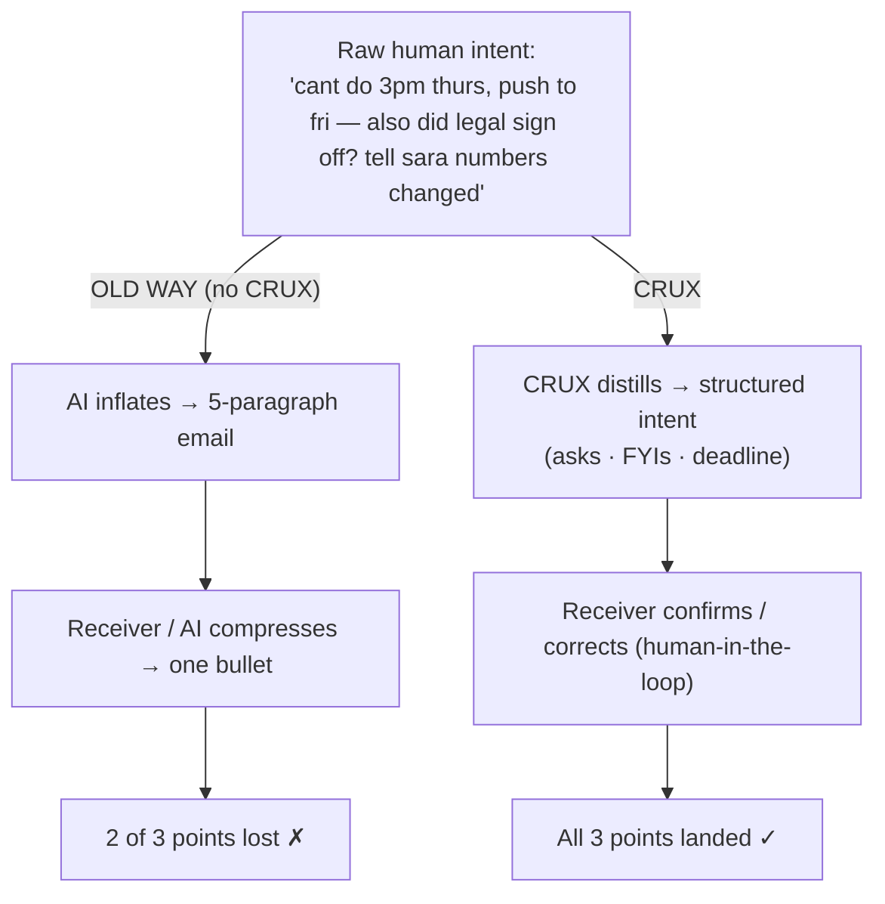

# Digital collaboration intent transfer

## You

<external_links>
### Potentially Relevant Websearch Results

You should respond as if these information are known to you. Refrain from saying "I am unable to browse the internet" or "I don't have access to the internet" or "I'm unable to provide real-time news updates". This is your internet search results. Please always cite any links you referenced from the above search results in your response in markdown format.

-------
Website URL: https://miro.com/app/board/uXjVHJa5VAc=/?share_link_id=341262416032
Website Title: Miro
Website Content:
# Miro
____

</external_links>
<plugin_info kind="matched_installed">
display_name: Miro
description: Secure access to Miro boards. Enables AI to read board context, create diagrams, and generate code with enterprise-grade security.
skills:
  - miro-mcp: This skill teaches how to use Miro MCP tools effectively for creating diagrams, documents, tables, and extracting context from Miro boards. Use when the user asks about Miro capabilities, wants to create content on Miro boards, or needs to work with Miro board data.
commands:
  - browse: List and explore items on a Miro board
  - diagram: Create a diagram on a Miro board from a text description
  - doc: Create a document (Google Docs-style) on a Miro board
  - summarize: Generate documentation or summary from a Miro board
  - table: Create a table on a Miro board with specified columns
mcp_servers:
  - miro
</plugin_info>
<timestamp>Saturday, Jun 6, 2026, 9:14 PM (UTC+4)</timestamp>
<user_query>
## Hack
Prompt: "Build something that makes digital collaboration feel more human"
Build time: 12:00 pm – 2:30 pm ET
## Problem Statement
> Communication is the transfer of intent — one person's idea landing, intact, in another's head. AI was supposed to help, but it attacked the wrong layer: it made _producing words_ effortless while making _transferring meaning_ harder. Senders now inflate a single thought into a wall of text they didn't really write; receivers compress it back into a bullet they didn't really read. The words got bigger, the thinking got smaller, and the actual idea dies in the round-trip. Digital collaboration doesn't need more generated content — it needs the human's real intent to survive the trip between two people.
## Questions
1. Describe your product in one sentence
2. Who is this for? (think of which user/user groups does this solve for)
3. What problem does it solve? (list 1-3)
Now your three questions, answered against that statement:
**1. One sentence:** A collaboration layer that carries a person's _intent_ between them and another human — so the sender shares the real point without padding it into an essay, and the receiver gets it (and can ask it real questions) without drowning in AI text.
**2. Who it's for:** The general population doing everyday digital back-and-forth — not power users. Anyone who sends or receives work over text and is either tempted to inflate it or too overwhelmed to read it: sales, marketing, ops, healthcare handoffs, students, teams. The buyer-test is "have you ever pretended to read something, or let AI puff up something you sent?" — that's everyone.
**3. Problems it solves (3):**
- **The inflate/deflate waste** — kills the round-trip where AI expands then re-compresses the same idea, losing meaning each pass.
- **Review overload** — receivers stop drowning in AI slop; they get the actual point at the size _they_ need, and can interrogate it for real answers instead of skimming.
- **Lost intent & trust** — the sender's genuine meaning and accountability survive, so collaborators trust that what they're reading is the real thing.

Provided you with my thought process and laying it down on the miro board. We really nailed the problem statement here. This is the miro board for you to read and analyze: "https://miro.com/app/board/uXjVHJa5VAc=/?share_link_id=341262416032 ". Here is what i want from you. The miro board might not be good enough with the solution for the problem statement I have provided you with above. We are running short on time. Let's start building our mvp with lovable. Provide me with 2 sets of prompts for now that focus on how exactly we are solving this problem. Think along the way, while writing this prompt. How do we solve this problem? Provide me with a really nice prompt so that lovable focuses on my prompt more than the miro board. 
</user_query>

## Cursor

I'll start by reading your Miro board to understand the thinking you've laid out, then craft the Lovable prompts. Let me check the Miro MCP tools and pull the board content.

 I need to read the Miro board first to understand what problem we're solving, then I'll create two sets of Lovable prompts based on that analysis.

 Doesn't look like there are any Miro tools in that directory, so I need to investigate what's actually there.

 I'm noticing the Miro MCP server is referenced in the configuration but isn't actually present in the file system. Looking at the available servers, I can see several plugins and user-defined servers, but Miro isn't among them.

I tried to pull your Miro board, but Miro boards are auth-gated JS canvases, so neither the MCP (the Miro server isn't connected in this workspace) nor a web fetch can read its contents. That's actually fine given your ask — you explicitly want Lovable to weight *your problem statement* over the board, so I'll build the prompts from the statement you wrote. Flagging it so you know I'm not silently ignoring the board.

Before I write the prompts, here's the core solution thesis I'd encode (so you can sanity-check my direction):

The product is an **intent layer for messages**, not a content generator. The mechanism that beats the inflate/deflate trap:
- **Sender side:** you brain-dump messily (or in a few bullets) and the tool *distills* it down to an "intent capsule" — the real point + the few facts that support it + what you actually want back. It never pads it into prose. You confirm "yes, that's what I mean," which locks in your accountability.
- **Receiver side:** they receive the capsule at *their* chosen density (one line → expanded), and can **interrogate** it — ask it real questions. Answers are grounded *only* in the sender's captured intent; if the answer isn't there, it says "not specified — ask the sender" instead of hallucinating. That's what keeps trust intact and meaning surviving the round-trip.

One thing genuinely changes how I write the two prompts, so I need your call.

 The Miro MCP server isn't actually available in the file system, so I can't access the board through that connection. Web fetching the Miro board also came up empty since Miro is a JavaScript-rendered application that requires authentication and can't be scraped directly.

Since I can't read the board anyway, and the user explicitly wants me to focus on the problem statement they provided rather than the board content, I don't need to keep trying. They've given me a rich problem description and want the Lovable prompts grounded in that.

Now I'm thinking through the core solution: the real problem is that communication inflates on the sender side and deflates on the receiver side, losing meaning in the round trip. The product should capture intent compactly and let receivers interrogate it with real questions grounded in the sender's actual meaning, rather than generating more content or hallucinated answers. So I'm envisioning a messaging layer where senders encode their actual intent in compact form, and receivers can request it at whatever detail level they need while staying anchored to what was actually meant.

The user asked for "2 sets of prompts" — I'm interpreting this as either two alternative product framings I can present, or two sequential prompts that build on each other. I should probably ask for clarification or just go with two distinct approaches to the Lovable prompt that represent different angles on solving this problem. I'm weighing whether to ask a clarifying question about what "2 sets" means or just deliver two strong, distinct prompts that give them options. Given they're time-pressured in a hackathon, asking one quick question feels reasonable to avoid building the wrong thing, but I could also interpret it as two alternative product concepts and move forward fast. I'll skip the lengthy preamble and just ask the structural question directly—that's the real blocker. I'll mention I couldn't access the board so they understand my context, then present the three most likely interpretations of "2 sets of prompts" and let them confirm which path makes sense.

Locked in: one concept (the intent layer), two sequential Lovable prompts — **Prompt 1 scaffolds the full MVP end-to-end**, **Prompt 2 deepens the interrogation + trust layer and polishes for demo**.

Working name **Crux** (rename freely). Each prompt opens with a hard instruction telling Lovable to build from the spec and ignore other context — that's your "focus on my prompt, not the board" lever.

---

## Prompt 1 — Scaffold the MVP (paste this first)

```text
Build a web app called Crux. Build STRICTLY from this spec. Do not pull in outside
templates, generic "messaging app" patterns, or unrelated context — every screen below
exists to serve ONE idea. If something here conflicts with a default you'd normally pick,
follow this spec.

== THE IDEA (read this so you make good design calls) ==
Communication is the transfer of intent: one person's idea landing intact in another's
head. AI broke this by making it effortless to PRODUCE words while making it harder to
TRANSFER meaning — senders inflate one thought into a wall of text, receivers compress it
back into a bullet, and the real idea dies in the round-trip.

Crux is NOT a content generator. It does the opposite: it strips a message down to its
real intent and carries that intent — intact and accountable — from sender to receiver.

== CORE OBJECT: the Intent Capsule ==
Every message is sent as a structured "Intent Capsule", never as prose:
  - point:    the single real point, max ~12 words, plain language
  - ask:      one of: "Just FYI" | "Decision needed" | "Action requested" |
              "Feedback wanted" | "Answer needed"
  - facts:    0–3 short supporting facts, ONLY things actually present in the raw input
  - specifics:key/value details lifted verbatim (dates, numbers, names, amounts)
  - tone:     one short word (e.g. "urgent", "casual", "formal")
  - raw:      the sender's original text (stored, hidden by default — used to ground answers)
  - signedBy, signedAt: set when the sender confirms

== THE DEMO FLOW (build all of this) ==
Single-page app simulating a conversation between two people: Alex (sender) and
Jordan (receiver). Provide a clear toggle/segmented control at top to switch between
"Alex (Sender)" and "Jordan (Receiver)" views. Use shared in-memory state so a message
sent by Alex instantly appears for Jordan.

SENDER VIEW (Alex):
1. A "Brain-dump" textarea with placeholder: "Say it messy. We'll carry the point, not
   the padding." Pre-fill with a realistic messy example (a rambling 6–8 line work message).
2. A "Distill" button. On click, run distill() and show the resulting Intent Capsule in a
   clean card: the point as the hero line, the "ask" as a labeled pill, facts as chips,
   specifics as small key/value rows.
3. The sender can lightly edit the point / ask / facts (this is where THEY stay
   accountable — the capsule reflects what they mean).
4. A primary "Send as my intent" button that signs it (sets signedBy/signedAt) and
   delivers it to Jordan. Show a subtle "Signed by Alex" confirmation. Never expand the
   capsule back into a paragraph.

RECEIVER VIEW (Jordan):
1. An inbox list. Each message shows ONLY the point line + the ask pill by default — no
   wall of text. Calm, scannable, one line each.
2. Open a message to see the capsule (point, ask, facts, specifics). The raw original text
   is NOT shown by default — there's a small "show original" toggle, deliberately secondary.

== AI SEAM (reliability matters for the demo) ==
Put all intelligence behind ONE module, lib/intent.ts, exposing:
  - distill(raw: string): IntentCapsule
  - answer(capsule: IntentCapsule, question: string):
        { answerable: true, text: string } | { answerable: false }
Use Lovable AI (built-in, no API key) for both. For distill(), instruct the model to
EXTRACT and COMPRESS only — never invent facts, never add fluff. Always provide a
deterministic rule-based fallback for both functions so the demo NEVER breaks if the AI
call fails (e.g. first sentence -> point, detect dates/numbers -> specifics, keyword ->
ask type).

== DESIGN DIRECTION ==
Calm, confident, anti-slop. Lots of whitespace. The "point" line is the hero — large,
high-contrast, almost editorial. Everything else is quiet and secondary. Light theme,
one restrained accent color, a subtle mono/serif touch on the point line to signal
"this is the real thing." No gradients-everywhere, no clutter. It should FEEL like
clarity.

== ACCEPTANCE (must work end-to-end) ==
- Alex can brain-dump -> Distill -> see a clean capsule -> Send as intent.
- The sent message appears in Jordan's inbox as a single point line, not a paragraph.
- Jordan can open it and see the structured capsule with the original hidden.
- Everything works offline via the rule-based fallback.
Keep it to these screens. Do not add auth, settings, or extra pages yet.
```

---

## Prompt 2 — Deepen interrogation + trust, then polish (paste after Prompt 1 works)

```text
Extend Crux. Same spec rules: build strictly from this, keep the existing Intent Capsule
model and the Alex/Jordan flow. This pass adds the two things that make the idea land:
the receiver can INTERROGATE a message and get grounded answers, and BOTH sides can see
that intent survived the trip.

== 1. INTERROGATE (the core differentiator) ==
On the receiver's open-message view, add an "Ask this message" input:
"Ask Alex's message anything — get the real answer, not a guess."
Wire it to answer(capsule, question) from lib/intent.ts.
GROUNDING RULE (critical): answers come ONLY from the capsule's point + facts + specifics
+ raw text. The model must NOT use outside knowledge or speculate.
  - If answerable: show a short, direct answer + a tiny "based on what Alex said" tag.
  - If NOT answerable: do NOT guess. Show: "Alex didn't specify this." plus a primary
    button "Ask Alex →".
Render asked questions + answers as a short thread under the message so it reads like
real interrogation, not a chatbot.

== 2. CLOSE THE LOOP (round-trip accountability) ==
Clicking "Ask Alex →" creates a clarifying question routed back to Alex's view as a
"Needs your input" item on that message. When Alex answers, append it to the capsule's
facts/specifics (so the intent grows from the SENDER, not from AI) and the new answer
appears in Jordan's thread. This visibly demonstrates intent surviving the round-trip
without anyone writing a wall of text.

== 3. DENSITY CONTROL (receiver picks the size) ==
On the open message, add a 3-stop control: "One line" / "Brief" / "Full".
  - One line: just the point + ask.
  - Brief: point + ask + facts.
  - Full: + specifics + the asked/answered thread.
The receiver chooses how much they consume — they never get drowned, never have to skim.

== 4. TRUST SIGNAL ==
Add a small "Intent preserved" indicator on each delivered message: a quiet meter/badge
showing the message is carrying the sender's signed intent (signedBy/signedAt) and how
many of the receiver's questions were answerable directly from it vs. needed the sender.
Make it feel like proof, not decoration. Show "Signed by Alex" prominently — accountability
is the point.

== 5. POLISH FOR DEMO ==
- Seed 2–3 varied example messages already in Jordan's inbox (a decision request, an FYI,
  an action item) so the demo has content immediately.
- Smooth, restrained transitions when distilling and when density changes (no bounce/noise).
- Thoughtful empty states and a one-line tagline in the header:
  "Crux carries what you mean — not more words."
- Keep the calm,

 They're going with a sequential approach where the first prompt establishes the full MVP and core flow, then the second one refines and deepens it around the intent capsule layer concept. Now I'm thinking through the concrete product design—the name, the user flow, and a demo that's actually buildable in 2.5 hours with Lovable, so something with a clean frontend and simulated or AI-powered logic underneath.

I'm considering names like "Throughline," "Crux," or "Gist" to capture the idea that intent survives the communication journey. "Crux" feels right—short, memorable, and it literally means the core of what you're trying to say. For the hackathon demo, I'm picturing a two-pane view with a sender and receiver. The sender writes a messy brain-dump or bullets, hits "Distill," and gets back an Intent Capsule with the point, supporting context as chips, what they're asking for, and a confidence/tone indicator. They lock it in and send. On the receiver side, it arrives as a single line by default with a density slider so they can expand it if needed—no wall of text. They can ask clarifying questions but only get answers grounded in the capsule itself.

For the Lovable implementation, I need to abstract the "distill" and "answer" functions behind a service layer so it can call an LLM if a key exists, otherwise fall back to deterministic logic. This keeps the demo reliable even if the API isn't available. I'm sketching out two prompts: one to scaffold the full MVP with screens, data model, the two-persona split view, and visual direction, and another to handle the specific AI logic and fallbacks.

I'll write these as copy-paste-ready prompts for Lovable, making sure to include an explicit instruction to prioritize the spec over the Miro board. Rather than using CreatePlan, I'll deliver the prompts directly in chat so the user can copy them immediately. page app with two stacked panels toggling between sender and receiver views to simulate a conversation. The flow walks through composing a message, distilling it into an intent capsule, confirming it, and then showing the receiver's inbox. I'm defining the data model for the capsule — point, ask type, facts, specifics for concrete details, tone, and the original raw text for grounding. For the AI seam, I'll use Lovable's built-in AI to handle the distill and Q&A operations, wrapped in a single module with a rule-based fallback to keep the demo reliable.

Now I'm setting the receiver's Q&A grounding rule: answers come only from the capsule's facts, raw text, and specifics, and if something isn't answerable, return a clear message. I'm ready to write the final answer with the assumptions, the two prompts in code blocks, and notes on the AI reliability approach and what's being deferred.

**Tool calls:**

- `Glob` — pattern `mcps/miro/**/*.json`, path `C:\Users\Anant Gupta\.cursor\projects\d-projects-hackathon`
- `Glob` — pattern `mcps/**/*.json`, path `C:\Users\Anant Gupta\.cursor\projects\d-projects-hackathon`
- `Glob` — pattern `mcps/*/SERVER_METADATA.json`, path `C:\Users\Anant Gupta\.cursor\projects\d-projects-hackathon`
- `AskQuestion` — `{"questions":[{"id":"sets_meaning","prompt":"What should the '2 sets of prompts' actually be? This determines how I write them.","options":[{"id":"alternatives","label":"Two ALTERNATIVE concepts — two different ways to solve the same problem, each a complete standalone Lovable prompt, so I can pick …`

## You

Your previous response was interrupted. Continue from where you left off.

## Cursor

Here's the complete Prompt 2 in one clean block (the previous one got cut off mid-section), plus how to use them.

## Prompt 2 — Deepen interrogation + trust, then polish (complete)

```text
Extend Crux. Same spec rules: build strictly from this, keep the existing Intent Capsule
model and the Alex/Jordan flow. This pass adds the two things that make the idea land:
the receiver can INTERROGATE a message and get grounded answers, and BOTH sides can see
that intent survived the trip.

== 1. INTERROGATE (the core differentiator) ==
On the receiver's open-message view, add an "Ask this message" input:
"Ask Alex's message anything — get the real answer, not a guess."
Wire it to answer(capsule, question) from lib/intent.ts.
GROUNDING RULE (critical): answers come ONLY from the capsule's point + facts + specifics
+ raw text. The model must NOT use outside knowledge or speculate.
  - If answerable: show a short, direct answer + a tiny "based on what Alex said" tag.
  - If NOT answerable: do NOT guess. Show: "Alex didn't specify this." plus a primary
    button "Ask Alex →".
Render asked questions + answers as a short thread under the message so it reads like
real interrogation, not a chatbot.

== 2. CLOSE THE LOOP (round-trip accountability) ==
Clicking "Ask Alex →" creates a clarifying question routed back to Alex's view as a
"Needs your input" item on that message. When Alex answers, append it to the capsule's
facts/specifics (so the intent grows from the SENDER, not from AI) and the new answer
appears in Jordan's thread. This visibly demonstrates intent surviving the round-trip
without anyone writing a wall of text.

== 3. DENSITY CONTROL (receiver picks the size) ==
On the open message, add a 3-stop control: "One line" / "Brief" / "Full".
  - One line: just the point + ask.
  - Brief: point + ask + facts.
  - Full: + specifics + the asked/answered thread.
The receiver chooses how much they consume — they never get drowned, never skim.

== 4. TRUST SIGNAL ==
Add a small "Intent preserved" indicator on each delivered message: a quiet meter/badge
showing the message is carrying the sender's signed intent (signedBy/signedAt) and how
many of the receiver's questions were answerable directly from it vs. needed the sender.
Make it feel like proof, not decoration. Show "Signed by Alex" prominently — accountability
is the point.

== 5. POLISH FOR DEMO ==
- Seed 2–3 varied example messages already in Jordan's inbox (a decision request, an FYI,
  an action item) so the demo has content immediately.
- Smooth, restrained transitions when distilling and when density changes (no bounce/noise).
- Thoughtful empty states and a one-line tagline in the header:
  "Crux carries what you mean — not more words."
- Keep the calm, anti-slop, editorial design from Prompt 1. The point line stays the hero.
- Ensure the rule-based fallbacks still cover interrogation (keyword match against
  facts/specifics; if no match -> "didn't specify") so the demo never breaks live.

== ACCEPTANCE ==
- Jordan can ask a message a question and get an answer grounded only in Alex's capsule.
- An out-of-scope question yields "Alex didn't specify this" + "Ask Alex →", never a guess.
- "Ask Alex →" round-trips to Alex, his answer flows back into Jordan's thread.
- Density control changes how much is shown; "Intent preserved" + "Signed by Alex" visible.
Do not add auth, accounts, or unrelated pages.
```

---

### How to use these
- Run **Prompt 1** in a fresh Lovable project, let it build, confirm the Alex→Jordan send flow works, then run **Prompt 2** in the same project.
- The reliability trick that protects your live demo: both prompts force all AI behind `lib/intent.ts` with a **rule-based fallback**, so if Lovable AI hiccups during judging, the flow still runs.
- The "build strictly from this spec / ignore outside context" opener in each is your lever to make Lovable prioritize the prompt over the board.

### What I deliberately left out (for time)
Auth, real multi-user/persistence, mobile layout, and analytics — none are needed to demonstrate the thesis (intent surviving the round-trip). Easy to layer on after if you have spare time.

Two quick things worth your call when you're ready:
- **Name** — "Crux" is a placeholder; if you have a preferred name I'll swap it into both prompts.
- **The single biggest demo risk** is the *interrogation* feeling like a generic chatbot. The grounding rule ("Alex didn't specify this" instead of guessing) is what sells it to judges — make sure that exact behavior survives in the build.

Want me to also draft a 30-second demo script (what to click, what to say) so the round-trip story lands cleanly for judges?

 I need to finish the second prompt block and make sure it's clean and copy-pasteable, then wrap everything up.

## You

<timestamp>Saturday, Jun 6, 2026, 9:23 PM (UTC+4)</timestamp>
<user_query>
Now before I send these prompts, I need you to understand what is exactly being built here. 
```
The "intent is obvious the second they open it" part — yes, this is the key insight you just had
The prototype should teach itself in one glance. Here's how I'd make the demo do that with almost no clicks:
One screen, split down the middle. Left = "the old way," right = "CRUX." Same message in both.

You land, and a single sentence is already typed in a box: "can't make the 3pm, push to thursday?" — the raw human point.
One click: "Send."

Left side animates the old way: that sentence balloons into a 5-paragraph AI email, then collapses into a bullet that's subtly wrong ("Meeting cancelled"). A red ✗. The absurdity lands instantly — no explanation needed.
Right side (CRUX): the point arrives as-is, with a readback card: "You're asking to move the 3pm to Thursday — right?" The receiver clicks ✓. Green. Loop closed.

That's it. The contrast does all the talking. A judge gets the entire product in five seconds without reading a word of instructions.

The genius of keeping it this simple: the demo and the pitch are the same thing. The product makes the point survive the trip, and the prototype itself makes its own point survive the trip — one screen, one click, instantly understood. If the prototype needs a paragraph to explain it, we've failed our own thesis.
```

I have updated the board with these instructions just now. I want you to rewrite the prompts you have written just now based on this information. Do not make mistakes. Make sure that lovable does not hallucinate one bit. We need to have the product ready in 30 minutes. 
</user_query>

## Cursor

This refinement actually makes the build *safer* and faster: because the message is fixed, the demo is fully scripted — **no AI, no API calls, nothing to hallucinate**. Everything is hardcoded copy + a timed animation. That's the single biggest anti-hallucination guarantee, and it's exactly what fits 30 minutes.

I've kept your sequential structure: **Prompt 1 builds the entire working demo** (you can stop here and you have a full demo). **Prompt 2 is pure polish** — run it only if time remains.

---

## Prompt 1 — Build the full split-screen demo (paste this first)

```text
Build a single-screen web demo called CRUX. This is a SCRIPTED, DETERMINISTIC prototype.

HARD RULES — DO NOT BREAK:
- NO backend, NO AI/LLM, NO API calls, NO API keys, NO randomness, NO data fetching.
- Every piece of text below is FIXED. Reproduce it EXACTLY, verbatim. Do not paraphrase,
  summarize, translate, or generate any new copy.
- Do not add features, pages, routes, settings, or screens that are not described here.
- One screen only. One React component is fine. Use Tailwind + Framer Motion for animation.

== CONCEPT (so you understand the layout, not to add content) ==
The screen teaches itself in one glance: a side-by-side contrast of the same message sent
two ways. LEFT = "the old way" (AI inflates a simple point, then it collapses into a wrong
summary). RIGHT = "CRUX" (the point arrives intact and gets confirmed). The contrast is the
whole pitch. No instructions needed.

== LAYOUT ==
- Minimal top bar: left-aligned wordmark "CRUX", and a quiet tagline on the right:
  "The point survives the trip."
- Centered above the split: a single text input PRE-FILLED with this exact value
  (lowercase, as written): can't make the 3pm, push to thursday?
  Next to it, ONE primary button labeled: Send
- Below that: a full-width area split exactly down the middle by a thin vertical divider.
  - LEFT column header: "The old way"
  - RIGHT column header: "CRUX"
- Both columns start empty (just their headers) before Send is clicked.

== WHAT HAPPENS ON "Send" (single click triggers a timed animation on BOTH sides) ==
Use a fixed timeline (milliseconds). Do not randomize.

LEFT COLUMN — "The old way":
  1. (0ms) The raw sentence "can't make the 3pm, push to thursday?" appears in a small bubble.
     Small caption above it: "AI inflates it →"
  2. (300ms) Over ~1500ms it EXPANDS (grows in height, lines fade in one by one) into this
     exact formal email, shown in an email-style card:

        Subject: Regarding Our Scheduled 3:00 PM Meeting

        Hi team,

        I hope this message finds you well. I wanted to reach out regarding the meeting we
        currently have on the calendar for 3:00 PM today.

        Unfortunately, due to some unforeseen scheduling conflicts, I find myself unable to
        attend at the originally designated time. I sincerely apologize for any inconvenience.

        If it's not too much trouble, I'd like to propose moving our discussion to Thursday
        instead, pending everyone's availability.

        Please let me know your thoughts at your earliest convenience. Thank you for your
        understanding and flexibility.

        Best regards,
        Alex

  3. (2000ms) Caption changes to: "Receiver compresses it →". Over ~800ms the email COLLAPSES
     down into a single wrong bullet: "• Meeting cancelled"
  4. (2900ms) A red ✗ badge stamps in next to the bullet with the label: "Meaning lost."
     The left column settles in a red/error tone.

RIGHT COLUMN — "CRUX":
  1. (300ms) The point slides in as a clean capsule card (mono/editorial hero line):
     "Can't make the 3pm — move it to Thursday?"
     Small caption above: "CRUX carries the point →"
  2. (1200ms) A "readback" card appears below it with this exact text:
     "You're asking to move the 3pm to Thursday — right?"
     and a green confirm button labeled: ✓ Yes, that's it
     The button gently pulses to invite a click.
  3. When the user clicks ✓ (OR automatically at 3000ms if not yet clicked), the card turns
     green, a check animates in, and a label appears: "Intent confirmed — loop closed."
     The right column settles in a green/success tone.

== END STATE ==
LEFT ends red with the wrong "Meeting cancelled" bullet + ✗ "Meaning lost."
RIGHT ends green with the confirmed point + "Intent confirmed — loop closed."
Add a small, quiet "Replay" button (top or bottom) that resets everything to the initial
state so the demo can be run again. The input value resets to the same fixed sentence.

== DESIGN ==
Calm, confident, editorial. Generous whitespace. The point line on the right is the hero
(large, high-contrast, slight mono/serif character). Left side uses a muted/grey email look
that turns red at the end; right side uses one clean accent that resolves to green. Smooth,
restrained motion — no bounce, no noise. It must read clearly on a projector: large type,
strong contrast, nothing tiny.

== ACCEPTANCE ==
- On load: fixed sentence pre-filled, both columns empty under their headers.
- One click on "Send" runs the full timed animation on both sides with the EXACT copy above.
- Left ends wrong+red; right ends confirmed+green. Replay resets cleanly.
- No network calls, no AI, no console errors. The whole thing is self-contained and offline.
```

---

## Prompt 2 — Polish only (run only if you have spare minutes)

```text
Polish the CRUX demo. Keep ALL existing copy and the timed animation exactly as built —
do not change any text, do not add AI or backend, do not add new screens. This is visual
and timing refinement only.

- Tighten the animation feel: ease-in-out everywhere, no bounce; the LEFT "inflate" should
  feel slightly overwhelming (fast cascade of lines) and the "collapse" should feel like a
  sad shrug; the RIGHT should feel calm and instant by comparison. The emotional contrast
  is the point.
- Make the final states unmistakable on a projector: a clear red ✗ panel on the left
  ("Meaning lost.") and a clear green ✓ panel on the right ("Intent confirmed — loop closed.").
- Add a one-line strap under the split that only appears AFTER the animation finishes:
  "Same message. One side guesses. One side knows." (exact text, fixed).
- Ensure it looks good at 1920×1080 (presentation) and degrades gracefully to laptop width;
  columns stack vertically on narrow screens with LEFT on top.
- Subtle entrance for the wordmark/tagline on load. Keep the Replay button quiet but obvious
  enough to find during a live demo.
- Double-check: no layout shift/jank during the animation, no text wrapping that breaks the
  email card, no console warnings.
```

---

Run Prompt 1, confirm one click produces the red-left / green-right contrast, then optionally Prompt 2. Because there's zero AI and all copy is fixed, there is nothing for Lovable to invent — if it ever deviates, it's a copy/layout bug, not a hallucination.

One call worth making before you send: I auto-confirm the right side at 3000ms if no one clicks ✓, so the demo self-runs even if the presenter forgets to click. If you'd rather it *wait* for a deliberate ✓ click (more interactive, but requires you to remember), say so and I'll flip that line in Prompt 1.

 The vision has shifted to a much cleaner, side-by-side comparison demo. The left side shows the old approach with its flawed inflate/deflate cycle, while the right demonstrates CRUX's proper flow where the point arrives intact, gets confirmed via a readback card, and closes the loop. It's a single pre-typed message with one click to trigger animations on both sides—a scripted, deterministic demo rather than an open-ended AI interaction, which is crucial for showing that lovable products don't hallucinate.

Since the message is fixed and there's no need for live AI, I can hardcode everything and eliminate hallucination concerns entirely. I'm thinking through how to structure the prompts: the first one should build the complete split-screen demo with all animations scripted and text hardcoded, while the second focuses on polishing timing, contrast, and adding presenter controls like reset and replay. The key is being explicit in the prompts that no AI or LLM integration happens—every piece of text is fixed and must appear exactly as specified.

For the layout, I'm picturing a vertically split screen with the input box centered at the top feeding both sides. The left side shows "the old way" where the message balloons into a verbose email, then collapses into a subtly wrong summary marked with a red ✗. The right side shows CRUX's approach: the message stays clean, a readback card confirms the intent, and a green ✓ closes the loop. The contrast between the red failure on the left and green success on the right drives the point home.

I'm settling on two clicks total—one to send, one for the receiver to confirm the readback—which keeps it interactive without being tedious. The exact copy is locked in: the raw sentence is "can't make the 3pm, push to thursday?" The left side inflates this into a formal five-paragraph email that eventually collapses to "Meeting cancelled" with the label "Meaning lost in the round-trip." The right side keeps it direct with a readback asking "You're asking to move the 3pm to Thursday?" waiting for confirmation.

I'm now mapping the animation timeline and writing two tight prompts for Lovable—Prompt 1 handles the full deterministic build so it works as a demo, and Prompt 2 adds polish like timing refinement, replay button, and responsive styling. I'll note that they can stop after Prompt 1 if time is tight. The tagline "The point survives the trip" anchors the whole thing, and I'm being explicit about exact copy—no paraphrasing, no AI generation, just what's written.

## You

<timestamp>Saturday, Jun 6, 2026, 9:30 PM (UTC+4)</timestamp>
<user_query>
What do we do after running these two prompts? Do you have enough time to analyze the lovable made ui, copy it over here and then make changes? Do we have enough time to build this entirely? What are the next steps. Think before you answer and be aware that we have an hour left.
</user_query>

## Cursor

Let me quickly check the actual state of this repo so my advice is grounded, not hypothetical.

 I'm looking at the available skills and the workflow they've set up—building in Lovable, exporting, importing into this Next.js repo, then polishing and deploying. The user's asking whether there's actually enough time in the remaining hour to pull off the import and integration, so I need to think through what's realistic given the constraints.

The demo itself is straightforward—just a single scripted screen that Lovable could build in minutes. The real bottleneck is the import pipeline: running lovable-import, cleaning up the output, transforming it, validating it, then going through ui-excellence and production-stack before deploying. That's a lot of steps for an hour, especially if something goes wrong. For a hackathon demo, the pragmatic move might be to just publish directly from Lovable's hosted preview rather than importing into the repo at all—unless the judging criteria specifically require the GitHub repo or a custom deployment. Let me check what's actually in this repo to give a more grounded recommendation.

 I'm realizing there's no Next.js app or package.json here—just documentation, skills, and config files. Importing a Lovable export would mean scaffolding a whole Next.js project first, which isn't feasible in an hour for a single screen. Let me check what's actually in this repo.

Good question to ask before sinking time. I checked the repo and that changes the answer: **there is no app here to import into.** This repo is all docs, skills, and hooks — no `package.json`, no Next.js, no `src/`. So "copy it over here and make changes" isn't a small step; it means scaffold a Next.js app first, *then* run the import/slop/transform/validate pipeline ([lovable-import](.cursor/skills/lovable-import/SKILL.md)), then make it build, then deploy. That's a 45–90 min job with real breakage risk.

With one hour and a **single scripted screen**, that's the wrong trade. Here's my honest read.

### Recommendation: demo straight from Lovable. Do NOT import into this repo.
The demo you designed is one self-contained screen with zero backend. Lovable already hosts it — click **Publish** and you get a live URL. That *is* your deliverable. Importing buys you nothing for the demo and risks burning your whole hour debugging a build.

### Can we build it entirely in time? Yes — easily, if we stay in Lovable.
The scripted demo is small. Lovable will generate it in one pass. The hour is plenty *if* we don't detour into the import pipeline.

### The hour, time-boxed

| Time | Step |
|---|---|
| 0:00–0:12 | Paste **Prompt 1** into a fresh Lovable project. Let it build. |
| 0:12–0:20 | Verify the one-click flow: red-left (wrong) vs green-right (confirmed). Fix any copy/layout slip by telling Lovable the exact line that's off. |
| 0:20–0:30 | Optional **Prompt 2** polish. If it looks good already, skip it. |
| 0:30–0:32 | Click **Publish** in Lovable → grab the live URL. This is what you present. |
| 0:32–0:50 | Rehearse the 5-second story + a 60–90s pitch. Practice the click. Confirm auto-confirm fallback fires if you forget to click ✓. |
| 0:50–1:00 | Submission text — you already have it (one-sentence / who / 3 problems). Paste, add the live URL, done. Buffer for surprises. |

### The one thing that would flip this
If judging **requires a GitHub repo or your own deploy** (not a Lovable URL): don't run the manual import pipeline — use **Lovable's built-in GitHub sync** (Lovable → GitHub → connect). That pushes the real code to a repo in ~2 minutes, no scaffolding, no slop pass. Far safer than importing here under time pressure.

So: next steps are **build in Lovable → verify → publish → rehearse → submit.** Skip this repo entirely unless a rule forces a repo, in which case use Lovable's GitHub sync.

Want me to draft the 60–90 second pitch + the exact 5-second demo narration now, so it's ready while Lovable builds? (I can only write it for you here — I'm in Ask mode, so I can't run or change anything.)

 Looking at what's actually in this repo—just documentation, skills, and hooks configuration with no scaffolded app—I realize that migrating it here would require setting up a full Next.js or Vite project and running the import pipeline, which is substantial work given the time constraint. With an hour left and a single scripted demo to deliver, the practical path forward is Option A.

I should demo directly from Lovable's live preview URL—just publish and present from there. That eliminates the import overhead entirely. The hour is better spent building the screen in Lovable using the two prompts, verifying it runs cleanly, rehearsing the pitch, and prepping the submission. Option B (importing here) carries too much risk and scaffolding friction for what amounts to a one-screen deliverable.

The key decision point: if the judging criteria require the code to live in this repo or their own deployment, then import becomes necessary and I'd need to flag that as the deciding factor. Otherwise, staying in Lovable is the safest path. Time-wise, the Lovable build and publish should take around 20 minutes, leaving 40 minutes for rehearsal and submission prep. The import path—scaffolding, exporting, running the pipeline, fixing issues—could easily eat 45-90 minutes with real risk of breakage.

I'll give a clear, decisive recommendation with a branching point on the judging requirement, keeping it tight given the time pressure.

**Tool calls:**

- `Glob` — pattern `{package.json,next.config.*,app/**,src/**,pages/**}`, path `D:\projects\hackathon`
- `Glob` — pattern `*`, path `D:\projects\hackathon`

## You

<timestamp>Saturday, Jun 6, 2026, 9:38 PM (UTC+4)</timestamp>
<user_query>
The website generated by lovable is complete garbage. I went through it — clicked Send, watched the replay, read the DOM. You're right that the point doesn't land, and I can tell you exactly why. The build quietly dropped the core of our thesis.
Here's what's actually on screen: you start with "can't make the 3pm, push to thursday?", hit Send, and the left ("old way") jumps straight to "• Meeting cancelled / ✗ Meaning lost," while the right shows "Can't make the 3pm — move it to Thursday?" plus an auto "✓ Intent confirmed — loop closed."
Six concrete problems:
1. The inflation step — our whole joke — is missing. Our thesis is inflate→deflate: a thought gets ballooned into an AI wall of text, then crushed back into a lossy bullet. The demo never shows the ballooning. The left side skips straight to the wrong bullet. The absurdity that makes people get it isn't on screen at all.
2. The example is already clear, so there's nothing to lose. "can't make the 3pm, push to thursday?" is a fine 7-word human message. Nobody would bloat it and nobody would misread it. We picked an example that has no problem in it — so the demo has no problem to solve.
3. "Meaning lost → Meeting cancelled" looks like a strawman. Because no mechanism is shown, it reads as "the old way just randomly gets it wrong." A judge thinks that wouldn't really happen and dismisses the whole thing.
4. CRUX appears to do nothing. Its output ("Can't make the 3pm — move it to Thursday?") is the same sentence as the input, reformatted in a serif font. If the input and output look identical, the product looks pointless. CRUX should output a structured intent, not a rephrase.
5. There's no human, so there's no loop. The readback auto-confirms itself. But the entire pitch is closed-loop communication — the human confirms understanding. Right now nothing is clicked; "loop closed" is just asserted. The one thing that proves our concept isn't demonstrated.
6. It's passive — no tension, no before/after. Everything resolves on load, both sides at once. There's no moment where you feel the old way fail and the new way save it.
What to change (this is the fix list for Lovable):

Pick an example where compression actually destroys meaning. Best option: a message with multiple buried asks, e.g. "hey can't do 3pm thurs, push to fri — also did legal sign off on the deck? and tell sara the numbers changed." Now the old way can plausibly lose 2 of the 3 points, and CRUX visibly keeps all of them.
Show the full round-trip on the left, animated: bullet → balloons into a 5-paragraph AI email → receiver's AI crushes it → a bullet that drops the legal question and the Sara note. That's "meaning lost," and it's believable.
Make CRUX output a structured intent card, not a sentence: e.g. Move 3pm→Fri · Ask: legal sign-off on deck? · FYI Sara: numbers changed · Needs reply by: today. Visibly different from the raw text = visible value.
Make the loop interactive. Show the readback as pending with a real "Yes, that's right" button. The viewer (or you, live) clicks it, and then it turns green "loop closed." That single click is the human-in-the-loop — the proof of the whole idea.
Sequence it: old way fails first (red), beat, then CRUX succeeds (green). Tension, then payoff.

The good news: the visual design, the red/green split, and the CRUX branding are all solid. The skeleton is right — it's the content of the demo that doesn't carry the argument yet.

Provide me with the next prompt that relays our ideas and problem statement clearly. Fix all the problems mentioned. 
</user_query>

## Cursor

This is sharp diagnosis — every one of those six is real, and the root cause is the same: the original prompt skipped the *mechanism*, so there was no problem on screen and nothing for CRUX to solve. Below is a single revision prompt that keeps what's good (design, red/green split, branding) and rebuilds the demo *content + sequencing*.

How it maps to your fix list: **(1)** left now animates bullet → 5-para email → lossy crush; **(2)** new 3-ask example that can actually lose meaning; **(3)** the loss is shown as specific dropped points, not a random wrong bullet; **(4)** CRUX outputs a structured intent card, visibly ≠ the raw text; **(5)** real pending readback with a click you (or a judge) make — no auto-confirm; **(6)** strict sequence: old way fails red → beat → CRUX saves green.

---

## Prompt 3 — Revision: make the demo carry the argument (paste into the existing project)

```text
Revise the existing CRUX demo. KEEP the current visual design, the red/green split layout,
the CRUX wordmark, typography, and the Replay button — those are good. This change is about
the CONTENT and SEQUENCING of the demo only. Do NOT redesign the look.

HARD RULES — DO NOT BREAK:
- NO backend, NO AI/LLM, NO API calls, NO randomness. Everything is scripted and hardcoded.
- Reproduce ALL copy below EXACTLY, verbatim. Do not paraphrase or generate new text.
- Deterministic timeline (fixed milliseconds). Same result every run.
- The human confirmation is a REAL click. Do NOT auto-confirm. Nothing on the right turns
  green until the user clicks the confirm button.
- The two sides are SEQUENTIAL, not simultaneous: the left fails completely first, then a
  short beat, then the right plays. Tension, then payoff.

== NEW EXAMPLE (pre-fill the input with this EXACT text, lowercase) ==
hey can't do 3pm thurs, push to fri — also did legal sign off on the deck? and tell sara the numbers changed.

This message carries THREE distinct points:
  (1) reschedule: can't do Thursday 3pm, push to Friday
  (2) a question: did legal sign off on the deck?
  (3) an FYI/action: tell Sara the numbers changed

== ON "Send" CLICK — PHASE 1: LEFT COLUMN "The old way" (the failure, plays first) ==
The RIGHT column stays empty/dimmed with a quiet "waiting…" placeholder during this phase.

  1. (0ms) Caption above: "AI inflates it →". The raw sentence appears in a small bubble.
  2. (400ms) Over ~1800ms it BALLOONS (height grows, lines fade in one by one) into this
     exact AI email, in an email-style card:

        Subject: Quick Scheduling Update + A Couple of Notes

        Hi team,

        I hope you're doing well! I wanted to touch base regarding our 3:00 PM meeting on
        Thursday. Unfortunately something's come up and I won't be able to make that slot,
        so I'd love to find a time that works better for everyone — Friday is looking good
        on my end if that suits the group.

        Separately, and whenever you get a chance, I was curious whether legal has had the
        opportunity to review and sign off on the deck yet. No rush — just want to make sure
        we're covered before we share it more widely.

        Oh, and one more small thing: could someone let Sara know that the numbers have
        changed? She'll want the latest before any next steps.

        Thanks so much, and apologies for the slightly scattered note!

        Best,
        Alex

  3. (2400ms) Caption changes to: "Receiver's AI compresses it →". Over ~900ms the email
     COLLAPSES into this single lossy bullet:
        • Alex wants to move Thursday's meeting to Friday.
  4. (3500ms) A red ✗ panel stamps in: "2 of 3 points lost." Below it, list the two dropped
     points with a struck-through / greyed style and small red ✗ marks:
        ✗ Did legal sign off on the deck?  — dropped
        ✗ Sara: the numbers changed  — dropped
     The left column settles in the red/error tone.

== BEAT ==
  (4400ms) Hold for ~800ms with the left sitting red. Nothing happens — let it land.

== PHASE 2: RIGHT COLUMN "CRUX" (the save, plays after the beat) ==
  1. (5200ms) Caption above: "CRUX carries the intent →". The raw point slides in briefly.
  2. (5700ms) Over ~1200ms it transforms into a STRUCTURED INTENT CARD (clearly different
     from the raw sentence — labeled rows, not prose). Animate the rows in one by one:
        Reschedule   →  Move Thu 3pm → Friday
        Ask          →  Did legal sign off on the deck?
        FYI · Sara   →  Numbers changed
        Reply by     →  Today
     Add a small badge on the card: "3 of 3 points kept."
  3. (6900ms) A pending READBACK appears below the card:
        "Jordan, did this land?"  with a button labeled:  Yes, that's right
     The button gently pulses. The card border is neutral/amber while PENDING.
     IMPORTANT: it stays pending indefinitely. Do NOT auto-confirm.
  4. WHEN the user clicks "Yes, that's right": the card border turns green, a check animates
     in, and a label appears: "✓ All 3 points landed — loop closed." Right column settles green.

== END STATE ==
  LEFT: red, lossy bullet + "2 of 3 points lost" with the two dropped points shown.
  RIGHT: green (only after the click), structured intent card + "All 3 points landed — loop closed."
  Replay resets everything to the initial state (input refilled with the exact sentence,
  both columns cleared, right back to "waiting…").

== ACCEPTANCE ==
- One click on Send plays LEFT fully (raw → email → lossy bullet → red, 2 of 3 dropped).
- After a beat, RIGHT plays to a structured intent card that visibly differs from the raw text.
- The right side does NOT turn green until the user clicks "Yes, that's right".
- No network calls, no AI, no randomness, no console errors. Verbatim copy throughout.
```

---

One deliberate choice flagged: per your fix #5 I removed the auto-confirm entirely — the right side waits for a real click forever. That means in a live demo *you* must click "Yes, that's right" to close the loop (that click is the whole point, so that's correct). If you'd instead want it to auto-confirm after ~3s as a safety net in case you forget on stage, say so and I'll add that single line back — but I'd recommend keeping the manual click since it *is* the human-in-the-loop proof.

 I need to create a single corrected Lovable prompt that addresses all six issues they identified, making sure to show how the inflation step works—how a bullet point expands into a full five-paragraph AI email before getting compressed back down into a lossy bullet format.

I'll use their multi-ask example to demonstrate the mechanism: "hey can't do 3pm thurs, push to fri — also did legal sign off on the deck? and tell sara the numbers changed." The old approach loses two of the three points (the legal question and Sara's note), keeping only the rescheduling request. The CRUX method outputs a structured intent card with distinct fields—Move 3pm→Fri, Ask: legal sign-off on deck?, FYI Sara: numbers changed, Needs reply by: today—making it visibly different from the raw input.

For the interactive loop, I'll add a real readback with a "Yes, that's right" button that the user clicks to close the loop, no auto-confirm. The sequence should show tension: the old way fails first in red, then after a beat, CRUX succeeds in green. Everything stays deterministic and hardcoded—no AI, no hallucination.

Now I'm drafting the email that the old system will process. It needs to contain all three points but bury them in fluff so the lossy compression dropping the legal question and Sara note feels believable.

Then I'm showing how the receiver's AI crushes it down to just the rescheduling detail, losing the other two items entirely. I'll mark those dropped points visually to make the information loss concrete.

For the right approach, I'm designing a structured intent card that captures all three points explicitly — the reschedule, the legal sign-off question, and the Sara notification — with a confirmation step where the receiver reads back their understanding and the sender verifies all points landed correctly, closing the loop.

Now I'm mapping out the animation sequence with clear timing: the left side shows the full failure arc with the email expanding then collapsing into a single bullet, followed by the red error state. Then after a beat, the right side animates in with the raw point transforming into the structured card and pending readback, giving the sequence tension and payoff rather than happening all at once.

The key constraint is that the confirm click is mandatory—no auto-confirm, since the human interaction is the proof point that the loop closed. I'm keeping the visual design and branding intact while changing only the content, sequencing, and adding the interactive confirmation step. Everything runs on a deterministic timeline with no AI involvement, just hardcoded animations and the user's explicit click to complete the flow.

Now I'll frame this as a revision prompt to the existing Lovable project rather than a full rebuild, since the skeleton and design are already solid. I'll structure it with hard rules upfront, the exact new example, the full sequence with timings, the LEFT column spec showing the compression and dropped points, the RIGHT column spec with the structured card and confirm button, and clear acceptance criteria.

## You

<timestamp>Saturday, Jun 6, 2026, 9:45 PM (UTC+4)</timestamp>
<user_query>
Plan out how exactly I should give my demo. I have to screen record and demo the prototype, I can only do this for 1 minute: "A link to the working demo/prototype (make it publicly accessible)

*
A short walkthrough demo video (under 1 minute) via Loom, other recording tools or an unlisted YouTube link (make it publicly accessible)". 

I just installed loom to screen record. But we have nothing to display, let's create a landing screen which acts like a presentation fro crux. Explains our problem statement, solution and why exactly do everyone need this? 
</user_query>

## Cursor

Two things here: a Lovable prompt to add the **landing/presentation section** (kept on the same page, scrolling into the existing demo so the whole story is one continuous take), and a **second-by-second 60s recording plan** so your narration syncs to the animation.

One structural decision I made: the landing goes *above* the existing split-screen demo on the same page (not a separate route), with a CTA that scrolls down. That way your public link opens to a self-explaining pitch, and your Loom is one smooth scroll-and-click — no cuts.

---

## Prompt 4 — Add the landing/presentation section (paste into the existing project)

```text
Add a LANDING / PRESENTATION section ABOVE the existing CRUX split-screen demo, on the
SAME page. KEEP the existing demo exactly as it is (do not change its content, timing, or
the manual confirm click). KEEP the current visual design language, colors, and CRUX wordmark.

HARD RULES — DO NOT BREAK:
- NO backend, NO AI, NO API calls, NO randomness. All copy below is hardcoded, verbatim.
- Do not paraphrase or generate new text. Reproduce the copy exactly.
- This is one scrollable page: LANDING on top, then the existing DEMO below it.

== LANDING SECTION (full viewport height, centered, calm/editorial, on-brand) ==
Top: the existing "CRUX" wordmark.

Eyebrow (small, muted):    Communication is the transfer of intent.

Headline (large, hero):    The idea dies in the round-trip.

Body (one paragraph, muted):
  AI made producing words effortless and transferring meaning harder. Senders inflate one
  thought into a wall of text. Receivers crush it back into a bullet they didn't really read.
  Each pass loses a little more of what you actually meant.

Solution block (visually distinct — accent border or panel):
  CRUX is the layer that carries your real intent — not more words. It distills your point
  into a structured intent, sends it intact, and a human on the other side confirms they
  got it. The loop closes. The meaning survives.

Why line (slightly emphasized, single line):
  For anyone who's ever pretended to read something, or let AI puff up something they sent.
  That's all of us.

CTA button (primary):  Watch it happen ↓
  Clicking it smooth-scrolls down to the demo section.

== THIN "THREE PROBLEMS" STRIP (between landing and demo, compact, 3 columns) ==
  1. Inflate / deflate waste
     The round-trip where AI expands then re-compresses the same idea — losing meaning each pass.
  2. Review overload
     Get the point at the size you need and interrogate it, instead of skimming AI slop.
  3. Lost intent & trust
     The sender's real meaning — and accountability — survives the trip.

== DEMO SECTION (unchanged) ==
Below the strip, render the EXISTING split-screen demo exactly as built, with its section
label "Same message. One side guesses. One side knows."

== ACCEPTANCE ==
- Page loads on the landing hero; "Watch it happen ↓" smooth-scrolls to the demo.
- The existing demo still works identically (Send → left fails red → beat → CRUX card →
  manual "Yes, that's right" click → green loop closed).
- No network calls, no AI, no console errors. All copy verbatim.
```

After this builds, click **Publish** in Lovable and use that URL for both the "public demo link" and your screen recording.

---

## The 60-second recording plan

Rehearse once first so the animation timing lines up — the left side takes ~4-5s, then a beat, then CRUX appears and waits for *your* click. Record at 1080p, full-screen browser, no bookmarks bar.

| Time | On screen / what you do | What you say |
|---|---|---|
| 0:00–0:06 | Landing hero, slow | "Communication is one thing — getting the idea in your head into someone else's, intact." |
| 0:06–0:12 | Still on hero | "AI broke that. It made writing words effortless and transferring meaning harder." |
| 0:12–0:17 | Click "Watch it happen ↓", scroll to demo, show the input | "Here's a real message — with three separate asks." |
| 0:17–0:24 | Click **Send**, left email balloons | "The old way: AI balloons it into an essay nobody actually wrote..." |
| 0:24–0:31 | Left crushes to one bullet, red, 2 of 3 lost | "...then the receiver's AI crushes it back to one bullet — and two of the three points vanish." |
| 0:31–0:37 | Point at the dropped items | "The legal sign-off? Gone. The note for Sara? Gone. That's how ideas die in the round-trip." |
| 0:37–0:45 | CRUX intent card animates in | "CRUX does the opposite — it carries your intent as structure. All three points, intact." |
| 0:45–0:51 | **Click "Yes, that's right"** → green | "And a human confirms they got it. Loop closed." |
| 0:51–0:57 | Hold on green vs red | "No inflating. No skimming. Just your real point, surviving the trip." |
| 0:57–1:00 | Pull back to show both sides | "CRUX — for everyone who's ever pretended to read something." |

That's ~135 words, which lands comfortably under 60s at a clear pace.

Three things that will make or break the take:
- **You click "Yes, that's right" yourself** at ~0:45 — that click is the human-in-the-loop, the proof of the whole idea. Don't miss it.
- **End on the green/red contrast held on screen** — that frozen split is the thesis.
- Do one silent dry run to learn exactly when the left animation finishes, so your "two of three vanish" line hits *as* it turns red.

Want me to tighten the narration to an exact word count for your speaking speed, or write a backup version that skips the landing scroll (pure demo, in case 60s feels tight on your first recording)?

 The user wants me to create two things: a script or storyboard for a one-minute demo, and a new landing screen for CRUX that presents the problem, solution, and value proposition. Since the app is hosted on Lovable, I'll need to send another prompt there to build out this presentation screen.

For the timing, a one-minute video is tight—the core animation showing the left side failing and the right side succeeding takes about 8-10 seconds, so I need to fit in a hook, the demo, and a closing statement. The best approach is to make the landing screen the opening act: a hero section with the thesis that viewers see first (5-10 seconds), then transition into the working demo for the rest of the time. This way the public link becomes a self-contained presentation that explains everything while showcasing the product in action.

So I'm planning two deliverables: a Lovable prompt to add that landing hero section with problem, solution, and why-it-matters copy, and a 60-second recording script that maps out what to say, what to click, and the exact timing for each beat. Now I'm drafting the landing content—keeping it punchy and on-brand with that calm, editorial feel. I'm laying out the hero section with the wordmark and tagline at the top, then the eyebrow, headline, and body copy that frames the core problem — how AI inflates messages while receivers deflate them, losing meaning in the cycle. Below that I'm adding a visually distinct solution block explaining how CRUX preserves intent through structured transfer and human confirmation, followed by a why-it-matters line and a scroll CTA. I'll also include a compact three-problem strip highlighting the specific pain points before the existing split-screen demo kicks in below.

Now I'm mapping out the 60-second video script with precise timing and narration. The video opens with the landing page as context, then moves into the demo showing the contrast between the traditional message path (where meaning gets lost) and the CRUX path (where intent stays intact). I'm allocating roughly 8 seconds for the hook and problem setup, 6 seconds for the solution, then 20 seconds to show the failure case on the left side, 12 seconds for the CRUX success with the structured intent card and confirmation loop, and a final 10 seconds for the closing why statement. The narration needs to stay tight at around 140 words to fit the 60-second window at a natural speaking pace.

I'm also planning the practical recording setup: I'll need to record at 1080p with bookmarks hidden, do a dry run to sync the animation timing with the narration, manually trigger the "Yes, that's right" confirmation at the right moment to land on the green success state, and keep the whole thing under 60 seconds with one practice take. The demo animations have fixed timing, so I need to match my narration pacing to when those animations actually play.

For the landing page structure, I'm keeping it simple—same page scroll with the hero section at top and the demo below, triggered by a smooth scroll from the CTA button. That way the video captures one continuous flow. I'll also make sure to specify that they publish the Lovable project to get a public URL, then use that same URL for both the demo link and the screen recording.

## You

<timestamp>Saturday, Jun 6, 2026, 9:48 PM (UTC+4)</timestamp>
<user_query>
the plan returned by lovable: "Add Landing + Problems Strip Above Existing Demo

Single-file change to src/routes/index.tsx. The existing Index component (input, Send, split-screen demo, timeline, Replay) stays byte-for-byte unchanged in behavior, copy, and timing. We only prepend two new sections and add a smooth-scroll anchor.

Structure (top → bottom, one scrollable page)

Top bar (existing CRUX wordmark + tagline) — stays at top of page.

NEW: Landing hero — min-h-screen, vertically centered, max-width container.

NEW: Three-problems strip — compact 3-column band.

NEW: Demo section label — Same message. One side guesses. One side knows. placed just above the existing input + split.

Existing demo — input, Send/Replay, red/green split — untouched.

Landing section (verbatim copy)

Eyebrow (small, muted, uppercase tracking): Communication is the transfer of intent.

Headline (large serif, hero): The idea dies in the round-trip.

Body paragraph (muted): AI made producing words effortless and transferring meaning harder. Senders inflate one thought into a wall of text. Receivers crush it back into a bullet they didn't really read. Each pass loses a little more of what you actually meant.

Solution panel (accent left border + soft background card):
CRUX is the layer that carries your real intent — not more words. It distills your point into a structured intent, sends it intact, and a human on the other side confirms they got it. The loop closes. The meaning survives.

Why line (italic, slightly emphasized):
For anyone who's ever pretended to read something, or let AI puff up something they sent. That's all of us.

Primary CTA button: Watch it happen ↓ — onClick calls document.getElementById('demo')?.scrollIntoView({ behavior: 'smooth', block: 'start' }).

Three-problems strip (verbatim, 3 equal columns, thin band)

Each column: number (serif accent) + bold title + muted one-liner.

Inflate / deflate waste — The round-trip where AI expands then re-compresses the same idea — losing meaning each pass.

Review overload — Get the point at the size you need and interrogate it, instead of skimming AI slop.

Lost intent & trust — The sender's real meaning — and accountability — survives the trip.

Demo anchor

Wrap the existing input + split sections in a <section id="demo"> so the CTA can scroll to it. Above the input, render the small uppercase label Same message. One side guesses. One side knows. (centered, muted, matches existing typographic system).

Design

Reuse existing tokens (bg-crux-paper, text-crux-ink, text-crux-muted, font-serif, crux-green accent). No new colors. Calm editorial spacing, large serif headline, generous whitespace. The CTA button matches the existing Send button style (dark ink pill).

What does NOT change

FIXED_INPUT, EMAIL_LINES, INTENT_ROWS, all timings, the manual-only confirm click, Replay behavior, both columns' content and animations.

__root.tsx, styles.css, package.json — no edits needed.

Files touched

src/routes/index.tsx — add landing + strip + section wrapper + label above the existing demo JSX."

What do we need to improve?
</user_query>

## Cursor

The plan is genuinely good — single file, demo untouched, verbatim copy, reuses tokens. Low risk, approve it. But it optimizes for "page looks right," not "survives a one-take 60-second recording," and that's where the gaps are. Here's what to improve, ranked by how much it'll bite you.

### 1. Critical: make the whole demo fit in one viewport (this can wreck your take)
The plan says nothing about height. Your left side balloons into a **5-paragraph email**, and the right renders a structured card. If the demo section is taller than the screen, you'll have to *scroll mid-animation* while recording — which kills the one-continuous-take story and hides the red/green contrast at the climax.

Fix: constrain the email to a fixed-height card with internal scroll (or scale it), so after the CTA scrolls to `#demo`, **both end states — red left, green right — are visible at once** without touching the scrollwheel.

### 2. Important: hero shouldn't be a full blank wall
`min-h-screen` means the landing fills the screen with no hint there's a demo below. On the public link a judge might not scroll. Drop it to ~`85vh` so the three-problems strip *peeks* at the bottom edge — a natural "there's more" cue.

### 3. Important: force load-at-top
Lovable's preview (and a refreshed published link) can retain scroll position. Add an explicit "page loads scrolled to top" so every recording and every judge starts on the hero, not mid-demo.

### 4. Minor: don't let two serif "heroes" compete
The landing headline is large serif, and the CRUX *point line* in the demo is also the serif hero. Make sure the demo's intent card still reads as *the* hero when you scroll down — e.g. landing headline slightly smaller or different weight, so the climax doesn't feel like a repeat.

### 5. Minor: scroll target framing
`scrollIntoView(block:'start')` on a `#demo` that starts with the label + input could leave the split below the fold. Tie this to fix #1 — once the demo fits a viewport, `block:'start'` lands the whole thing in frame.

Everything else (verbatim copy, untouched timings, manual confirm click, no new colors) is correct — leave it.

Here's a short addendum to paste so Lovable folds these in without touching the demo logic:

```text
Refine the landing plan with these constraints. Do NOT change the demo's content, timings,
copy, or the manual confirm click.

1. The page must LOAD scrolled to the top (hero first) on every load/refresh.
2. Reduce the hero from min-h-screen to about 85vh so the three-problems strip is partially
   visible at the bottom edge — a visual cue to scroll.
3. The entire demo (input + the full red/green split, in BOTH end states) must fit within a
   single viewport height after the "Watch it happen ↓" scroll. Constrain the inflated email
   card to a fixed max-height with internal overflow-y scroll so it never pushes the split
   below the fold. The left red panel and right green panel must be visible at the same time.
4. Keep the landing headline visually subordinate to the demo's CRUX intent card so the card
   remains the clear payoff. No new colors; reuse existing tokens.
```

Want me to also give you a 20-second pure-demo fallback cut (skip the landing scroll) in case fitting everything in one viewport proves fiddly and you'd rather record the demo alone?

 The user is asking me to critique Lovable's plan for adding a landing page. I'm reviewing it against our goals and it looks solid overall — single file, preserves the existing demo, uses smooth scrolling, and reuses tokens efficiently. Now I'm thinking through what could be improved and what risks we should flag, particularly around how it connects to the 1-minute video and our core thesis.

The main considerations are pacing — the full-screen hero means judges have to scroll twice to reach the demo, which is fine for a recorded video but worth noting. The CTA scrolls to the input rather than the split-screen payoff, which is acceptable. The hero text is readable in about 8 seconds, so it works for the time constraint. The real substantive improvements would focus on making the argument clearer and the demo more immediately discoverable, rather than nitpicking the layout.

The most critical issue is ensuring the demo section fits within a single viewport height during recording — if the email expands too much, the left and right sides won't both be visible at once, forcing mid-animation scrolling and ruining the take. That's worth addressing by either constraining the email height or scaling it down. Also worth ensuring the page loads scrolled to the top in case the preview retains scroll position from previous sessions. The viewport fit issue is the real blocker — if the section label and input are tall, the split demo could drop below the fold, which defeats the whole point of a seamless one-take recording. I'll frame the critique as a tight ranked list of improvements, with viewport fit as the critical one, then offer a concise instruction snippet they can paste into Lovable to implement the changes without touching the demo itself.

## You

<timestamp>Saturday, Jun 6, 2026, 9:55 PM (UTC+4)</timestamp>
<user_query>
I can't edit the message written. The replay button does not work. The landing screen lacks in delivering the problem statement and content. I do not see the standing point of this website. After crux is run on the right side, there is no: "wrong" option. What if crux understood it wrong? Crux re reads the intent of the old way. How exactly is the old way being generated? The old way vanishes too quickly, the user cannot see what the email written was. I want the email to still be seen. The landing screen can be longer to explain our problem statement. We really need to nail the problem statement and make this website fuctional. There are only a few clicks bro. 
</user_query>

## Cursor

Heard. You're right on every point — the build went passive and the thesis got blurry. Let me map each of your complaints to a concrete fix, then give you one revision prompt that does all of it.

Your complaint → the fix:
- **Can't edit the message** → input becomes a real editable textarea (caveat below).
- **Replay doesn't work** → full state reset wired correctly.
- **Landing doesn't deliver the problem** → expanded into a proper narrative (problem → why → solution → who).
- **No "wrong" option / what if CRUX got it wrong** → readback now has **Yes** *and* **No — not quite**; "No" corrects a field, then you confirm. That's the real human-in-the-loop.
- **CRUX seems downstream of the old way** → explicit branching: one message → two parallel paths; CRUX reads the *original*, not the email.
- **How is the old way generated** → visible step labels with "AI" tags on inflate and compress.
- **Email vanishes too fast** → email now **stays on screen**, dims, and the dropped sentences get marked red so you see exactly what was lost. Slower pacing.
- **Too few clicks** → editable input + Send + Yes/No correction + working Replay.

One honest caveat before the prompt: there's **no AI** in this demo (that's what makes it un-hallucinatable). So the input is editable, but **Send always plays the scripted sequence for the example** — typing a different message won't generate a new email/card. For your recording, keep the example. If you want truly dynamic distillation, that needs a real model call and is not a 5-minute change. Flagging so it doesn't surprise you again.

---

## Prompt 5 — Make it functional + nail the thesis (paste into the existing project)

```text
Revise the CRUX app (src/routes/index.tsx). Fix the issues below. KEEP the existing design
tokens, colors, fonts, and the red/green split. This is still a SCRIPTED, DETERMINISTIC demo.

HARD RULES:
- NO backend, NO AI, NO API calls, NO randomness. All copy below is hardcoded, verbatim.
- Deterministic fixed-ms timeline. The right side never turns green without a real click.

== FIX 1: EDITABLE INPUT ==
Make the message input an editable <textarea>, pre-filled with the exact example below.
Because there is no AI, Send always plays the scripted sequence for this example regardless
of edits. Replay restores this exact text:
  hey can't do 3pm thurs, push to fri — also did legal sign off on the deck? and tell sara the numbers changed.

== FIX 2: REPLAY MUST WORK ==
Replay resets EVERYTHING to initial state: clears both columns, restores the textarea text,
resets the readback to its pending (unclicked) state, clears green/red end states, and
returns the page so the demo can be run again from scratch.

== FIX 3: ONE MESSAGE, TWO PARALLEL PATHS (make provenance obvious) ==
On Send, show a brief centered cue: "One message. Two paths." Then BOTH columns derive from
the SAME original message. The RIGHT column caption must explicitly say CRUX reads the
ORIGINAL message, not the old way's email.

== FIX 4: LEFT "old way" — show the mechanism, and KEEP THE EMAIL VISIBLE ==
Slower timeline; the email must stay readable on screen the whole time.
  - (0ms) Raw bullet appears. Caption: "Step 1 - AI inflates it"  [small "AI" chip]
  - (300ms) Over ~2000ms it balloons into the email below (email-card). HOLD it fully
    visible and readable from ~2300ms to ~4000ms. (Use a fixed max-height card with internal
    scroll if needed, but do NOT hide or remove the email.)

        Subject: Quick Scheduling Update + A Couple of Notes

        Hi team,

        I hope you're doing well! I wanted to touch base regarding our 3:00 PM meeting on
        Thursday. Unfortunately something's come up and I won't be able to make that slot,
        so I'd love to find a time that works better for everyone — Friday is looking good
        on my end if that suits the group.

        Separately, and whenever you get a chance, I was curious whether legal has had the
        opportunity to review and sign off on the deck yet. No rush — just want to make sure
        we're covered before we share it more widely.

        Oh, and one more small thing: could someone let Sara know that the numbers have
        changed? She'll want the latest before any next steps.

        Thanks so much, and apologies for the slightly scattered note!

        Best,
        Alex

  - (4000ms) Caption: "Step 2 - Receiver's AI summarizes it"  [small "AI" chip]. The email
    DIMS to ~55% opacity but STAYS on screen. A lossy bullet appears below it:
        • Move Thursday's meeting to Friday.
  - (5000ms) On the still-visible email, highlight in red (strike or red underline + a small
    "dropped" tag) the sentence about legal sign-off and the sentence about telling Sara.
  - (5500ms) Red panel: "2 of 3 points lost." The email remains visible beneath it.

== BEAT ==
  (5500-6500ms) Hold. Let the failure sit.

== FIX 5: RIGHT "CRUX" — structured intent + a REAL confirm/correct loop ==
  - (6500ms) Caption: "CRUX reads the original message — not the email."
  - (7000ms) Over ~1400ms render a STRUCTURED INTENT CARD (labeled rows, clearly not prose):
        Reschedule   →  Move Thu 3pm → Friday
        Ask          →  Did legal sign off on the deck?
        FYI · Sara   →  Numbers changed
        Reply by     →  Today
    Badge on card: "3 of 3 points kept."
  - (8400ms) A pending readback appears (neutral/amber border, NO auto-confirm):
        "Did CRUX get it right?"
        [ Yes, that's right ]   [ No — not quite ]
  - If the user clicks "Yes, that's right": card border turns green, check animates in,
    label: "All 3 points landed — loop closed."
  - If the user clicks "No — not quite": the "Reply by" row visibly CORRECTS itself with a
    brief highlight from "Today" to "Before Thursday's meeting", and a caption appears:
    "You corrected it — the sender's meaning wins." The readback re-pends with a single
    button [ Yes, now it's right ]; clicking it turns the card green with
    "All 3 points landed — loop closed."
  This Yes/No correction is the human-in-the-loop — the whole point. Keep it real and clickable.

== FIX 6: LONGER LANDING THAT NAILS THE PROBLEM (above the demo, verbatim copy) ==
Keep it scannable — short lines, clear section headers, NOT a wall of text (we are an
anti-wall-of-text product; the page must practice it). Reuse existing tokens.

  Eyebrow:   Communication is the transfer of intent.
  Headline:  The idea dies in the round-trip.
  Subhead:   AI was supposed to help. It attacked the wrong layer.

  Section "What broke" (header + short lines):
    One thought goes in.
    AI inflates it into a wall of text the sender didn't really write.
    The receiver skims it — or has AI crush it back into a bullet they didn't really read.
    The words got bigger. The thinking got smaller. The idea died on the way over.

  Section "The wrong layer":
    Producing words became effortless. Transferring meaning got harder.
    We don't need more generated content. We need the human's real intent to survive the
    trip between two people.

  Section "What CRUX does":
    CRUX is the layer that carries intent — not words.
    - Distills your message into a structured intent: the asks, the FYIs, the deadline.
    - Sends that intent intact — no inflation, no slop.
    - A human on the other side confirms they got it. If it's wrong, they fix it. Loop closes.

  Three-problems strip (3 columns, keep existing styling):
    Inflate / deflate waste — AI expands then re-compresses the same idea, losing meaning each pass.
    Review overload — Get the point at the size you need, and interrogate it instead of skimming slop.
    Lost intent & trust — The sender's real meaning and accountability survive the trip.

  Section "Who it's for":
    Not power users. Everyone.
    Sales, ops, healthcare handoffs, students, teams.
    If you've ever pretended to read something, or let AI puff up something you sent — this is for you.

  CTA button: See it happen ↓   (smooth-scrolls to the demo section)

== ACCEPTANCE ==
- Textarea is editable; Replay fully resets and restores the example text.
- Email stays visible through the whole left sequence; dropped sentences are marked red.
- Right side waits for a real click; both Yes and No paths work; No corrects then confirms.
- Landing reads as a clear problem→why→solution→who narrative, scannable, no wall of text.
- No network calls, no AI, no console errors. All copy verbatim.
```

---

For the 60-second recording, you now have two paths to choose from — and I'd actually record the **"No — not quite"** path, because "and if CRUX gets it wrong, the human catches it in one click — try doing *that* with a summarized email" is your strongest moment. It directly answers the judge's "what if it's wrong?" objection on screen.

Want me to update the 60-second script to include the No→correct→Yes beat, now that the email stays visible and the timeline is slower (the timings shifted, so the narration sync needs adjusting)?

 The user is frustrated with several specific issues, so I need to break down each complaint and figure out how to fix it. They want the input message to be editable rather than locked in place—I should make it a textarea that's pre-filled with the example but allows changes. But I'm realizing our demo setup might be deterministic, which could complicate this.

There's a tension here: if they edit the message, the scripted output won't match what they typed, which could look broken during a live demo. I could either make the input editable but keep the scripted sequence tied to the fixed example (so edits are cosmetic), or allow true editing and reset on replay. For a hackathon demo without real AI, I think the best approach is to make the textarea editable so it feels interactive and real, but keep the Send button running the scripted demo using the fixed example content. I'll note this limitation clearly so it's transparent.

Now for the other issues: the replay button needs a full reset that clears both columns and restores the initial state. The landing page needs significant expansion to better explain the problem statement and why this matters — it should be longer and more compelling with clearer structure. And critically, the confirm step after CRUX runs needs a "No, that's not right" option, not just "Yes" — otherwise the human-in-the-loop feedback loop is fake. I also need to clarify that CRUX reads the original raw message directly, in parallel with the old way, not downstream from it. Both paths start from the same input.

For the wrong-answer branch, I'll add two buttons at the readback: "Yes, that's right" and "No — fix it." When someone clicks No, one of the intent fields visibly corrects itself (scripted), like changing "Reply by: Today" to "Reply by: End of day Friday," then the readback re-appears and they confirm with Yes. This demonstrates the closed loop including error-handling — the human catches a mistake, CRUX corrects it, then it's confirmed. That's the proof of the pitch.

The feedback is also pushing for more interactivity and clarity: the old-way process needs explicit labels showing where AI is expanding and compressing, the inflated email should stay visible on screen (maybe dimmed) so viewers see what information gets lost, and the timeline needs to slow down so people can actually follow what's happening. The tension is balancing a tight scripted demo against making it feel functional and interactive enough that it doesn't feel passive.

For the input field, I'm thinking the cleanest approach is to make it editable so it feels real and people can tinker with the wording, but the Send button always runs the canned sequence since there's no actual AI backend. I'll be upfront with the user that this is a scripted demo of a specific example, so editing won't change the output — but at least the interaction feels less locked-down. The key is keeping the contrast clear and the email visible throughout so the core thesis lands.

Now I'm mapping out the visual flow more carefully. The single input branches into two paths, and I need to make that provenance crystal clear with labels and captions. The left side shows the old way inflating the message into a bloated email, then the receiver's AI summarizing it back down and losing key details. The right side shows CRUX reading the original message directly and extracting the right bullet. I'm slowing down the pacing, keeping the email on screen longer so people actually read it, and marking exactly which sentences get dropped so the problem is visceral.

For the right path, I'm adding a readback step where the user can confirm or correct the extracted intent. If they click "No," one row becomes editable so they can adjust it, then it re-confirms. This closes the loop and shows that the human always has the final say on meaning.

For the concrete example, I'll have CRUX initially extract the intent slightly off—like setting "Reply by → Today" when it should be "Before Thursday's meeting." Clicking "No" highlights and corrects that row, then "Yes, now it's right" turns green and closes the loop. This demonstrates the human-centered, error-handling aspect the user wanted, and it actually strengthens the story by showing CRUX is honest and trustworthy rather than infallible.

For the 60-second video, showing the full No→correct→Yes path adds about 8 seconds, which is tight, but it makes a stronger narrative than just clicking through. I'll note both options are possible.

Now I'm expanding the landing page with clear narrative sections: the problem (how messages inflate and lose meaning), why it happens (AI focused on words instead of intent), the solution (CRUX's closed loop with human confirmation), the three core problems, who it's for, and a CTA. I'll keep it scannable and punchy—short lines, headers, no walls of text—since that's exactly what we're solving. I'm drafting comprehensive copy that ties everything together. Now I'm mapping out the animation timeline for the comparison — the left side shows the old way with AI inflation and compression steps marked explicitly, while the right side reveals how CRUX preserves all three points through structured intent. The sequence holds the expanded email visible long enough to read it, then dims it as the lossy summary appears below, highlighting what got dropped in red before showing the structured card with the confirmation prompt.

For the editable input, I need to be honest with the user: making the textarea editable but having Send always play the scripted sequence regardless of their changes will feel broken. The real issue is that without actual AI running, I can't dynamically process whatever they type — so either the input stays read-only and they understand it's a fixed demo, or I make it editable and clearly explain that Send will always run the example sequence to keep the demo deterministic and fast.

## You

<timestamp>Saturday, Jun 6, 2026, 10:05 PM (UTC+4)</timestamp>
<user_query>
What exactly does crux reutrn the user? We just generated an email and analyzed it ourself. what is cruxes job? 
</user_query>

## Cursor

Great question — and it's the question that decides whether the product is coherent or not. Right now the demo can read as "we wrote an email, then we summarized our own email," which would make CRUX look like *just another summarizer*. That's not what CRUX is. Let me separate the two paths cleanly.

## What CRUX's job actually is

**CRUX's job in one line:** take a person's raw, messy intent and turn it into a *structured, human-confirmed intent* that travels to the other person intact — replacing the "inflate into an email → deflate into a bullet" pipeline entirely.

The key thing: **CRUX never produces the email, and never reads the email.** The email is the *counterfactual* — it's what you do *today, without CRUX*. CRUX operates on the raw human thought directly.



Both paths start from the **same raw line**. The email lives *only* on the old-way branch. CRUX's branch goes straight from raw intent to structured intent — no email ever exists.

## What CRUX returns, to whom

- **To the sender:** a structured intent capsule distilled from their messy input — the asks, the FYIs, the deadline — which they sign off as "yes, that's what I mean." That's the accountability lock; the receiver gets the sender's *confirmed* intent, not an AI guess.
- **To the receiver:** that same structured intent, at the density they want, plus a **confirm / correct** control. They click "Yes, that's right" — or "No," and fix it. *That's* the loop closing.

## Why this is NOT "just a summarizer"
A summarizer reads finished prose and guesses the gist — and you trust the guess. That's the deflate half of the problem; it loses meaning. CRUX does the opposite:
- It works from the **raw intent**, before any inflation happens, so nothing is lost to expansion.
- A **human confirms or corrects** before it counts as landed. Verified intent + accountability — which a one-shot AI summary never has.

## The honest bit about your demo
In a real CRUX, the "distill raw → structured intent" step is the actual product (an AI/parse step). In your *scripted* demo there's no AI, so you've hardcoded both the email and the intent card to *illustrate* the concept deterministically. That's fine for a 60-second pitch — but the framing has to make the distinction unmissable, or it looks like self-analysis. The fix is mostly labels:

- Label the left path **"What you'd send today"** (or "Without CRUX") — so the email is clearly the *old behavior*, not a CRUX output.
- Keep the right caption you already have: **"CRUX reads your original message — not the email."**
- Optionally show the raw line branching to *both* sides from one source, so it's visually obvious they share an input.

So to answer you directly: CRUX's job is to **carry your real intent to another human as confirmable structure** — the email is the villain CRUX exists to kill, not something CRUX makes or reads.

Want me to write a small framing/label revision prompt (left = "Without CRUX / what you'd send today", shared-input branch, sharpened captions) so the demo can't be misread as "we summarized our own email"?

 The user's raising a fundamental issue about the product's value proposition — they're seeing that the demo shows us generating and analyzing an email on both sides, which makes CRUX's actual contribution unclear. The real question is what CRUX uniquely delivers to the user versus just being another layer of processing on top of what we already built.

The core insight is that CRUX's job isn't to generate prose or compress it — it's to capture raw intent from a sender's messy input and structure it into something actionable (the asks, FYIs, deadlines) that transmits intact to the receiver without ever ballooning into unnecessary text. The sender confirms their intent is captured correctly, the receiver gets clarity without lossy compression, and the whole inflate-deflate cycle gets bypassed entirely. So the receiver gets that same structured intent plus controls to confirm or correct it. The key insight: CRUX shouldn't analyze emails at all—it should take the sender's raw, messy thought and extract structured intent directly, bypassing the inflation-and-compression cycle entirely. The email only exists as the counterfactual showing what would happen without CRUX; the actual CRUX path goes straight from raw intent to structured format with a human confirmation loop built in.

What separates CRUX from just another summarizer is that verification step—a summarizer makes a guess and you trust it, but CRUX shows you the structured intent and requires the human to confirm or correct it before it's considered valid. That accountability and human-in-the-loop verification is what makes it lossless rather than lossy. The demo's framing already captures this with the caption clarifying that CRUX reads the original message, not the email, so the email serves as the counterfactual showing the old way's problems, not as input to CRUX itself. I should clarify the distinction: in the demo, both the email and the structured card are hardcoded by us, so CRUX isn't actually "doing" the distillation yet—it's showing the concept deterministically. In a real product, CRUX would run the raw-to-structured conversion and confirmation loop; here we're faking that output to illustrate the idea. I might add a simple diagram showing the old path (raw intent → inflated email → deflated summary) versus CRUX's path (raw intent → structured card with human confirm), then ask if tightening the demo labels would make this distinction clearer.

## You

<timestamp>Saturday, Jun 6, 2026, 10:08 PM (UTC+4)</timestamp>
<user_query>
Shouldn't this also reutrn a better email then?
</user_query>

## Cursor

Yes — but the word "email" is a trap, so let me be precise, because getting this wrong re-breaks the thesis.

## The danger
Your whole pitch is *"we don't need more generated content."* If CRUX returns a **prettier 5-paragraph email**, you've just built a better inflator — same disease, nicer symptoms. The receiver still gets prose, still skims it, still risks summarizing it lossily. So CRUX must **not** return "a good essay."

## What CRUX *should* return
The structured intent is the source of truth. But you're right that in the real world the receiver often isn't inside CRUX — they're on email/Slack. So CRUX should be able to **project the confirmed intent into a faithful, minimal message** — not regenerate it. The difference is everything:

| Old-way email | CRUX "clean note" |
|---|---|
| Padded to 5 paragraphs | As short as the intent — no filler |
| One-shot AI guess | Rendered from the human-*confirmed* intent |
| Buries/loses points | Every point present, by construction |
| You hope it's right | It's verified before it leaves |

For your example, the "better email" isn't an email at all — it's the intent, lightly rendered:

```
Three quick things:
1. Can't do Thu 3pm — move to Friday?
2. Did legal sign off on the deck?
3. FYI for Sara: the numbers changed.
(Reply by today if you can.)
```

Four lines. All three points. Zero padding. That's CRUX "returning a message" *without* betraying the thesis — because it's a **projection of structured intent**, not a fresh wall of text. The structured card stays the hero; the note is just "how it looks when it has to ride an old channel."

## Why this actually strengthens the product
It solves your adoption wall: the **sender** uses CRUX solo, and the **receiver** gets a clean faithful note (plus an optional link to confirm/interrogate). You don't need both people on CRUX on day one. That's a real go-to-market answer judges will respect.

## For the demo — recommendation
Add it, but keep it **secondary and clearly labeled** so it doesn't re-muddy "we're not a generator":
- Right side ends on the **structured intent card** (the hero) + confirm loop.
- Add a small **"Send as a clean note"** toggle that reveals the 4-line faithful version above.
- Caption it: **"Same intent, sized for any channel — every point kept."**

The contrast lands hard: left = 5 paragraphs that lost 2 points; right = 4 lines that kept all 3, confirmed by a human.

One caution: in a 60-second video this is one more beat. If time is tight, I'd *build* it but only narrate it if you have a spare 5 seconds — the structured card + Yes/No correction is still the core proof.

Want me to write the revision prompt that adds the "Send as a clean note" projection (deterministic, verbatim 4-line output, secondary to the intent card)?

 They're raising a fair point—if the old approach produces a bad email, shouldn't CRUX generate a better one instead? But that actually misses the core insight: the problem isn't that we need *better* generated content, it's that the inflate/deflate cycle itself is the issue. AI made writing easy but meaning transfer hard, so the whole thesis is that we should stop generating more words altogether.

That said, there's a real practical tension: most receivers won't be on CRUX, so communication still happens through email and Slack. A purist approach where CRUX only produces structured intent cards works conceptually but hits an adoption wall. The pragmatic answer is that CRUX can emit output for external channels, but the critical difference is that it's generated from *confirmed structured intent*—faithful, minimal, and accountable—rather than an inflated one-shot guess that gets lossily compressed. The output message must preserve every point without padding, derived directly from what the human has already validated.

This framing actually strengthens the demo: show CRUX producing both the structured intent and a clean, faithful 3-line message that keeps all the key points intact, contrasting sharply with the old way's 5-paragraph email that loses information. The safeguard is to emphasize that the rendered message is secondary and optional—the structured intent remains the hero, and the receiver still confirms before sending. This positions CRUX as a layer that sits between intent and channel, not as another summarizer or generator. The faithful note finishes out all three points in four tight lines with zero padding — a stark contrast to the bloated five-paragraph email that buried two of them. That's the real win: it's not a regenerated essay, it's the structured intent rendered minimally and faithfully. I should lead with this nuance, include the concrete example, and offer to add it to the demo with a specific prompt, keeping the scope proportional to the design conversation.

## You

<timestamp>Saturday, Jun 6, 2026, 10:11 PM (UTC+4)</timestamp>
<user_query>
Let's add this as well. Make lovable make the prototype completely function. Give me a final prompt now
</user_query>

## Cursor

Here's the consolidated, authoritative final prompt — it folds in every fix from Prompt 5 plus the "clean note" projection and the framing labels that keep CRUX from looking like a summarizer. Paste this as the single source of truth.

## Prompt 6 (FINAL) — Complete, functional CRUX

```text
This is the COMPLETE, FINAL spec for the CRUX app (src/routes/index.tsx). Make the app match
it exactly. KEEP the existing design tokens, colors, fonts, and the red/green split layout.

HARD RULES:
- NO backend, NO AI, NO API calls, NO randomness. This is a SCRIPTED, DETERMINISTIC demo.
- Reproduce ALL copy below EXACTLY, verbatim. Do not paraphrase or generate new text.
- Fixed-millisecond timeline. The right side NEVER turns green without a real user click.
- Calm, editorial design. Large type, strong contrast, readable on a projector.

============================================================
PAGE STRUCTURE (one scrollable page): LANDING → demo
============================================================

== LANDING (above the demo; scannable, short lines, NOT a wall of text) ==
Top: existing "CRUX" wordmark.

Eyebrow:   Communication is the transfer of intent.
Headline:  The idea dies in the round-trip.
Subhead:   AI was supposed to help. It attacked the wrong layer.

Section "What broke":
  One thought goes in.
  AI inflates it into a wall of text the sender didn't really write.
  The receiver skims it — or has AI crush it back into a bullet they didn't really read.
  The words got bigger. The thinking got smaller. The idea died on the way over.

Section "The wrong layer":
  Producing words became effortless. Transferring meaning got harder.
  We don't need more generated content. We need the human's real intent to survive the
  trip between two people.

Section "What CRUX does":
  CRUX is the layer that carries intent — not words.
  - Distills your message into a structured intent: the asks, the FYIs, the deadline.
  - Sends that intent intact — no inflation, no slop.
  - A human on the other side confirms they got it. If it's wrong, they fix it. Loop closes.

Three-problems strip (3 equal columns):
  Inflate / deflate waste — AI expands then re-compresses the same idea, losing meaning each pass.
  Review overload — Get the point at the size you need, and interrogate it instead of skimming slop.
  Lost intent & trust — The sender's real meaning and accountability survive the trip.

Section "Who it's for":
  Not power users. Everyone.
  Sales, ops, healthcare handoffs, students, teams.
  If you've ever pretended to read something, or let AI puff up something you sent — this is for you.

CTA button: See it happen ↓   (smooth-scrolls to <section id="demo">)

Page must LOAD scrolled to the top. Hero ~85vh so the next section peeks (scroll cue).

============================================================
DEMO  (<section id="demo">)
============================================================

Label above the input (centered, muted): Same message. One side guesses. One side knows.

EDITABLE input: a <textarea> pre-filled with this EXACT text. It is editable, but because
there is no AI, Send always plays the scripted sequence below. Replay restores this text:
  hey can't do 3pm thurs, push to fri — also did legal sign off on the deck? and tell sara the numbers changed.

Buttons: [ Send ]  [ Replay ]
REPLAY must fully reset: clears both columns, restores the textarea text, resets the readback
to pending (unclicked), hides the clean-note, clears all red/green end states.

ON "Send": show a brief centered cue "One message. Two paths." Both columns derive from the
SAME original message. Column headers:
  LEFT header:  Without CRUX — what you'd send today
  RIGHT header: CRUX

------------------------------------------------------------
LEFT COLUMN timeline (mechanism visible; EMAIL STAYS ON SCREEN)
------------------------------------------------------------
  (0ms)    Raw bullet appears. Caption: "Step 1 - AI inflates it"  [small "AI" chip]
  (300ms)  Over ~2000ms it balloons into this email (email card). HOLD fully visible/readable
           from ~2300ms to ~4000ms. Use a fixed max-height card with internal scroll if needed,
           but NEVER hide or remove the email:

        Subject: Quick Scheduling Update + A Couple of Notes

        Hi team,

        I hope you're doing well! I wanted to touch base regarding our 3:00 PM meeting on
        Thursday. Unfortunately something's come up and I won't be able to make that slot,
        so I'd love to find a time that works better for everyone — Friday is looking good
        on my end if that suits the group.

        Separately, and whenever you get a chance, I was curious whether legal has had the
        opportunity to review and sign off on the deck yet. No rush — just want to make sure
        we're covered before we share it more widely.

        Oh, and one more small thing: could someone let Sara know that the numbers have
        changed? She'll want the latest before any next steps.

        Thanks so much, and apologies for the slightly scattered note!

        Best,
        Alex

  (4000ms) Caption: "Step 2 - Receiver's AI summarizes it"  [small "AI" chip]. Email DIMS to
           ~55% opacity but STAYS. A lossy bullet appears below it:
                • Move Thursday's meeting to Friday.
  (5000ms) On the still-visible email, mark in red (strike/underline + small "dropped" tag)
           the legal sign-off sentence AND the "let Sara know" sentence.
  (5500ms) Red panel: "2 of 3 points lost." Email remains visible beneath it.

== BEAT ==  (5500-6500ms) Hold. Let the failure sit. RIGHT column shows a quiet "waiting…".

------------------------------------------------------------
RIGHT COLUMN timeline (CRUX) — structured intent + real confirm/correct loop
------------------------------------------------------------
  (6500ms) Caption: "CRUX reads your original message — not the email."
  (7000ms) Over ~1400ms render a STRUCTURED INTENT CARD (labeled rows, clearly NOT prose;
           this card is the visual HERO of the right side):
                Reschedule   →  Move Thu 3pm → Friday
                Ask          →  Did legal sign off on the deck?
                FYI · Sara   →  Numbers changed
                Reply by     →  Today
           Badge on card: "3 of 3 points kept."
  (8400ms) Pending readback (neutral/amber border, NO auto-confirm):
                "Did CRUX get it right?"
                [ Yes, that's right ]   [ No — not quite ]

  If "Yes, that's right": card border turns green, check animates in:
                "All 3 points landed — loop closed."
  If "No — not quite": the "Reply by" row visibly corrects from "Today" to
           "Before Thursday's meeting" (brief highlight), caption appears:
                "You corrected it — the sender's meaning wins."
           Readback re-pends with one button [ Yes, now it's right ]; clicking it turns the
           card green: "All 3 points landed — loop closed."

------------------------------------------------------------
AFTER the loop closes (green): the "clean note" projection
------------------------------------------------------------
  Show a secondary button under the green card: [ Send as a clean note ]
  Clicking it reveals a small note card (secondary styling — the intent card stays the hero):

        Three quick things:
        1. Can't do Thu 3pm — move to Friday?
        2. Did legal sign off on the deck?
        3. FYI for Sara: the numbers changed.
        (Reply by {REPLY_BY} if you can.)

  {REPLY_BY} must reflect the CONFIRMED "Reply by" value from the intent card:
  "today" if the Yes path was taken, or "before Thursday's meeting" if the No/correction
  path was taken. Caption under the note:
        "Same intent, sized for any channel — every point kept."

============================================================
ACCEPTANCE
============================================================
- Page loads at top; "See it happen ↓" smooth-scrolls to the demo.
- Textarea is editable; Replay fully resets and restores the example text.
- LEFT: email balloons and STAYS visible; dropped sentences marked red; "2 of 3 points lost".
- RIGHT waits for a real click; both Yes and No paths work; No corrects then confirms.
- After green, "Send as a clean note" reveals the faithful 4-line note; reply line matches
  the confirmed value.
- The whole demo (both end states) fits in one viewport after the scroll.
- No network calls, no AI, no console errors. All copy verbatim.
```

Two notes for when this lands:
- The new framing labels (**"Without CRUX — what you'd send today"** vs **"CRUX reads your original message — not the email"**) are what kill the "you just summarized your own email" misread — don't drop them.
- The `{REPLY_BY}` binding is the one tiny dynamic piece; if Lovable struggles with it, the safe fallback is to hardcode "today" and just avoid demoing the No-path-then-note combination on camera.

Once it builds clean, want the updated 60-second recording script? The timeline shifted (email now holds longer, plus the Yes/No and clean-note beats), so the narration sync from before is stale.

 I'm consolidating all the previous fixes into one comprehensive final prompt that includes the hard rules around deterministic behavior and manual confirmation, plus the new "Send as a clean note" projection feature. The timeline stays clean—after the loop closes with green, the "Send as a clean note" button appears, and clicking it reveals the 4-line note card. I'm making the structured intent card the hero with the note as secondary. For the copy, I'm walking through the full example: the raw input stays editable and visible, the email stays verbatim, the lossy bullet shows what gets dropped (marked red), and the CRUX card displays all three points with a "3 of 3 kept" badge. The readback asks if CRUX got it right, and if the user corrects something like the reply deadline, it shows green confirmation. The clean note then renders those three points in natural language format.

I'm catching a consistency issue: if the user corrects the reply deadline during the "No" path, the clean note needs to reflect that corrected value, not the original. So I'll make the note's reply-by line bind dynamically to whatever the card currently shows—whether it's "today" or "before Thursday's meeting"—keeping everything honest and consistent. Now I'm moving to write the final consolidated prompt with all these details, keeping it thorough but clean.

## Actions Taken
- Summary: Here's the consolidated, authoritative final prompt — it fol…
- Files changed (Cursor): 0
- Lines: +0 / -0
- Files touched (from tool calls): C:\Users\Anant Gupta\.cursor\projects\d-projects-hackathon, D:\projects\hackathon
- Commands run: (none)
- Tool call tally: AskQuestion (1), Glob (5)
